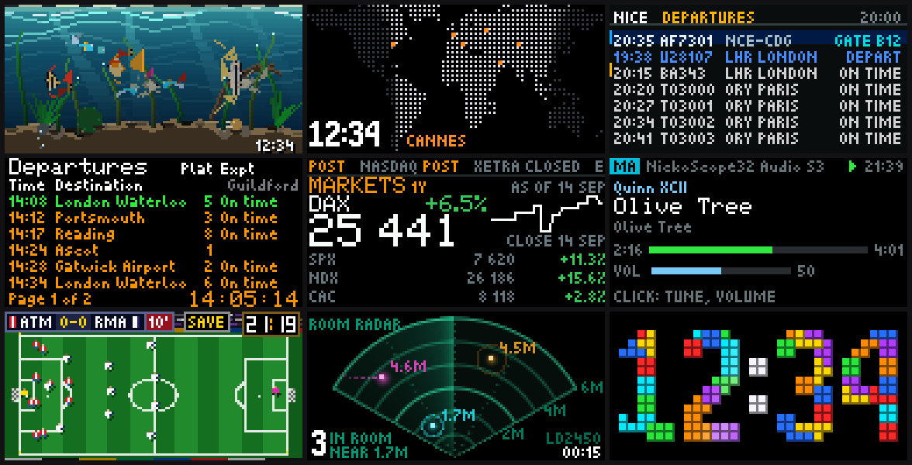

# AnimatedPixelClock (NickoScope fork)

A 128x64 RGB LED wall panel on the Waveshare ESP32-S3-RGB-Matrix board. It
started as [Keralots/AnimatedPixelClock](https://github.com/Keralots/AnimatedPixelClock),
a retro-arcade clock, and all of that is still here. This fork adds live screens
fed from the network, Lua effects uploaded over WiFi, a knob and a carousel,
Home Assistant over MQTT, and an SDK that lets an AI agent drive the panel.



*Host renders of the panel's own frames, 128x64 scaled 3x. Top row: the Lua
aquarium, the world clock, the flight board. Middle: the rail board, the market
dashboard, the media player. Bottom: the football clock, the room radar and the
Tetris clock.*

- **Flash it from the browser:** [nickoscope.github.io/AnimatedPixelClock](https://nickoscope.github.io/AnimatedPixelClock/)
- **Releases:** [github.com/NickoScope/AnimatedPixelClock/releases](https://github.com/NickoScope/AnimatedPixelClock/releases/latest)
- **Report a bug:** [issues](https://github.com/NickoScope/AnimatedPixelClock/issues)

## Hardware

| Part | Notes |
|------|-------|
| Waveshare ESP32-S3-RGB-Matrix | ESP32-S3-WROOM-2 N32R16V: 32 MB octal flash, 16 MB octal PSRAM, a 2x8 HUB75 socket with on-board buffers, two USB-C sockets (USB and POWER), BOOT and RESET buttons, and an SHTC3 temperature and humidity sensor |
| 2x 64x64 HUB75E panels | Chained OUT to IN with the ribbon into one 128x64 canvas, 1/32 scan. The panels here are `RGB-Matrix-P2-64x64-B` with FM6124HJ column drivers; the firmware initialises them in FM6126A mode |
| 5V power | Each panel has its own power harness. The board has a USB-C socket marked POWER and 5V/GND posts |
| EC11 rotary knob (optional) | One knob with a push switch. Without it the carousel runs the panel by itself |

This is the only board this fork is tested and released for. The firmware still
builds for the boards upstream supports (ESP32-S3-WROOM-1 devkit, ESP32-S3-Zero,
Super Mini, wired by hand to the panels), but none of those has been flashed
here; for them, see [upstream](https://github.com/Keralots/AnimatedPixelClock)
and its [wiring guide](docs/HUB75_WIRING.md).

## What is on the panel

The pages:

| Page | What it shows | Needs | Details |
|------|---------------|-------|---------|
| Clock | Fourteen animated clock styles, see [Clock styles](#clock-styles) | nothing | this file |
| World clock | A dotted world map with day, night and twilight, your cities, and home's time in home's zone | nothing | [src/worldclock](src/worldclock/README.md) |
| Flight board | Departures and arrivals for any airport, and flights you track | a FlightAware AeroAPI key, or Home Assistant | [src/flightboard](src/flightboard/README.md) |
| Rail board | Departures and arrivals for any National Rail station | a Realtime Trains token, or Home Assistant | [src/railboard](src/railboard/README.md) |
| Yacht radar | Live AIS vessels in the Bay of Cannes: a sweeping plot and a vessel table | an aisstream.io key | [src/yachtradar](src/yachtradar/README.md) |
| Media | Now playing on a Home Assistant or Music Assistant player, and the knob as its remote | Home Assistant, MQTT | [src/media](src/media/README.md) |
| Markets | Indices, ticker, portfolio and holdings pages with an exchange tape | Home Assistant, MQTT | [src/market](src/market/README.md) |
| Lua effects | Seven built in (football, snooker, snake and Tetris clocks, Minecraft, the room radar, La Gioconda) and up to twelve of your own | nothing; the room radar needs a presence sensor over MQTT | [src/lua](src/lua/README.md), [gallery](gallery/README.md) |

The weather clock, the ambient screensavers, custom GIF animations, the PC
monitor and the audio visualizer from upstream are all still in; they are
described further down.

The board's own SHTC3 sensor reports temperature and humidity in `/api/info`, on
the portal's Clock page, and, on request, as two Home Assistant sensors
([src/climate](src/climate/README.md)).

### Lua effects over WiFi

A new screen is a Lua script, sent to the running panel in about a second: no
build, no flash, no reboot. The panel keeps **twelve** uploaded effects of up to
**50 KB** each, beside the seven compiled in, and they survive reboots and
OTA updates.

```bash
python3 tools/agent/gallery.py show aquarium      # one of the gallery's screens
```

The [gallery](gallery/README.md) has an aquarium that reacts to people in the
room, a starship, the Bay of Cannes and La Gioconda. Scripts are written and
checked on the host first with [`tools/luasim`](tools/luasim), which runs the
same API the panel does.

### The knob and the carousel

Turn the knob to walk every clock style, then every page. Click enters a page
that has controls of its own, such as the media remote, and click again leaves
it. Leave the knob alone for 60 seconds and the carousel
takes over, showing each page and each clock style for 15 seconds. Both numbers
can be changed in the web portal.

### Home Assistant

The panel talks to Home Assistant over MQTT, through one connection shared by
every page. It has no default broker: it connects only after you give it one in
the portal. Without Home Assistant the clock, world clock, flight board, rail
board, yacht radar and Lua effects all work on their own; the media and market
pages and the room radar need it. The Home Assistant side of each page (the
AppDaemon apps) lives next to it under [`tools/`](tools).

### An SDK for AI agents

[`tools/agent/`](tools/agent/README.md) is a Python SDK and an MCP server
(over stdio) that let Claude Code, Codex or any MCP client
find panels on the network by MAC address, bring a new one up, switch pages,
read what the panel is doing, and write and upload new Lua screens.
[`AGENTS.md`](AGENTS.md) is where an agent starts. It deliberately has no
flashing tool: building and flashing is a person's call.

## Clock styles

| ID | Style | Description |
|----|-------|-------------|
| 0 | Mario | Mario jumps to bounce changed digits; optional idle enemy encounters |
| 1 | Standard | Traditional digital clock with date |
| 2 | Large | Extra-large digits |
| 3 | Space Invaders | Shoots lasers to change digits; choose an invader or spaceship character |
| 5 | Pong / Arkanoid | Breakout-style ball physics, digits shatter and reassemble |
| 6 | Pac-Man | Pac-Man eats pellet-based digits |
| 7 | Snake | Nokia-style snake hunts pellets left by changed digits |
| 8 | Tetris | Block digits rebuilt by slabs or falling dots, idle falling blocks with a separate configurable color per shape; optional small corner-clock mode hands the whole panel to an auto-played game with a much taller stack |
| 9 | Cycle All Styles | Choose enabled styles, their order and duration in Clock settings; Weather is skipped until configured |
| 10 | Asteroids | Wireframe ship shoots changed digits into spinning line shards |
| 11 | Dino Runner | A T-Rex runs and jumps cacti; a pterodactyl swaps changed digits |
| 12 | Matrix Rain | Digital rain with fading glyph trails; changed digits decode out of the rain |
| 16 | TRON | Two neon light cycles leave fading trails, avoid walls and crash into sparks; one traces changed digits as a continuous line |
| 15 | Bomberman | Brick digits explode with cross-shaped blasts and rebuild; a tiny hero navigates between digits, bombs crates and collects bonuses |
| 14 | Weather Clock | Time plus live local weather: animated condition icon, temperature, daily range, humidity, sunrise/sunset |

Select **Bomberman** in **Clock > Clock style** and save. Its digit color is
configurable in **Colors**. It respects 12/24-hour time and colon blinking.
The hero follows corridors around the digits, chooses different bombing spots,
and retreats to safety. Blast arms stop at the first digit brick or crate.
In **Cycle All**, enable Bomberman and set its duration; existing rotations keep
their order and durations, with Bomberman initially disabled.

Select **TRON** in **Clock > Clock style** and save. **Colors** controls the
time digits and both light cycles. It supports 12/24-hour time and colon blinking.
Under TRON settings, **Motorcycle variant** selects **Motorcycle (side view)**
(the default) or **Light cycle (top view)**. Save to keep the choice across reboots;
it also applies when TRON runs in Cycle All.
Enable TRON separately in **Cycle All**; existing rotations retain their settings
with the new style initially disabled.

ID 4 is a legacy alias for the Space Invaders renderer and is not a separate
choice in the web interface. ID 13 is retired; use the IDs listed above.

Style colors are editable in the web interface (digits,
characters, effects, backgrounds), so each clock can match your setup.

The style names describe what each animation is styled after. This project is
not affiliated with or endorsed by the rights holders; see
[Trademarks and attribution](#trademarks-and-attribution).

## Web interface

Once on WiFi, open the device's IP address or `http://pixelclock.local` in a browser:

- **Clock settings**: style, 12/24 hour, date format, position, per-style animation
  options, per-element colors with one-click reset to defaults
- **Display**: brightness (live slider), colon blink mode/rate, adaptive refresh rate,
  scheduled night dimming (start/end time to the minute + dim level) and a scheduled
  power-off window that blanks the panel overnight to spare the LEDs
- **Audio visualizer**: effect style, its colors and the oscilloscope options
- **Timezone**: built-in region list with automatic DST transitions (POSIX TZ rules, no
  manual toggles)
- **Network**: DHCP or static IP, device name (mDNS), show IP at boot, NTP time
  servers (see below)
- **PC monitor layout**: which metrics are visible and where, 5-row / 6-row / large
  text modes, progress bars, drag-and-drop placement on a live preview
- **Config export/import** as JSON (includes the color palette)
- **Firmware update**: upload a `.bin` over the air

### Time servers (NTP)

The clock gets the time over NTP and applies the timezone rules locally. By default it
asks `pool.ntp.org`, then `time.nist.gov`.

The **Network** page has a *Time servers (NTP)* card with a primary and a secondary
field. Either accepts a hostname or an IP, so you can point the clock at a local time
source (a router, a pfSense box, an internal NTP server) instead of the public pool.
Leave the primary blank to fall back to the compiled default; leave the secondary blank
to use no fallback server at all.

**Test** probes each configured server directly and reports whether it answered, with
the UTC time it returned. That check uses its own throwaway socket, so it never
disturbs the running clock. Saving the settings reapplies the timezone and forces a
resync, which can take a few seconds on a slow server.

Both fields are included in config export/import.

## Weather (optional)

The Weather Clock (style 14) shows current conditions next to the time: an animated
icon (sun, clouds, rain, snow, storm...), the temperature, today's high/low, humidity
and sunrise/sunset times. When enabled it also joins the Cycle All rotation as an
extra screen.

Setup (web interface, Clock page, Weather Clock style):

1. Tick **Enable weather updates**.
2. Type your city into **Find your location** and press Search - it fills in the
   coordinates (the lookup runs in your browser; the device only stores latitude and
   longitude). You can also enter coordinates manually.
3. Pick Celsius or Fahrenheit. Save.

Data comes from [Open-Meteo](https://open-meteo.com/) (no account or API key needed),
fetched every 10 minutes. The optional API key field is only for Open-Meteo
commercial subscriptions. Icon, effect and temperature colors are editable in the
style's Colors card like any other clock.

## Ambient screensaver

On the web interface's Display page you can run an **ambient screensaver** instead of
the clock: a Space Invaders battle, a Pac-Man chase, a starfield, an aquarium with
fish, bubbles and kelp, or a burning room where a very calm dog insists everything is
fine. An optional small clock stays in the corner. Press **Start
now** to keep the effect on until you stop it, or enable the schedule to have it come
on automatically during set hours (e.g. 20:00-23:00). `GET /api/mode/ambient` /
`/api/mode/auto` do the same from automations.

### Custom animations (upload your own GIFs)

The **Custom animation** ambient effect plays animations you upload to the device
from the board's flash storage (about 23 MB free on the Waveshare board, shared
with the Lua effects). The UI reports the current upload budget, including space
needed for a temporary file.

In the desktop companion, save `pixelclock.local` (or your clock's IP) on
**Connection**, then open **Animations**. Refresh storage, select a GIF, choose
crop/pad/stretch and its anchor, and create a preview. Automatic frame skipping
fits the clip to available space while preserving its duration. Upload the result
and use **Play** to try it. To keep it as the ambient effect, select it on the
clock's Display page and save. GIF input is limited to 8MiB; trim large clips first.

Alternatively, convert a GIF with the command-line tool:

```bash
pip install pillow
python tools/gif2pca.py my.gif                        # writes my.pca
python tools/gif2pca.py my.gif --preview check.gif    # eyeball the result first
python tools/gif2pca.py my.gif --upload http://pixelclock.local   # convert + upload
```

The converter fits the GIF to the 128x64 panel (`--fit crop|pad|stretch`, with
`--anchor start|center|end` choosing which edge survives a crop - use `--anchor end`
to keep a caption at the bottom), quantizes all frames to one 16-color palette and
packs them into a compact `.pca` file (4KiB of pixel data per frame, 1.5MiB max, up to 360
frames; use `--frame-skip 2` for long GIFs).

Upload either with `--upload`, with the file picker on the Display page (select the
ambient effect "Custom animation" to see it), or with curl:

```bash
curl -F "anim=@my.pca" "http://pixelclock.local/api/anim/upload"
```

Then pick the animation in the dropdown, **Save**, and **Start now**. Uploaded
animations survive reboots and normal firmware-only OTA updates; replacing or
erasing the filesystem removes them. Manage them with
`GET /api/anim/list` and `GET /api/anim/delete?name=<name>`.

### Custom clock rotation

Select **Custom rotation** (style 9) in Clock settings. Enable the desired styles,
move them with **Up/Down**, and set each duration from 5 to 3600 seconds, then
save. At least one non-weather style must remain enabled. Rotation resumes from
the first available style after another display mode interrupts it. Settings are
included in configuration export/import.

### Device diagnostics

Expand **Diagnostics** under **Device status** in the web portal for firmware,
flash/storage capacity, heap usage, reset reason, time/weather state and animation
errors. **Download diagnostics** saves the same information as JSON, without WiFi
credentials. It is also available at `GET /api/diagnostics`.

## PC monitor mode (optional)

With the companion app running on your PC, the display switches to live hardware
stats (CPU/GPU temps and loads, RAM, disks, fans, network throughput; up to 20
metrics) and returns to the clock when the PC goes offline.

**Companion app v4** (Windows + Linux) lives in
[`PC-Companion-App-v4/`](PC-Companion-App-v4/): a tray app with a
web-style config window, live device preview, drag-and-drop layout editor and
sensor picker.

- **Windows**: download and run
  [`pc_stats_monitor_v4.exe`](https://github.com/NickoScope/AnimatedPixelClock/releases/latest/download/pc_stats_monitor_v4.exe),
  no Python needed. Install
  [LibreHardwareMonitor](https://github.com/LibreHardwareMonitor/LibreHardwareMonitor/releases)
  and run it as Administrator for temperature/fan/power sensors (on 0.9.5+ enable
  Options > Remote Web Server > Run).
- **Linux**: `cd PC-Companion-App-v4/linux-companion`, then
  `python3 -m pip install -r requirements.txt` and
  `python3 pc_stats_monitor_v4_linux.py`.

The release includes the Windows companion alongside the firmware. Follow the
[Windows companion instructions](PC-Companion-App-v4/win-companion/README.md)
to run from source or rebuild it.

Metrics are sent as JSON over local UDP (port 4210), at the companion's configured
update interval. Both companions default to 3 seconds. CPU usage depends
on the host, enabled sensors and update interval.

Do not want the stats screen? Untick **Send PC stats to the display** on the
Connection page. The companion stops reading sensors and stops sending packets,
so the device falls back to its clock or scheduled ambient screen. Combined with
the audio visualizer below, that gives a display that is either the equalizer
while music plays or the clock the rest of the time.

## Audio visualizer (optional)

With the companion app streaming your PC's sound, the display becomes a 32-band
spectrum analyzer: smooth bars with a green/yellow/red gradient (colors editable),
falling peak dots, and an optional small clock in the corner.

Choose **Visualizer style** in the device web UI's **Display -> Audio visualizer**
card, then **Save settings**:

- **Classic EQ**: the original 32 bars, editable colors and falling peak dots (default).
- **Neon Mirror**: segmented cyan and magenta bars pulse outward from a central
  horizon, with bright peak markers for a synthwave look.
- **Phosphor Waterfall**: a scrolling spectrum history in green, mint and amber,
  inspired by vintage computer displays. Bass is on the left, treble on the right;
  new sound enters at the top and fades downward.
- **Purple LED Stage**: a curved concert light wall. Each column follows its own
  band, bass opens the wave and treble adds pale pink highlights.
- **Starfield Overdrive**: flight through stars whose trails stretch on every
  bass onset.
- **Oscilloscope**: the live waveform on a lab-scope graticule, with a phosphor
  trail behind it. The trace is trigger-aligned on the PC so it stands still
  instead of sliding, and it takes its colors from the same three editable slots
  as Classic EQ (grid from the low color, trace from mid, peaks from the top one).

Classic EQ and the Oscilloscope each have their own color pickers, and the
**Colors and options** card shows the set that belongs to the selected style; the others use fixed palettes. All of them support the small clock and the same companion audio
stream. Style selection survives restarts and is included in settings
export/import; older settings keep Classic EQ by default on a fresh device.

Selecting the Oscilloscope also reveals its own options, all of which default to
the look above:

- **Graticule**: its own color, or switched off for a bare trace (default on).
- **Trace colors**: the trace itself and the color it fades to at full
  deflection (default yellow fading to red).
- **Flat trace color**: drops that fade so the trace is one color (default off).
- **Fill to centre line**: a solid silhouette instead of a bare line (default off).
- **Phosphor trail**: 0 to 4 ghost traces behind the live one. 0 is a single
  sharp line, 4 smears the most (default 3).
- **Vertical gain**: 50 to 200 percent trace height. Above 100 the loud parts
  flatten against the top and bottom edges, like a scope driven too hard
  (default 100).

**Restore oscilloscope defaults on save** puts all of those back, colors
included, without touching any other setting.

The Oscilloscope needs the waveform that the companion app from this release
sends alongside the spectrum. An older companion streams the spectrum only, and
the device then says so on screen instead of drawing a trace; the other styles
keep working with either version.

Turning **Show small clock** off also hides the fixed guide lines in Neon Mirror
and Phosphor Waterfall. Waterfall then uses the full display height, and the
Oscilloscope re-centers its graticule on the full panel.

Setup:

1. On the PC: tick **Audio visualizer stream** on the companion's Connection
   page and save. The Windows executable build bundles the audio dependencies;
   when running from source, install `soundcard` and `numpy` if needed
   (`python -m pip install soundcard numpy`). It captures whatever the PC is
   playing (WASAPI loopback on Windows, PulseAudio monitor on Linux) - no cables,
   no microphone.
2. On the device: **Audio visualizer** page -> **Start visualizer**
   (or `GET /api/mode/viz` from an automation).

The visualizer stays on until you stop it; if the audio stream disappears for 10
seconds the display falls back to automatic display selection: PC stats while
the companion is online, otherwise the scheduled ambient effect or clock. The
visualizer returns automatically when the stream resumes.

### Start it automatically when music plays

Step 2 can be automatic. Under the stream checkbox, tick **Start the visualizer
when music plays** and save. The companion then watches how loud the captured
audio is and switches the display for you:

| Setting | Default | What it does |
|---|---|---|
| Start delay | 3 s | Sound must keep playing this long before the companion calls `/api/mode/viz`. Short sounds (Windows pops, chat notifications) never reach it. |
| Stop delay | 20 s | Quiet for this long calls `/api/mode/auto`, handing the display back to PC stats, ambient or the clock. |
| Sound threshold | -45 dB | Anything quieter counts as silence. Lower it (-55) if quiet music is missed, raise it (-35) if background sounds trigger it. |

Quiet gaps shorter than a second (between tracks, pauses in a song) do not
restart the start delay, and the companion only releases the display if it was
the one that switched it. The Connection page shows the current sound level in
dB, so you can read it while music plays and set the threshold below it.

After a temporary network failure (for example, waking the PC), failed automatic
mode changes are retried until they succeed or a newer mode replaces them. The
stream keeps its last resolved device IP through temporary `.local` lookup failures.
If the clock restarts during playback, automatic mode restores the visualizer
after detecting its new uptime (checked every 10 seconds).

## Flashing

### Web flasher (recommended)

Open **[nickoscope.github.io/AnimatedPixelClock](https://nickoscope.github.io/AnimatedPixelClock/)**
in Chrome or Edge on a desktop, plug the board in over USB and press Install. It
writes the full image at `0x0`, then hands your WiFi to the board over USB
(Improv Serial) in the same tab. The page also has a serial log viewer, useful
if the panel stays dark after a flash, and the Windows companion download.

The page carries one board, the Waveshare ESP32-S3-RGB-Matrix, because it is
the one that has been flashed from there and seen to boot. Upstream runs its own
flasher at [pixelclock.stolaris.dev](https://pixelclock.stolaris.dev) for the
boards it supports.

### Building from source

Built with [PlatformIO](https://platformio.org/).

```bash
pio run -e matrix-waveshare-rgb -t upload
```

The board needs `opi_opi` memory, not the `qio_opi` of WROOM-1 builds: with quad
flash set, the image uploads and then every boot dies in `do_core_init` right
after "Octal Flash Mode Enabled". `platformio.ini` has it right; the note is here
because the symptom looks like a dead board. **Do not flash it with a WROOM
image** for the same reason.

`matrix-waveshare-rgb-bringup` builds a standalone panel self-test
(`bringup/hello_matrix.cpp`), useful before the full firmware. The upstream
environments (`matrix-s3-wroom`, `matrix-s3`) still build.

Release packaging is described in [docs/firmware/README.md](docs/firmware/README.md).

### First-time WiFi setup

The web flasher hands your network over right after installing. If you miss
that, the board opens an open access point named **PixelClock-Setup**; join it
and a captive portal (or `192.168.4.1`) takes your WiFi credentials. Then the
panel shows its IP address, and the portal is at that address or at
`http://pixelclock.local`.

### OTA updates

After the first flash, update over WiFi from the portal's Firmware Update
section, or from the command line:

```bash
curl -F "firmware=@.pio/build/matrix-waveshare-rgb/firmware.bin" http://<device-ip>/update
```

From a [release](https://github.com/NickoScope/AnimatedPixelClock/releases/latest),
upload `OTA_ONLY_firmware-v<version>-waveshare.bin`. Do not upload the full
`firmware-v<version>-waveshare.bin`: it carries the bootloader and partition
table and belongs at `0x0` over USB. Downloads can be checked against
`SHA256SUMS.txt`.

## HTTP control API

Simple GET endpoints for home automation (Home Assistant, Node-RED, cron + curl).
These controls do not save settings themselves. Mode/display overrides reset on
reboot; brightness and style changes update the in-memory settings and can be
persisted by a later settings save. No authentication, so keep
the device on a trusted LAN.

| Endpoint | Description |
|----------|-------------|
| `/api/status` | Current display/mode state as JSON |
| `/api/display/off` / `/api/display/on` | Blank / restore the panel |
| `/api/display/brightness?value=0-100` | Set brightness (percent) |
| `/api/mode/clock` / `/api/mode/auto` | Force the clock / resume automatic mode |
| `/api/mode/ambient` | Force the ambient screensaver on now |
| `/api/mode/viz` | Force the audio spectrum visualizer (needs the companion streaming) |
| `/api/clock/style?id=<id>` | Switch the clock style; use an ID from the table above (13 is retired) |
| `/api/ntptest?server=<host>` | Probe an NTP server and report whether it answers |
| `/api/reboot` | Soft-restart (settings kept) |

```bash
curl http://pixelclock.local/api/display/off
curl "http://pixelclock.local/api/display/brightness?value=30"
curl "http://pixelclock.local/api/clock/style?id=8"
```

Home Assistant example:

```yaml
rest_command:
  clock_display_off:
    url: "http://pixelclock.local/api/display/off"
  clock_display_on:
    url: "http://pixelclock.local/api/display/on"
```

## Notifications API

Push a message banner onto the display from anything that can send an HTTP request.
The banner appears over the active screen (including ambient effects and the
visualizer), scrolls if the
text is too long, and disappears on its own.

```bash
curl -X POST http://pixelclock.local/api/notify \
  -H "Content-Type: application/json" \
  -d '{"text":"Doorbell!","icon":"bell","color":"#FFAA00","duration":8000}'
```

| Field | Required | Description |
|-------|----------|-------------|
| `text` | yes | Message, up to 200 bytes (200 ASCII characters) |
| `color` | no | Banner color as `#RRGGBB` (default white) |
| `icon` | no | One of `bell`, `mail`, `alert`, `heart`, `check`, `cross`, `info`, `home`, `music`, `star` |
| `duration` | no | Display time in ms, 1000-60000 (default 5000) |
| `position` | no | `top` or `bottom` (default: the position set in the web interface) |

`GET /api/notify/dismiss` clears the banner early. A new POST replaces the current
banner. The feature can be disabled entirely on the web interface's Display page
(Notifications card), where the default banner position is also set.

Home Assistant example:

```yaml
rest_command:
  clock_notify:
    url: "http://pixelclock.local/api/notify"
    method: POST
    content_type: "application/json"
    payload: '{"text":"{{ message }}","icon":"{{ icon | default(''info'') }}","color":"{{ color | default(''#FFFFFF'') }}"}'
```

## Credits

This is a fork of [Keralots/AnimatedPixelClock](https://github.com/Keralots/AnimatedPixelClock)
by Keralots: the clock styles, the ambient effects, the web portal, the PC
companion and the audio visualizer come from there. Its sibling project for
small OLED screens is [SmallOLED-PCMonitor](https://github.com/Keralots/SmallOLED-PCMonitor).

## Libraries

- [ESP32-HUB75-MatrixPanel-DMA](https://github.com/mrcodetastic/ESP32-HUB75-MatrixPanel-I2S-DMA) (matrix driver)
- Adafruit GFX, WiFiManager (tzapu), ArduinoJson, Improv-Serial
- [Lua 5.4](https://www.lua.org/) for the effects

## License

Licensed under the [MIT License](LICENSE).

## Trademarks and attribution

AnimatedPixelClock is an independent, non-commercial hobby project. It is not
affiliated with, endorsed by, sponsored by or connected to Nintendo, The Tetris
Company, Bandai Namco, Taito, Atari, Konami or any other rights holder.

The clock and ambient style names describe what each animation is styled after,
so that you can tell the styles apart. Every sprite and effect in this firmware
is drawn procedurally from the source in this repository, with user-configurable
colors. No game artwork, sprite sheets, tile data, ROM data, fonts, sounds or
music from any commercial game are copied, bundled or distributed here, and the
firmware does not emulate or reproduce any of those games.

All product names, game titles, logos and brands referenced in this project are
the property of their respective owners. They are used here only to describe the
visual style of an animation, and their use does not imply any endorsement,
sponsorship or affiliation.
