# Lua effects gallery

Screens for a 128x64 panel, each one file, each one sent to a running panel in
about a second. No build, no flash, no reboot.

```bash
# any of them, onto the panel on your network
python3 tools/agent/gallery.py show starship
```

or through the MCP server, which is the same thing an agent would do:

```
effect_upload  name=starship  from_gallery=true
```

A panel holds **twelve** uploaded effects at once, up to 50 KB each, beside
the seven compiled in.
`tools/agent/gallery.py list` says what is here; `panel_effects` says what is on
the panel.

---

## AQUARIUM

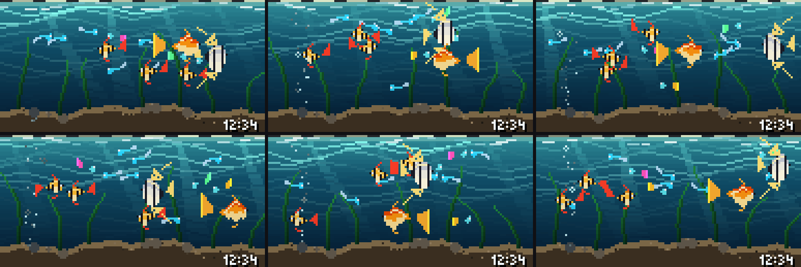

A lit freshwater tank. Five species, each drawn from its own silhouette and its
own shading rather than a recoloured lozenge: a goldfish with a six-rayed veil
tail, an angelfish whose height comes from swept fins and two trailing
filaments, tiger barbs in amber with black bars and red fins, guppies with a
different tail each, and a shoal of neons carrying that one electric blue line
along the flank. Three vertical segments a column - back, flank, belly - plus a
sheen where the lamp catches the back, which is what makes a body look round
instead of flat.

**It reads the room, and slowly.** `presence` is the same MTR-1 feed ROOM RADAR
draws, over MQTT from Home Assistant. Every reaction is a low-pass in *seconds*:
about six to turn toward somebody who walks in, a second and a half to scatter
from a fast movement, half a minute to settle again, forty-five seconds of an
empty room before the tank dims and goes to sleep. Because the constants are in
seconds and not frames, the behaviour is the same at 15 fps and at 4.

Two rules were learned the hard way and are the whole difference between this
and a screensaver:

- **The room nudges a heading; it never tows a fish.** Making the person's
  position the target dragged the whole tank after them like iron filings. The
  fish swims its own route and presence bends it by 18%.
- **There is glass on all four sides.** Nothing is ever off screen. This is an
  aquarium, not a window on the sea.

**Depth is continuous and the fish swim through it.** Each carries a depth from
0 at the back glass to 1 at the front, drifting on its own twenty-to-forty
second cycle. It picks the body from five precomputed sizes, sets the haze on
the colour, sets the apparent speed and decides what is drawn over what - the
shoal is sorted back to front. A fish coming toward you grows, sharpens and
passes in front of the others. And a turn is a turn: `face` crosses zero over a
third of a second while the body foreshortens, so the fish banks through it.

Bubbles leave the airstone in the corner and nowhere else; one starting in open
water is the tell of a drawn tank. A corydoras shuffles along the sand on its
pectorals, a snail crosses at a pixel every two seconds, and every fish in the
near half of the tank has a shadow under it.

*31.4 KB of the 50 KB a script may be · ~48,000 instructions a frame · 12-15 fps*

---

## LA GIOCONDA

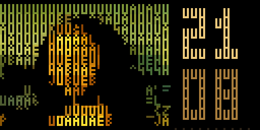

The painting drawn in ASCII characters, and the clock beside it built from them
too. Every cell is one `px.text` call in a colour chosen by
[chafa](https://github.com/hpjansson/chafa) — which searches the whole symbol
set for the glyph whose bitmap best matches that cell, and picks the colour
jointly with it, rather than choosing a character by brightness and a colour
afterwards. The font it matched against is the panel's own: `tools/luasim/mkbdf.py`
writes PicopixelFB out as a BDF so the shapes it compares are the shapes the
panel will draw.

Drawn once. This firmware does not clear the canvas between frames, so after the
first frame only the clock half is repainted.

*6.7 KB · ~1,700 instructions a frame · 4 fps*

---

## CANNES

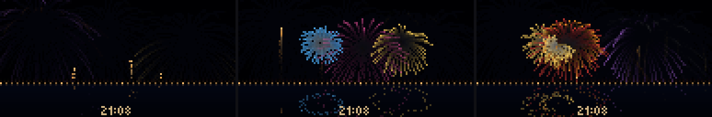

The Festival d'Art Pyrotechnique, over the bay. Shells climb from the Croisette,
burst in eight colours, and the water takes it back — dimmer and jittered,
because still water is not a mirror.

The trails are free: each frame blends the sky a little way towards its own
colour, so last frame becomes this frame's smoke. Gravity and drag on every
ember, which is what makes a burst open fast, slow, and fall rather than just
expand.

*10.4 KB · ~100,000 instructions a frame · 8 fps on the panel*

---

## STARSHIP

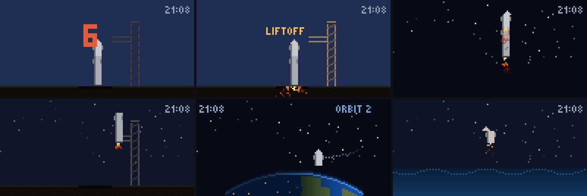

One flight a minute, and **the minute is the clock**. `PERIOD` is 60, so
`px.t()` is the second hand: the count, ignition, hot staging, the booster's
flip and catch at the tower, two orbits, re-entry, the flip and burn, and a
splashdown in the Gulf all land on the real seconds of the real minute. At
:00 the engines light.

Nothing fades here — it clears and redraws, and stays under about 400 calls into
C a frame, which is what a frame is actually spent on. That is why it holds the
full 20 fps where the fireworks manage 8.

The Earth is drawn a column at a time rather than a pixel at a time: the limb,
a hairline of atmosphere, continents, a terminator that walks, and city lights
on the night side.

*18.9 KB · ~10,000 instructions a frame · 20 fps*

---

## FLIP DOT CLOCK

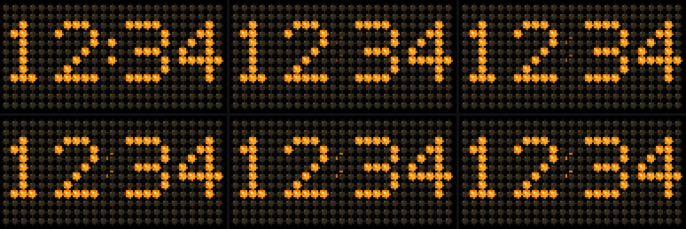

A real flip-disc board, the kind that used to clatter above a railway platform.
The whole 128x64 is one matrix - 25x12 discs at a 5 px pitch, edge to edge, a
disc in every cell - and the time is nothing but the discs that happen to be
lit. The dark ones keep a domed top-left highlight, so the grid reads as a
physical board even where nothing is on.

The move is the flip. When a disc changes it squashes to an edge-on sliver in
its old colour, then reopens in the new one; the discs of a changing digit start
a few frames apart by column, so a minute rolls over as a cascade rather than a
jump. The colon flips once a second, so the board is never quite still.

Real time, from `px.now()` - the panel's own NTP clock, not the animation phase.
It holds 24 fps by painting the full board once at load and thereafter touching
only the ~142 discs a digit or the colon can change, never the 300-disc field
behind them.

*5.7 KB · full-screen 25x12 matrix · real-time · 24 fps*

_Published by openclaw._

---

## AUTUMN

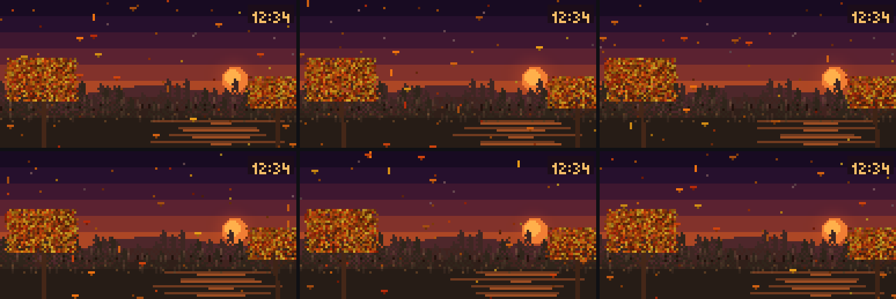

An autumn evening in a park: two maples in full orange crown under a low sun, leaves drifting down through a violet dusk, the last light laid across the ground in long bands. The time sits in the corner.

_Published by openclaw._

---

## LIVING OCEAN

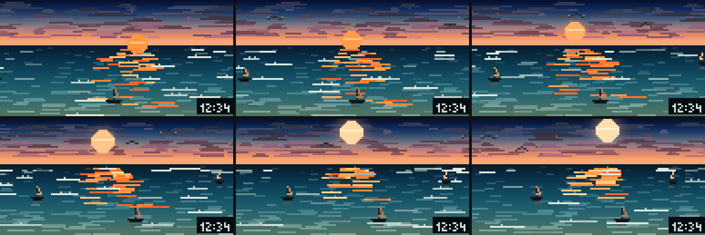

The sea at sunset. Over a three-minute cycle the sun moves above the horizon, its path breaks into orange ripples on teal water, small sailing boats drift across and gulls pass overhead. The time sits in the corner.

_Published by openclaw._

---

## PICTURE DAY PHOTO

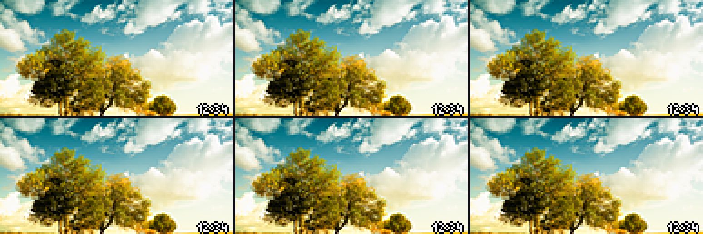

The photograph of the day, from the morning: autumn trees under a bright sky full of cloud, painted once in 24-bit colour and left on screen, with the time in the corner. No people in it.

_Published by openclaw._

---

## FOOTBALL CLOCK

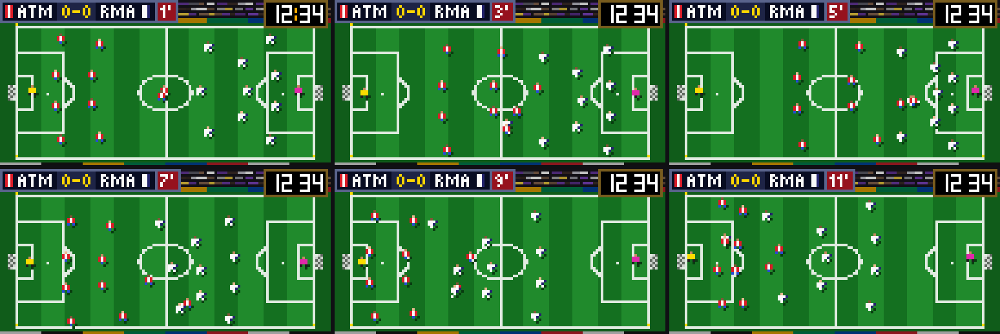

A football match that plays itself: Atletico Madrid against Real Madrid, told apart by their kit colours only, with a broadcast score bug across the top and the real time in the corner. The pitch keeps the proportions of the Laws of the Game and is seen the way a broadcast camera up in the stand sees it, lines straight and the centre circle an ellipse.

Also compiled into the firmware for now; this copy is here to be loaded over the air.

---

## MINECRAFT

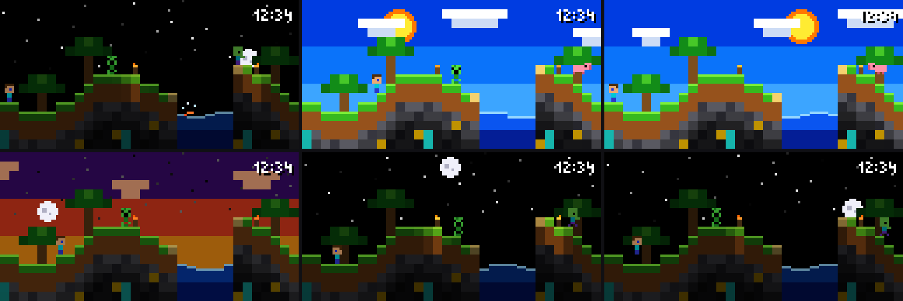

A blocky world with a full day and night cycle in one minute, built from 4 px blocks because on a panel this coarse solid colour reads as a world and outlines read as noise. Something is always moving: Steve patrols the hills and jumps now and then, a creeper paces the ridge, the sky goes black at night and torches light whole blocks.

Also compiled into the firmware for now; this copy is here to be loaded over the air.

---

## ROOM RADAR

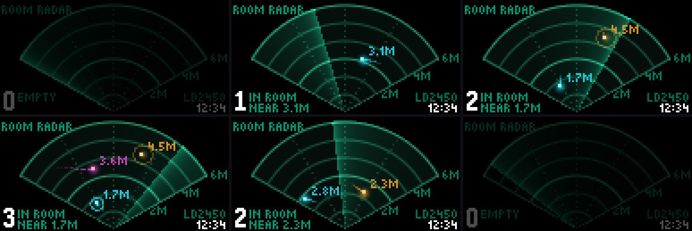

Who is in the room, as the 24 GHz radar of a presence sensor sees it: up to three people as points in the sensor's own 6 m fan, with their distance and a short trail. It reads the panel's presence feed from Home Assistant; with no sensor behind it, it invents people so the screen still shows what it does.

Also compiled into the firmware for now; this copy is here to be loaded over the air.

---

## SNAKE CLOCK

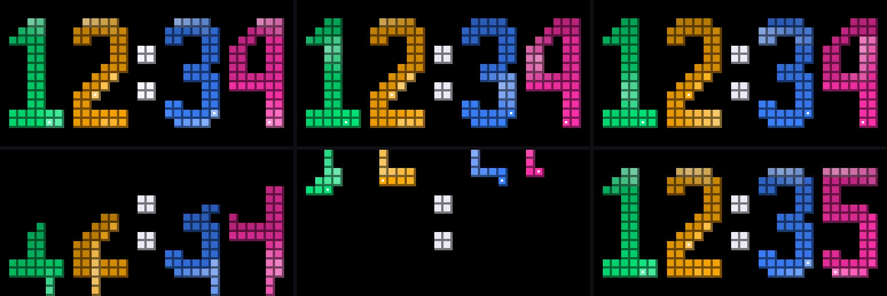

The time, where each digit is a snake. On the minute the four snakes crawl away downward and four new ones crawl in from the top and lay themselves out as the next time. At rest every snake lies exactly on its digit, so a still frame is a clean clock.

Also compiled into the firmware for now; this copy is here to be loaded over the air.

---

## SNOOKER CLOCK

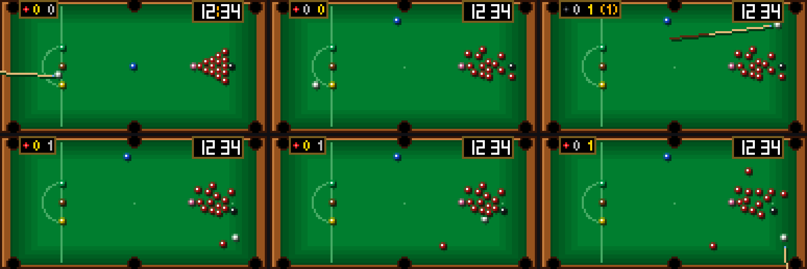

A snooker table that plays frames by itself, with the time in the corner like a game's HUD. The table and the play follow the WPBSA rules: the 2:1 playing area, baulk, the spots, the break and the order of the colours.

Also compiled into the firmware for now; this copy is here to be loaded over the air.

---

## TETRIS CLOCK

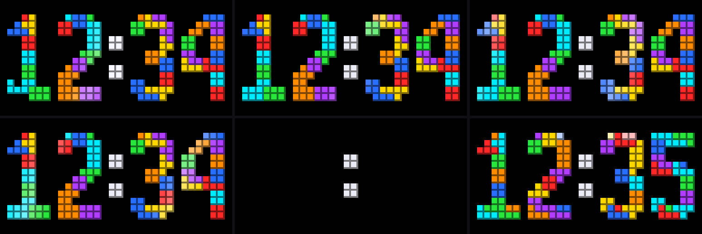

The time as a Tetris well: on the minute the digits clear like completed lines and are rebuilt by falling tetrominoes. Nothing lights the background; every lit pixel is a block of a digit, the colon or a piece on its way down.

Also compiled into the firmware for now; this copy is here to be loaded over the air.

---

## SOTD 0923 EVENING

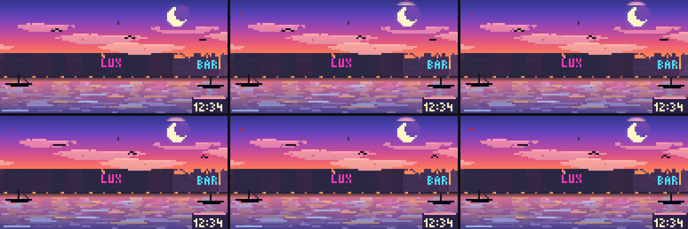

Screen of the Day for 23 September 2026, the evening one, second take: a waterfront at dusk, indigo and violet over a gold horizon, a crescent moon, the neon of LUX and BAR on the quay, boats and a restless reflection. Brighter than the first take, so it still reads on a panel dimmed for the evening.

_Published by openclaw._

---

## Adding one

The loop, and only the last step needs a panel:

```
effect_api      what a script may call, and every budget
effect_write    tools/luasim/scripts/<name>.lua, checked by the panel's own rules
effect_preview  sheet=12 — stills spread across the whole run
effect_check    the firmware's real runtime and real budgets, on your laptop
effect_upload   onto a panel
```

Then `python3 tools/agent/gallery.py add <name>` copies it here with a preview.

An agent publishes with `gallery_publish` (MCP) or `gallery.py publish <name>
--about "..." --by <agent>`: the same checks, a preview, a section here, the
index, one commit that touches only this folder. Its entries say who published
them, and it can replace or remove only those (`gallery_unpublish`). An agent
has no key for GitHub: it publishes into a staging branch on its own machine,
and a maintainer brings it here with `gallery.py sync`, every entry checked
again.

Three things that are not obvious and cost an evening each:

- **`LUA_32BITS`.** `lua_Integer` is int32 and `lua_Number` is a single-precision
  float. The textbook LCG multiplier overflows and the generator collapses. Use
  xorshift32; `effect_api` has it written out.
- **The cost is the crossing into C**, not the work inside `px.*`. A full-screen
  `px.blend` pass is 5,760 calls; halving it changed nothing, because the effect
  task shares core 0 with Wi-Fi and was being preempted rather than computing.
- **`math.random` cannot be used at all** — it is seeded differently in the
  simulator and on the panel, so `fx_parity` could not compare the two.
