# Lua effects gallery

Screens for a 128x64 panel, each one file, each one sent to a running panel in
about a second. No build, no flash, no reboot.

```bash
# any of them, onto the panel on your network
python3 tools/agent/gallery.py show starship
```

or through the MCP server, which is the same thing an agent would do:

```
effect_upload  name=starship  from_gallery=true
```

A panel holds **36** effects at once, each as big as it needs (up to 512 KB since firmware 2.6.3). Since firmware 2.6.0
none are compiled in: this gallery is where every effect comes from, the
former built-ins included.
`tools/agent/gallery.py list` says what is here; `panel_effects` says what is on
the panel.

---

## AQUARIUM

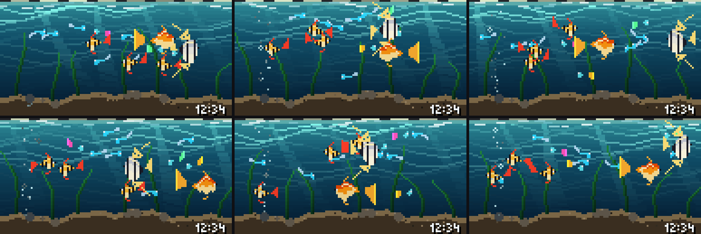

A lit freshwater tank. Five species, each drawn from its own silhouette and its
own shading rather than a recoloured lozenge: a goldfish with a six-rayed veil
tail, an angelfish whose height comes from swept fins and two trailing
filaments, tiger barbs in amber with black bars and red fins, guppies with a
different tail each, and a shoal of neons carrying that one electric blue line
along the flank. Three vertical segments a column - back, flank, belly - plus a
sheen where the lamp catches the back, which is what makes a body look round
instead of flat.

**It reads the room, and slowly.** `presence` is the same MTR-1 feed ROOM RADAR
draws, over MQTT from Home Assistant. Every reaction is a low-pass in *seconds*:
about six to turn toward somebody who walks in, a second and a half to scatter
from a fast movement, half a minute to settle again, forty-five seconds of an
empty room before the tank dims and goes to sleep. Because the constants are in
seconds and not frames, the behaviour is the same at 15 fps and at 4.

Two rules were learned the hard way and are the whole difference between this
and a screensaver:

- **The room nudges a heading; it never tows a fish.** Making the person's
  position the target dragged the whole tank after them like iron filings. The
  fish swims its own route and presence bends it by 18%.
- **There is glass on all four sides.** Nothing is ever off screen. This is an
  aquarium, not a window on the sea.

**Depth is continuous and the fish swim through it.** Each carries a depth from
0 at the back glass to 1 at the front, drifting on its own twenty-to-forty
second cycle. It picks the body from five precomputed sizes, sets the haze on
the colour, sets the apparent speed and decides what is drawn over what - the
shoal is sorted back to front. A fish coming toward you grows, sharpens and
passes in front of the others. And a turn is a turn: `face` crosses zero over a
third of a second while the body foreshortens, so the fish banks through it.

Bubbles leave the airstone in the corner and nowhere else; one starting in open
water is the tell of a drawn tank. A corydoras shuffles along the sand on its
pectorals, a snail crosses at a pixel every two seconds, and every fish in the
near half of the tank has a shadow under it.

*31.4 KB · ~48,000 instructions a frame · 12-15 fps*

---

## LA GIOCONDA

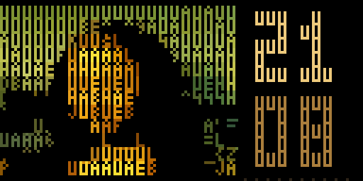

The painting drawn in ASCII characters, and the clock beside it built from them
too. Every cell is one `px.text` call in a colour chosen by
[chafa](https://github.com/hpjansson/chafa) — which searches the whole symbol
set for the glyph whose bitmap best matches that cell, and picks the colour
jointly with it, rather than choosing a character by brightness and a colour
afterwards. The font it matched against is the panel's own: `tools/luasim/mkbdf.py`
writes PicopixelFB out as a BDF so the shapes it compares are the shapes the
panel will draw.

Drawn once. This firmware does not clear the canvas between frames, so after the
first frame only the clock half is repainted.

*6.7 KB · ~1,700 instructions a frame · 4 fps*

---

## CANNES

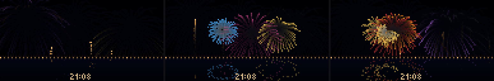

The Festival d'Art Pyrotechnique, over the bay. Shells climb from the Croisette,
burst in eight colours, and the water takes it back — dimmer and jittered,
because still water is not a mirror.

The trails are free: each frame blends the sky a little way towards its own
colour, so last frame becomes this frame's smoke. Gravity and drag on every
ember, which is what makes a burst open fast, slow, and fall rather than just
expand.

*10.4 KB · ~100,000 instructions a frame · 8 fps on the panel*

---

## STARSHIP

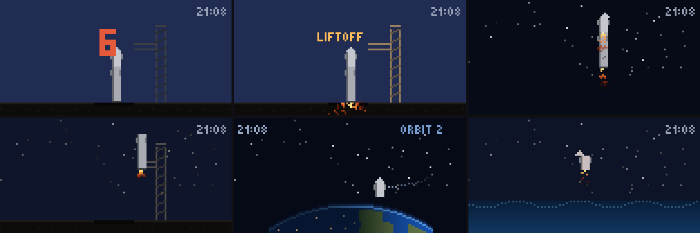

One flight a minute, and **the minute is the clock**. `PERIOD` is 60, so
`px.t()` is the second hand: the count, ignition, hot staging, the booster's
flip and catch at the tower, two orbits, re-entry, the flip and burn, and a
splashdown in the Gulf all land on the real seconds of the real minute. At
:00 the engines light.

Nothing fades here — it clears and redraws, and stays under about 400 calls into
C a frame, which is what a frame is actually spent on. That is why it holds the
full 20 fps where the fireworks manage 8.

The Earth is drawn a column at a time rather than a pixel at a time: the limb,
a hairline of atmosphere, continents, a terminator that walks, and city lights
on the night side.

*18.9 KB · ~10,000 instructions a frame · 20 fps*

---

## FLIP DOT CLOCK

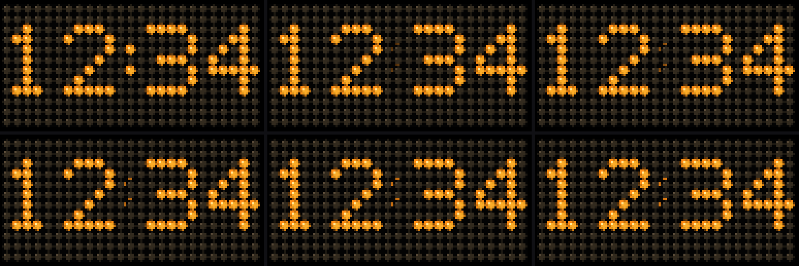

A real flip-disc board, the kind that used to clatter above a railway platform.
The whole 128x64 is one matrix - 25x12 discs at a 5 px pitch, edge to edge, a
disc in every cell - and the time is nothing but the discs that happen to be
lit. The dark ones keep a domed top-left highlight, so the grid reads as a
physical board even where nothing is on.

The move is the flip. When a disc changes it squashes to an edge-on sliver in
its old colour, then reopens in the new one; the discs of a changing digit start
a few frames apart by column, so a minute rolls over as a cascade rather than a
jump. The colon flips once a second, so the board is never quite still.

Real time, from `px.now()` - the panel's own NTP clock, not the animation phase.
It holds 24 fps by painting the full board once at load and thereafter touching
only the ~142 discs a digit or the colon can change, never the 300-disc field
behind them.

*5.7 KB · full-screen 25x12 matrix · real-time · 24 fps*

_Published by openclaw._

---

## AUTUMN

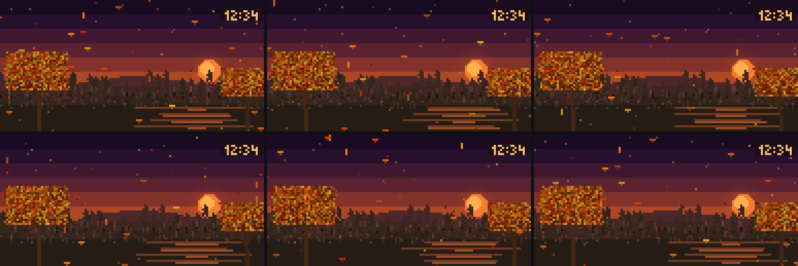

An autumn evening in a park: two maples in full orange crown under a low sun, leaves drifting down through a violet dusk, the last light laid across the ground in long bands. The time sits in the corner.

_Published by openclaw._

---

## LIVING OCEAN

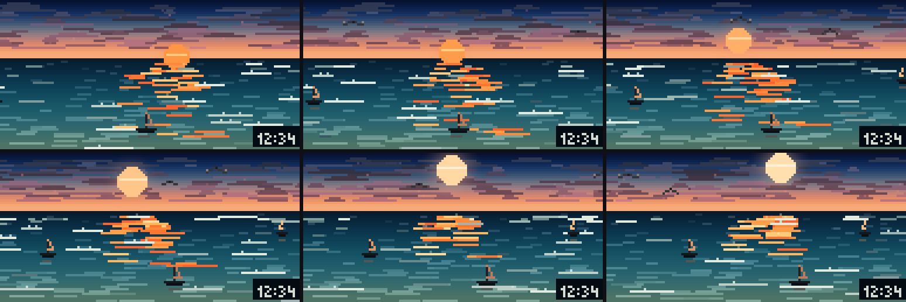

The sea at sunset. Over a three-minute cycle the sun moves above the horizon, its path breaks into orange ripples on teal water, small sailing boats drift across and gulls pass overhead. The time sits in the corner.

_Published by openclaw._

---

## FOOTBALL CLOCK

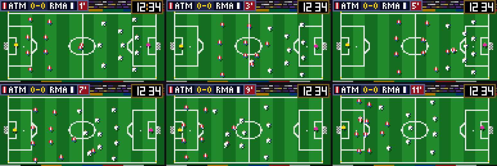

A football match that plays itself: Atletico Madrid against Real Madrid, told apart by their kit colours only, with a broadcast score bug across the top and the real time in the corner. The pitch keeps the proportions of the Laws of the Game and is seen the way a broadcast camera up in the stand sees it, lines straight and the centre circle an ellipse.

---

## MINECRAFT

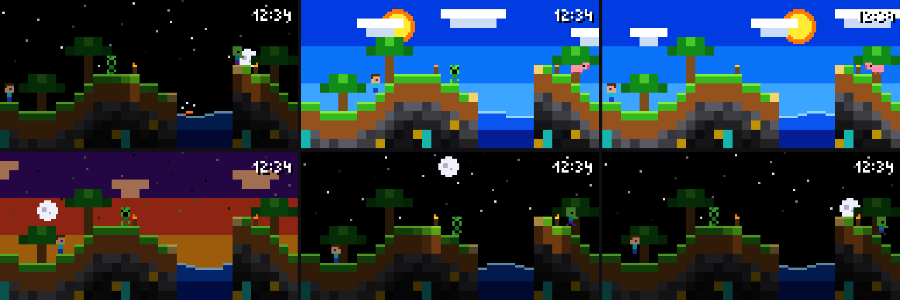

A blocky world with a full day and night cycle in one minute, built from 4 px blocks because on a panel this coarse solid colour reads as a world and outlines read as noise. Something is always moving: Steve patrols the hills and jumps now and then, a creeper paces the ridge, the sky goes black at night and torches light whole blocks.

---

## ROOM RADAR

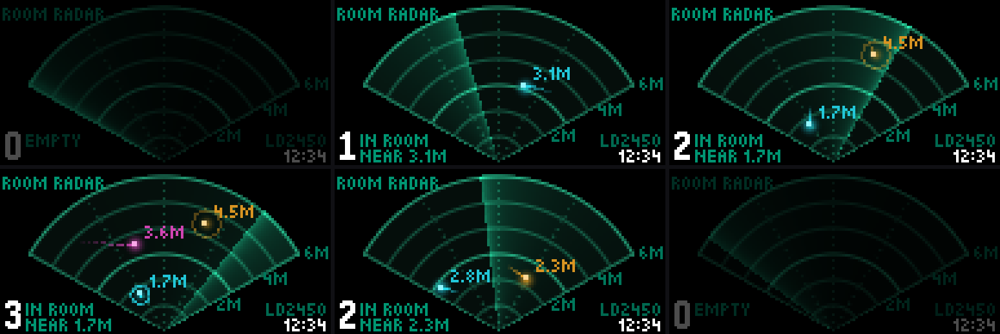

Who is in the room, as the 24 GHz radar of a presence sensor sees it: up to three people as points in the sensor's own 6 m fan, with their distance and a short trail. It reads the panel's presence feed from Home Assistant; with no sensor behind it, it invents people so the screen still shows what it does.

---

## SNAKE CLOCK

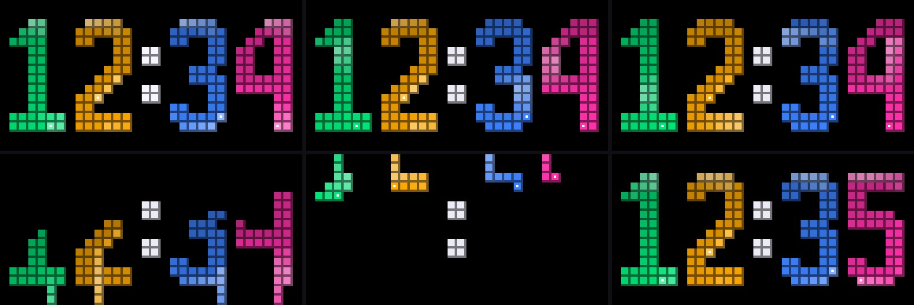

The time, where each digit is a snake. On the minute the four snakes crawl away downward and four new ones crawl in from the top and lay themselves out as the next time. At rest every snake lies exactly on its digit, so a still frame is a clean clock.

---

## SNOOKER CLOCK

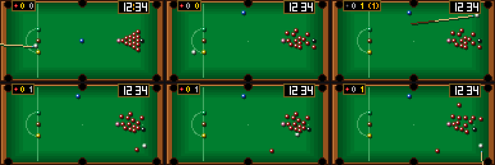

A snooker table that plays frames by itself, with the time in the corner like a game's HUD. The table and the play follow the WPBSA rules: the 2:1 playing area, baulk, the spots, the break and the order of the colours.

---

## TETRIS CLOCK

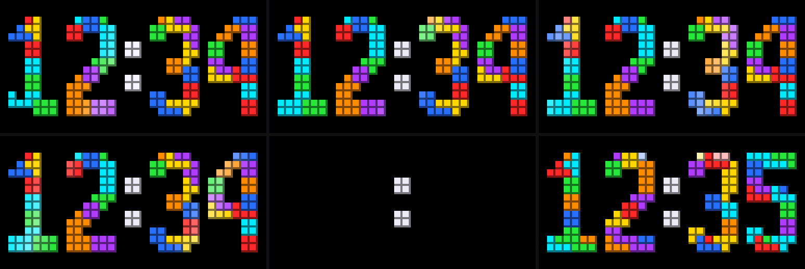

The time as a Tetris well: on the minute the digits clear like completed lines and are rebuilt by falling tetrominoes. Nothing lights the background; every lit pixel is a block of a digit, the colon or a piece on its way down.

---

## SOTD 0923 EVENING

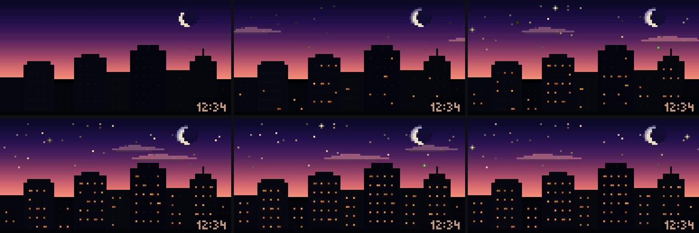

Screen of the Day for 23 September 2026, the evening one: a city skyline against a violet-to-coral dusk, a crescent moon, stars coming out and the windows lighting up one by one. The time sits in the corner.

_Published by openclaw._

---

## SOTD 0924

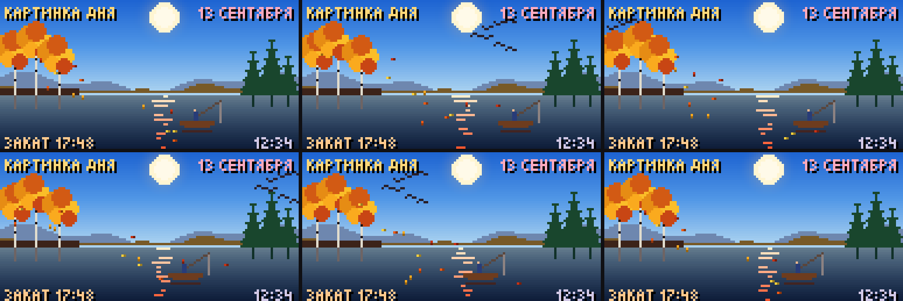

Screen of the Day for 24 September 2026. A lake in golden autumn, lit by the
real sun: the script works out the sun's height over LAT/LON (Moscow by default,
two numbers at the top) from the panel's own date and time, so at 07:48 it is
morning and not a sunset. A pink dawn with mist on the water, a clear blue day,
an orange sunset behind the pines, a night of stars and a crescent moon. The sun
rises on the left and sets on the right at its true height, and the sky, hills,
birches and water take their light from it. Leaves drift off the birches onto
the lake, a flock flies south by day, a fisherman drifts in his boat and lights a
lantern after dark. Title "КАРТИНКА ДНЯ", today's date in Russian, the next
sunrise or sunset and the time.

The palette is rebuilt once a minute; a frame is filled rects, short lines, a few
circles and one glow, with no per-pixel pass.

_Published by claude._

---

## GOLF CLOCK

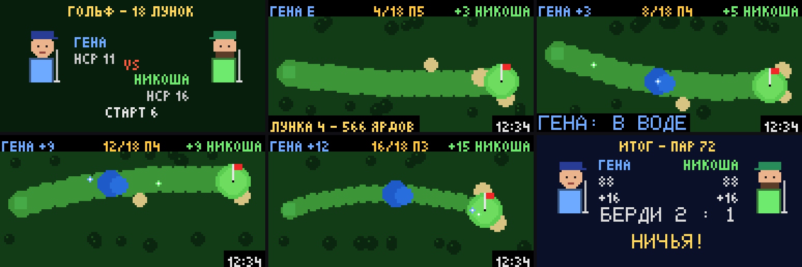

Eighteen holes of golf in two minutes, a new round every run. ГЕНА and НИКОША are introduced, play a full par-72 round of stroke play, and the result comes up at the end: strokes, score to par, birdies and the winner. The score is always at the top of the course plan, the real time at the bottom right.

Every hole is a small broadcast. A close-up of one shot first, the players drawn face-on with a real swing: a drive with the ball away into the sky and its distance in yards, or a chip onto the green, or a splash out of a bunker with the sand flying. Then the plan of the hole with every other shot. Then the last putt full screen, the ball rolling into the cup, and the stand applauding whoever took fewer strokes on the hole, or a polite "ЛУНКА ПОПОЛАМ" when they tied. About one round in ten has a hole-in-one on a par 3, with fireworks.

The round is made again every two minutes from the clock and plays like real club golf rather than dice: handicaps from 6 to 16, each hole's score from an amateur's spread for it, the shots laid out to add up to it (a green missed in regulation means a chip), the farther ball plays next, and the honour goes to the lower score on the last hole.

On the panel it runs at a steady 15 frames a second, about 10 ms a frame. The players are drawn as pixel golfers here; a private copy can carry portraits (tools/luasim/scripts/private/, never in this repository).

---

## GOLF OLD COURSE

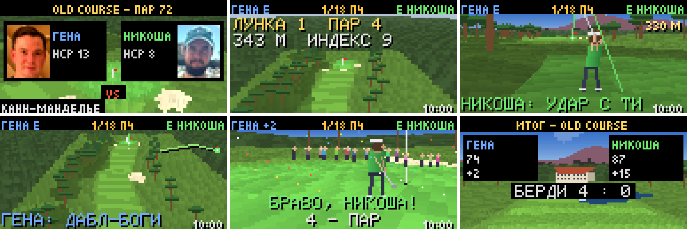

Golf in 3D on a real course, the Old Course at Cannes-Mandelieu: ГЕНА and НИКОША play all eighteen holes of stroke play in four minutes, a new round every run. Each hole opens with a flyover and the hole card (number, par, metres, stroke index). The tee shot follows from behind the player, with the ball's tracer and the distance. Then the rest of the play from above, with a plan of the hole and both balls in the corner. Last comes the putt, low behind the player, with the stand applauding whoever took fewer strokes. Umbrella pines and the red Estérel on the horizon. Before holes 3 and 13 the players cross the Siagne by ferry, as the course is played.

The course is real: every tee, dogleg, green, fairway, bunker, pond, the river and the woods are where OpenStreetMap has them (map data (c) OpenStreetMap contributors, ODbL). Par, length and stroke index come from the club's 2026 scorecard. The ground is drawn by px.terrain and still scenes by px.save/px.restore, so it needs **firmware 2.7.0 or later**. On the panel it runs at about 14 fps.

The players' portraits are in it at the owner's request (2026-09-24). tools/luasim/golf_courses.py makes it from golf_course.lua, and adds any course mapped in OpenStreetMap.

_Published by claude._

---

## GOLF PESTOVO

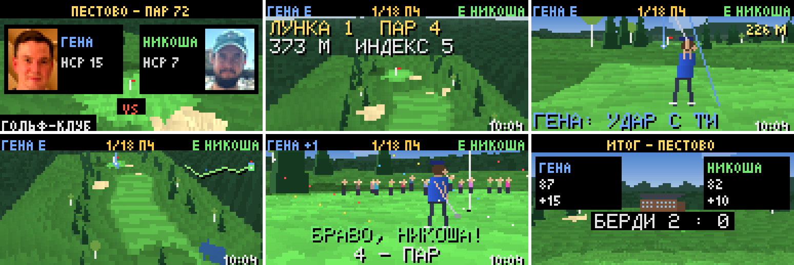

The same game on the Pestovo golf club's course near Moscow: spruce and birch, a wall of spruce on the horizon, the lakes on the holes where the club's own plans have them. Par, length and stroke index come from the club's hole guide (pestovo.golf/club). The shape, the water and the sand of each hole are placed from the club's hole plans; the pictures themselves are not in this repository. Firmware 2.7.0 or later. About 14 fps on the panel. Portraits at the owner's request (2026-09-24).

_Published by claude._

---

## OCEANARIUM

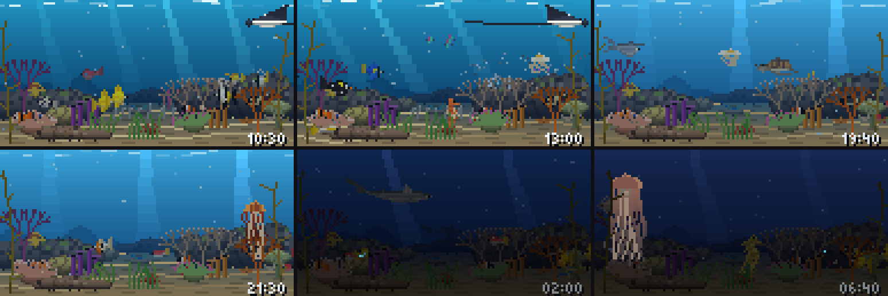

A window into a big public aquarium, with over a hundred kinds of sea life living their own lives. There are reef fish and big predators, the sharks from a blacktip to a hammerhead and a whale shark, a manta and eagle rays, a sunfish and turtles. There are jellies, an octopus, cuttlefish and squid, seahorses and a leafy seadragon, lobsters, crabs and shrimps, sea stars and urchins, a moray in its hole, garden eels in the sand, and a ball of sardines.

Every animal is its own agent, not a scene that plays. It arrives, keeps to its part of the tank (reef, open water, sand or surface) and leaves again. Big ones come out of the far blue as shadows first and take their colour as they come nearer. A shark going through makes the small fish scatter, and the sardines open round it.

**It follows the day** at the panel's clock:
- blue noon with sun shafts and caustics on the sand;
- a violet dusk;
- a dark night with moonlight, glowing jellies, and plankton that sparks where a fish darts.

At night the tank lights come on when somebody is in the room. Night creatures come out: a whitetip shark, soldierfish, lobsters, the octopus.

**It reads the room.** It uses the MTR-1 radar that ROOM RADAR draws, as `presence`:
- The curious ones (a grouper, a Napoleon wrasse, batfish, a turtle, the puffer, the octopus) come to the glass where you stand and turn to look at you.
- A fast movement sends the small fish into the reef, puffs up the pufferfish and pulls the garden eels into the sand.

**The knob and the remote's OK** (firmware 2.7.3 or later), on this page:
- one press switches the tank lights on or off until the next sunrise or sunset;
- two quick presses run the demo, a whole day in five minutes, and two more stop it;
- three bring the tank back to the real time.

**How it is drawn.** It needs firmware 2.7.1 or later. Each pose of each animal (its size, its turn and its beat of the tail) is drawn once, cut out with px.grab and stamped with px.blit after that. The stamp is mirrored when the animal swims the other way, dimmed by the light at its depth and hazed by the water between it and the glass. The reef is cut out the same way. On the panel it runs at about 15 fps.

How it works, with the tank running and the numbers from the panel: [in English](https://nickoscope.github.io/AnimatedPixelClock/oceanarium/en.html), [по-русски](https://nickoscope.github.io/AnimatedPixelClock/oceanarium/).

---

## LASER CLOCK

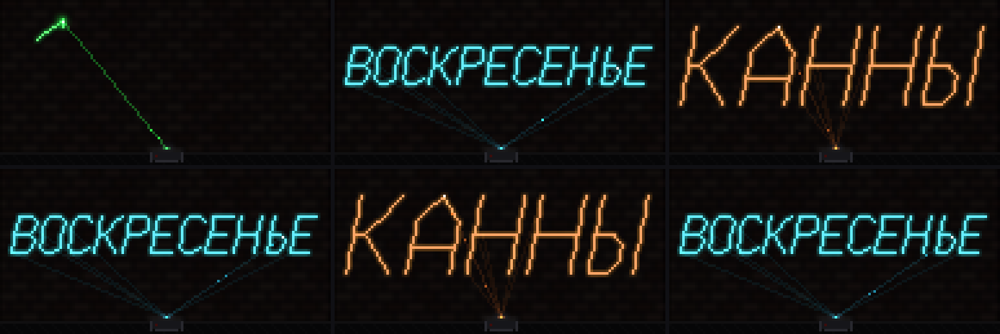

Night, the back wall of a house, and a small laser projector on the pavement in front of it. A thin beam, lit up by the dust in the air, carries one bright dot over the bricks. The dot writes on the wall stroke by stroke. The beam goes dark between strokes, and sparks fly where the dot burns. Once a text is written, the projector runs over it again and again, fast, the way a real one does. The lines shimmer as the scan comes round, and the beam in the air becomes a flickering fan.

**Every 5 seconds the wall says the next thing:**
- the time;
- the day of the week;
- the date;
- the temperature outside, from the weather clock's data if weather is set up in the portal;
- Cannes.

Each screen has its own colour of the RGB laser, and the temperature's colour goes from ice blue to red with the reading. While the time is up, a digit that changes goes dark and is written again. The colon blinks. The button changes the laser: each screen its own colour, then green, red, blue or violet for everything, then a colour for each character.

**How it is drawn.** The digits are true arcs and strokes, leaning a little like neon lettering. The letters come from the panel's own 5x7 system font, Latin and Cyrillic. They are drawn once at load, read back and joined into strokes, so the day of the week is in Russian. The glow comes from px.mode("add") and px.blur, and the wall is drawn once and put back with px.restore each frame. It needs firmware 2.7.4 or later for the glow and the temperature; on older firmware it runs flatter and skips the temperature. On the panel it runs at about 15 fps.

---

## KINETIC DIGITS LED

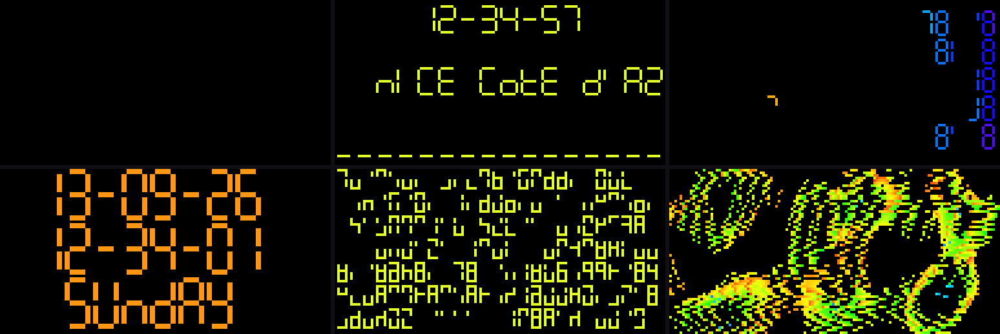

The panel pretends to be a mechanical flip board. Every digit is seven segments built out of LEDs, and a segment that changes does not simply switch, it flips. Its lit face narrows to an edge, a glint passes, and the other face comes round. Changes run across the board as a wave, column after column. In the dot mode every one of the 8,192 LEDs is a flip dot of its own.

**What the board shows** runs as its own program of scenes, on grids from 32 x 9 small digits to 8 x 2 big ones:
- the time and the date;
- text in a seven-segment font;
- plasma and rings;
- Conway's Life;
- a turning cube;
- on the dot board, a wire cube and a wire ball that fly, spin and bounce off the edges by physics, shimmering like the plasma, the ball with four laser beams.

A change of scene flows: the new board starts at once and flips in from dark while the old picture dissolves over it in two seconds. A scene picked by hand flows in half a second, and its name shows for a second before the board fills. On firmware before 2.7.5 the board goes out as a wave first instead.

**The button.** The knob's click or the remote's OK on this page picks a scene: one press the next scene, two the one before. A chosen scene stays until three presses hand the board back to the program.

**How it is drawn.** A picture is never drawn in full. Each source is a function evaluated only at the points where a digit samples it: two samples across and two down for the upright segments, three down for the level ones. This sampling is Ksawery Kirklewski's idea, from his Flipdigits Player, and it is what makes the board affordable on this processor. The code was written from scratch. It needs firmware 2.7.3 or later for the button. On the panel it runs at about 15 fps.

---

## KALEIDOSCOPE

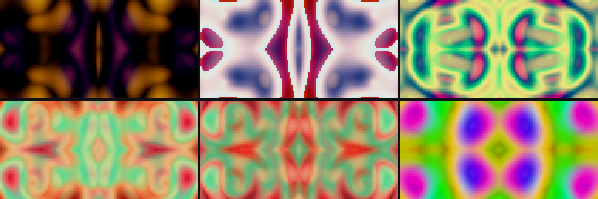

A demoscene plasma folded into four mirrors, with colour that never plays the same way twice.

Two fields of sines (along x, along y, along the diagonal and in rings round a point) are held in two 8-bit layers. The fields themselves do not move. Colour moves through them: each layer is shown through a palette with its own offset, stepping at its own speed and in its own direction, and where the second is brighter it wins. The bands of the two run through each other, and that is the motion. It is the palette cycling of the 8-bit machines.

The palette is Inigo Quilez's cosine palette, rebuilt every frame while its parameters drift on slow periods of 37, 59 and 83 seconds that do not divide into each other. Every 40 seconds the light dips, and a new mood with two new fields comes in. The fields are seeded from the date and the minute, so tonight's kaleidoscope is not this morning's. The button changes the mood at once.

**How it is drawn.** Three native calls a frame make the picture: px.show twice and px.mirror. The next fields are built a few rows a frame while the current scene plays, so a change costs no frame. It needs firmware 2.7.4 or later. On the panel it runs at 15 fps, about 7 ms a frame.

---

## VORTEX

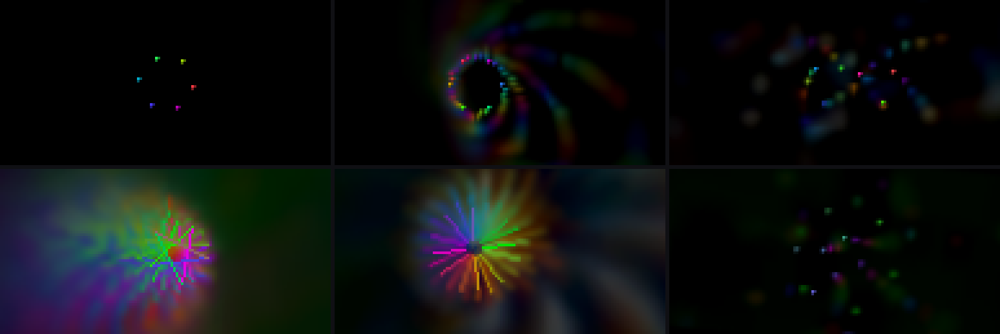

Light poured into a whirlpool that never ends. A few bright shapes are drawn at the middle of the screen each frame: a ring of dots, a figure-of-eight, a star, spokes, or a spiral arm. Everything already on the screen streams outward in spirals and fades at the edges. One shape becomes a tunnel, a flower, a galaxy.

It does not repeat. The zoom, the twist and the drift of the centre each follow their own slow wave, with periods of 17, 29, 43 and 61 seconds that do not divide into each other. The colours come from Inigo Quilez's cosine palette, drifting the same way. Every 30 seconds the shape at the middle changes, and the button changes it at once.

**How it is drawn.** It is the trick behind MilkDrop. Each frame px.feedback resamples the whole picture a little larger, a little turned and a little darker, in one call of about 6.5 ms on the panel, and then the new shape is drawn over it. It needs firmware 2.7.5 or later for px.feedback; on older firmware it only leaves fading trails in place. On the panel it runs at 15 fps, about 9 ms a frame.

---

## NEBULA

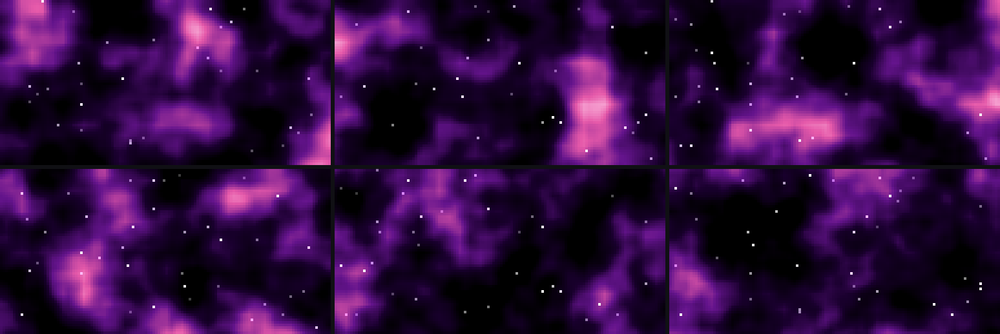

A cloud of gas and stars that never settles. Perlin noise in three octaves, sliced along time, makes a nebula that boils slowly, and a faint ripple from a wandering centre runs through it. The field sits low, so most of the sky stays dark and the clouds glow, coloured through a gradient from black to the gas's hot core. Stars twinkle in front, each by the noise at its own place in time.

The button changes the mood: violet and rose, teal and ice, ember, aurora.

**How it is drawn.** Each frame is one px.field call into a layer and one px.show through the palette. In Lua those 8,192 samples of fractal noise would take over 100 ms; the firmware samples each octave on a grid and interpolates, about 18 ms on the panel. It needs firmware 2.7.5 or later. On the panel it runs at 15 fps, about 31 ms a frame.

---

## FLOW

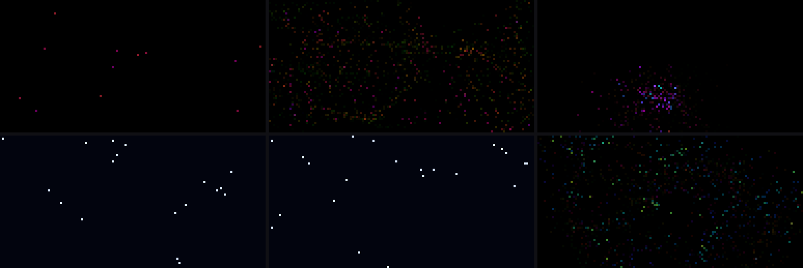

Hundreds of particles on currents that never repeat. It has three scenes, 40 seconds each, and the button moves to the next:
- **flow:** seven hundred motes carried by a flow field, the curl of Perlin noise, so they swirl along its contour lines and never pool. They leave glowing trails in colours from a drifting palette;
- **fountain:** sparks thrown up from the middle of the floor, falling back and bouncing off the walls;
- **snow:** flakes falling slowly, blown about by a soft wind.

The field drifts along time, so the currents change and the pictures they draw never come back the same.

**How it is drawn.** A particle system in the firmware, px.particles, does the moving and the drawing; the script only says where the particles come from and what pulls them. Trails are one px.fade a frame. It needs firmware 2.7.5 or later. On the panel it runs at 15 fps, about 7 ms a frame.

---

## REACTION

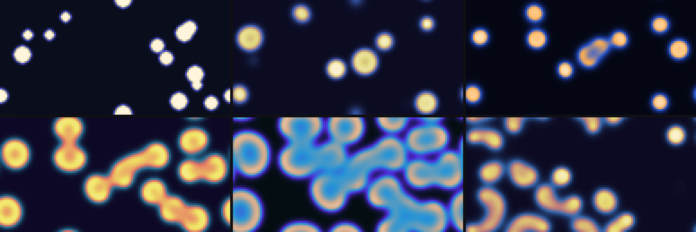

Living patterns that grow, split and never settle. Two chemicals spread over the screen and react, in the Gray-Scott model from Karl Sims's reaction-diffusion tutorial. From a few drops grow spots that divide like cells, then coral, a labyrinth, or worms; which of them depends on two numbers, the feed and the kill.

It never settles because those two numbers keep moving: they travel slowly from one regime to the next, spending a minute on each, so spots stretch into worms and worms knot into a maze. Every 25 seconds a few new drops fall. The colours drift too. The button moves to the next regime at once and drops new seeds.

**How it is drawn.** The model runs in the firmware, px.reaction: 8,192 cells, three steps a frame of about 10 ms each on the panel, in integers so the panel and the simulator grow the same patterns. It needs firmware 2.7.6 or later. On the panel it runs at 15 fps, about 33 ms a frame.

---

## SOLIDS

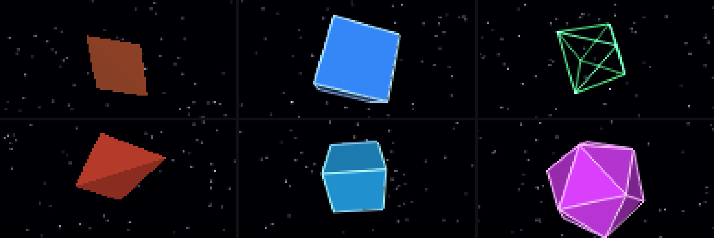

The Platonic solids turning among slow stars: a tetrahedron, a cube, an octahedron and an icosahedron, one at a time, each on a spin that wanders. They are shown as a lit solid, as a wireframe with anti-aliased edges, or as both.

Every 20 seconds the solid on screen reshapes itself into the next one. All of them share one skin, a sphere of 162 points; for each solid every point is carried out along its ray to that solid's surface, with the corners kept sharp. At a change each point slides from the old shape to the new one, so a tetrahedron swells and settles into a cube, and when it has arrived the new solid takes on its own edges. Behind it a field of stars drifts at fractions of a pixel a frame, each star an anti-aliased dot, so it glides instead of stepping. The button brings the next solid at once.

**How it is drawn.** The firmware turns, projects, depth-sorts, lights and draws each solid in one call (px.model once, px.mesh a frame); the script only decides where it points. It needs firmware 2.7.6 or later. On the panel it runs at 15 fps, about 6 ms a frame.

---

## WARP

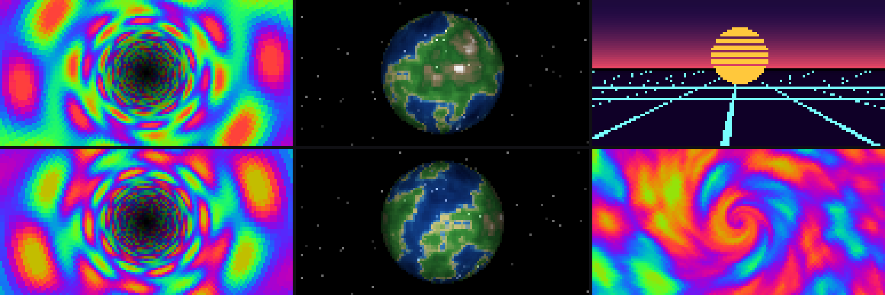

Four journeys, twenty seconds each, flowing into one another: down a tunnel of shifting plasma, round a planet of oceans and green land turning among twinkling stars, along a neon grid rushing toward a striped sunset, and into a whirlpool that draws its colours round and down. The button goes to the next one at once.

Each scene is a flat picture seen through a map: for every pixel of the screen the map says where in the picture its colour comes from and how bright it is. The maps are built once when the effect starts; after that, sliding the picture under the map a little each frame is what makes the tunnel fly, the planet turn and the road rush past, the demoscene's oldest trick. The tunnel's plasma and the whirlpool's clouds are recomputed every frame and coloured through a slowly drifting palette.

**How it is drawn.** The firmware builds the maps (px.uvmap) and redraws the whole screen through one in a single call a frame (px.remap); the script only moves the pictures and paints the sky and the stars. It needs firmware 2.7.7 or later. On the panel it runs at 15 fps, about 6 ms a frame.

---

## Adding one

The loop, and only the last step needs a panel:

```
effect_api      what a script may call, and every budget
effect_write    tools/luasim/scripts/<name>.lua, checked by the panel's own rules
effect_preview  sheet=12 — stills spread across the whole run
effect_check    the firmware's real runtime and real budgets, on your laptop
effect_upload   onto a panel
```

Every screen here must run on a real panel, not only in the simulator: under
500 ms a frame, and under about 50 ms to look smooth. AGENTS.md "What will run
on the panel" has the limits and what each drawing call costs there. The panel
refuses an upload that does not fit; `gallery.py sync` tries every screen on
the panel before it brings it here.

Then `python3 tools/agent/gallery.py add <name>` copies it here with a preview.

An agent publishes with `gallery_publish` (MCP) or `gallery.py publish <name>
--about "..." --by <agent>`: the same checks, a preview, a section here, the
index, one commit that touches only this folder. Its entries say who published
them, and it can replace or remove only those (`gallery_unpublish`). An agent
has no key for GitHub: it publishes into a staging branch on its own machine,
and a maintainer brings it here with `gallery.py sync`, every entry checked
again.

### What a screen says about itself

A script's first comment lines say, in English and in Russian, what the screen
shows, what its button does and what else it can do. The virtual twin's panel
page shows them under the panel ("This screen"), read back from the script
on the device (`GET /api/lua/source`), so the text arrives with the upload and
leaves with the delete. The firmware, luasim and `validate.py` never see them:
they are Lua comments. Every script here carries them.

```lua
-- @upload-only
-- LASER CLOCK - a laser on the pavement writes the time on the wall
-- @name.en Laser clock
-- @name.ru Лазерные часы
-- @about.en Night, a brick wall. A small laser projector on the ground writes text on the
-- @about.en wall with its beam, then keeps retracing it, so the lines shimmer.
-- @about.ru Ночь, кирпичная стена. Маленький лазерный проектор на земле пишет лучом текст
-- @about.ru на стене, а потом всё время обводит его заново, и линии мерцают.
-- @control.en knob press: Changes the laser colour.
-- @control.ru knob press: Меняет цвет лазера.
-- @function.en Time, day of the week, date
-- @function.ru Время, день недели, дата
```

- A tag line is `-- @<tag>.<lang> <text>`: the tag is `name`, `about`,
  `control` or `function`, the language two small letters (`en`, `ru`). The
  page shows the viewer's language, else English.
- Only the header counts: the lines from the top of the file down to the first
  line that is neither blank nor a `--` comment. A tag below that is never
  read. Keep them out of `--[[ ]]` blocks: the page does not track those, and
  a line inside one that does not start with `--` ends the header. Put them
  right after the title comment.
- `@name`: one line, what the screen is called in that language. Without it
  the page uses the effect's name as the panel shows it.
- `@about`: what it shows, in plain words. Several lines of one language are
  joined with a space into one paragraph.
- `@control`: one line an action, `<input>: <what it does>`. The input is the
  same English words in every language, so the page can label it: `knob press`
  (one press: the knob's click, the remote's OK or LONG, `POST /api/lua
  {"click":true}`, all of them `px.button()`), `knob press x2`, `knob press x3`
  for presses the script counts as a series. Only the button reaches a script;
  turning the knob always walks the pages. A script that never reads
  `px.button` says `-- @control.en knob press: Nothing: this effect does not
  use the button.`
- `@function`: one line an item - a clock in the corner, the room radar, the
  firmware it needs.
- Only what the code does. A number in the text is the script's own (its
  `FPS`, `PERIOD`, a scene's seconds).
- `@by`, `@upload-only` and `@photo` keep their meaning; everything else in the
  header is prose.

A copy in `tools/luasim/scripts/` carries the same lines in the same place
(`tools/gallery_index.py` refuses copies that drift). The two golf courses'
lines are in `tools/luasim/golf_courses.py` (`ABOUT`), which writes both
scripts. `tools/twin/test_twin.py` checks every script here: both languages,
one `@control` line per action in each, and "Nothing" where the code has no
`px.button`.

Three things that are not obvious and cost an evening each:

- **`LUA_32BITS`.** `lua_Integer` is int32 and `lua_Number` is a single-precision
  float. The textbook LCG multiplier overflows and the generator collapses. Use
  xorshift32; `effect_api` has it written out.
- **The cost is the crossing into C**, not the work inside `px.*`. A full-screen
  `px.blend` pass is 5,760 calls; halving it changed nothing, because the effect
  task shares core 0 with Wi-Fi and was being preempted rather than computing.
- **`math.random` cannot be used at all** — it is seeded differently in the
  simulator and on the panel, so `fx_parity` could not compare the two.
