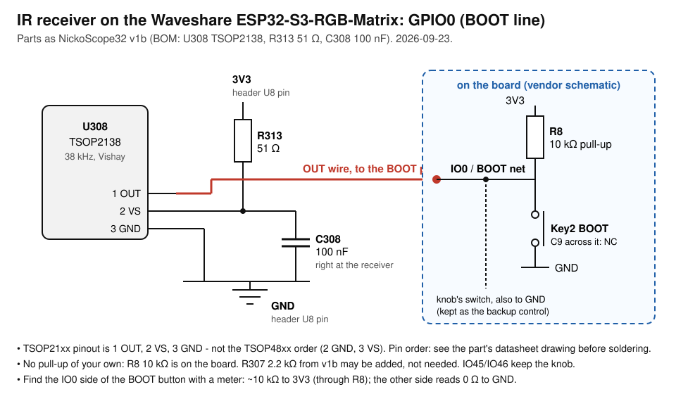

# The infrared remote

The panel is driven by one EC11 knob today. The owner's plan is to retire it and
drive the same gestures from a remote, so this module does not invent a control
scheme: it produces what the knob produces - detents and a button level - and
hands them to the encoder's own state machine. Click, long press, browse, enter:
one implementation, not two that drift.

Ported from NickoScope32's ADD-79 (`ir_remote.{h,cpp}`, v33.55.0). What came
across: learned codes rather than hard-coded ones, NVS so a remote survives a
reflash, and a simulator that injects a slot at the level a real frame reaches.
What is ours: the rules are plain C++ in `ir_map.h` and tested on the host, the
receiver is a separate flag so a build can carry the module with no library and
no heap, and the seam is the encoder's sampling task rather than `loop()`.

## Flags

| Flag | Needs | In |
|---|---|---|
| `IR_ENABLED` | nothing | `matrix-waveshare-rgb` |
| `IR_RX_ENABLED` | `IR_ENABLED` (`#error` otherwise), and a free pin | **not set yet** - no receiver is soldered |

`IR_ENABLED` alone gives the decoder, the learned map, the portal card, the
serial console and the seam. `IR_RX_ENABLED` adds IRremoteESP8266 and the GPIO.
A build that asks for the receiver while `CONTROL_ENCODER_ENABLED` holds the same
pin is refused at compile time - that is the whole point: the remote takes the
knob's place, it does not sit beside it.

`tools/flag_matrix.py` builds four rows: the module alone, the module with the
receiver, and two that must be refused (the receiver with the knob, the receiver
without the module).

## Files

| | |
|---|---|
| `ir_map.h` | the ten buttons, the function list and the approved default layout, the learned map, and the state machine: frames in, detents, a button level or an action out. No Arduino, tested on the host |
| `ir_actions.cpp` | what a button does when it is not the knob: each action calls what the matching HTTP route calls |
| `ir_console.h` | the serial grammar: one line in, one command out. Tested on the host |
| `ir.cpp` | the receiver, NVS, the serial console, `/api/info`, the portal's handlers |
| `../control/control.cpp` | the seam: two places inside the 1 kHz sampling task |
| `../../tools/ir/check_ir.py` | the host test - 263 checks over the rules and the grammar |

## The hardware: GPIO0, the BOOT line (since 2026-09-23)



The receiver sits on **GPIO0**, beside the knob: IO45/IO46 keep the knob as the
backup control, and GPIO0 carries the BOOT button, the knob's switch and the
receiver at once - all three only ever pull it low. The vendor schematic's
reset/boot circuit gives the line **R8 10 kOhm to 3V3** and leaves **C9 across
the button unfitted**, so an open-collector receiver needs no resistor of its
own and nothing smears its pulses. It idles high, which is also the normal-boot
level of this strapping pin.

Parts, as on NickoScope32 v1b (its BOM): **U308 Vishay TSOP2138** 38 kHz
(LCSC C7128385), **R313 51 Ohm** in series with VS from 3V3, **C308 100 nF**
from VS to GND at the receiver. v1b's R307 2.2 kOhm pull-up is not needed here.
TSOP21.. pins are **1 OUT, 2 VS, 3 GND** (TSOP48.. differs).

How a press is told from IR on the shared line: `src/control` counts the
switch as pressed only after it has been low for CTRL_SW_DEBOUNCE_MIN_MS,
40 ms, while the receiver shares the pin. The longest mark any protocol the
library knows is the Hitachi AC424 air conditioner's 29.8 ms leader
(ir_Hitachi.cpp), so an air conditioner's remote cannot click the knob. A remote pressed during a reset can land the chip
in download mode; another reset recovers. Knowledge base: docs/24-ir-remote.md.

## The earlier plan: IO45

**There is no free GPIO on this board.** The expansion header U8 is four pins -
IO45, IO46, GND, 3V3 - and the knob holds both signals (`src/control/control.cpp`
has the sources; the vendor pin table gives IO10 to RTC_INT and IO13 to IMU_INT,
and neither reaches the header). So the receiver's default pin is **IO45, the
knob's own**, and the two cannot be built together.

A Vishay receiver's OUT is an open collector with a **30 kOhm pull-up inside the
package** (datasheet 82459 rev 2.4, block diagram), supply 2.0 to 5.5 V, so 3V3
from the header is in range. But this board pulls IO45 and IO46 **down** with
10 kOhm (schematic R59, R60). Those two divide:

| | |
|---|---|
| idle line, as wired | 3.3 x 10 / (30 + 10) = **0.83 V** |
| what the ESP32-S3 needs to read a one | 0.75 x VDD = **2.48 V** |
| with an external 2.2 kOhm from OUT to 3V3 | 3.3 x 10 / (10 + 2.05) = **2.74 V**, and 1.6 mA sunk when the receiver pulls down, inside its 5 mA rating |

**CALCULATED, NOT MEASURED.** It is the first thing to put a meter on when the
receiver is soldered: with no pull-up the line would sit low for ever and the
decoder would see one endless burst. The datasheet's own application circuit
also asks for a series resistor and a capacitor on Vs "in case there are strong
ripple or spikes on the supply line" - next to a HUB75 panel switching amps,
fit them.

Pick a 38 kHz part (TSOP4838 / TSOP2238 and relatives): the NEC format the
owner's remote uses is a 38 kHz carrier (Vishay application note 80071 rev 2.3).

## The timings, and where they come from

Vishay application note 80071 rev 2.3, "Data Formats for IR Remote Control",
THE NEC CODE: a frame opens with a 9 ms leader and a 4.5 ms pause, and a held
key repeats **in a 108 ms time slot**. Everything else follows from that number:

| | | |
|---|---|---|
| `kHoldMs` | 250 ms | the button is released once frames stop. It outlives one dropped repeat (2 x 108 = 216 < 250) and not two |
| `kRepeatFreshMs` | 200 ms | a NEC repeat carries no code, so it extends the last slot - but only while that slot is still the one being held |
| `kRotAccMax` | 3 detents | the seam drains at 1 kHz, so this only fills if the sampling task is starved; better to drop the excess than to spin the display after the remote stopped |
| `kLearnWindowMs` | 15 s | long enough to pick the remote up and aim it |

## Learning

Codes are not hard-coded: each slot is learned from whatever remote is in the
room, and the map lives in its own NVS namespace (`irmap`), so it survives a
reflash and a new remote is re-learned instead of recompiled. One physical code
lives in one slot only - learning it again moves it, and the move is reported.

**Known limit, carried over from the port:** RC5 and RC6 remotes put a toggle
bit in the code that flips on every press, so such a remote would answer every
other press. NEC - the owner's - does not. Masking the bit per protocol is
queued, not done.

## Testing it without hardware

`ir_sim` is not a debug hook bolted on the side: it enters at exactly the level
a decoded frame does, so the seam, the encoder's state machine and every page
are exercised. On the serial port at 115200:

```
ir                         what the module knows: pin, receiver, the ten buttons
ir help                    the commands and every function's name
ir cw 3                    three detents clockwise - the display should browse
ir ccw                     one back
ir ok                      a click
ir ok 1200                 held past the encoder's 1 s threshold: a long press
ir do bright_up            any function, no button needed (`ir do page 20`)
ir press 5 [ms]            button 5, whatever it is set to
ir fn 5 vol_up             what button 5 does (`ir fn 10 page 20`)
ir learn 3                 open the window, then press button 3 on the remote
ir cancel
ir clear 3 | ir clear all  forget codes; the functions stay
```

Nothing else in the firmware reads `Serial` while `loop()` runs - the Improv
window in `src/network` closes before it begins - so these lines cannot collide
with anything. Lines that do not start with `ir` are left alone.

The portal's Remote card does the same over HTTP, one row per button with a
Learn button, the learned code, a drop-down of functions and Test:
`GET /api/ir` (the table and the functions this build offers),
`/api/ir/press?btn=N[&hold=ms]`, `/api/ir/do?fn=name[&page=N][&hold=ms]`,
`/api/ir/fn?btn=N&fn=name[&page=N]`, `/api/ir/learn?btn=N`, `/api/ir/cancel`,
`/api/ir/clear?btn=N|all`. Every one answers with the table.

## The buttons and what they can do

Owner's list and default layout, approved 2026-09-23:

| Button | Default | | Function | Held |
|---|---|---|---|---|
| 1 | Back (turn left) | | `ccw`, `cw` - the knob's turn | once per press |
| 2 | Forward (turn right) | | `ok` - the knob's press | held while frames arrive |
| 3 | OK | | `long` - a long press | once per press |
| 4 | Long press | | `power` - screen on/off | once |
| 5 | Screen on/off | | `bright_up`, `bright_down` - 10 %, never below 1 %; kept across a reboot | once per press |
| 6 | Brightness +10 % | | `home` - the clock page | once |
| 7 | Brightness -10 % | | `next_style` - the next clock style | repeats |
| 8 | Home: the clock | | `carousel` - on/off | once |
| 9 | Carousel on/off | | `ambient` - the screensaver on/off | once |
| 10 | Play/pause | | `page` - a chosen page (by number, as /api/panel lists them) | once |
| | | | `media_toggle`, `media_next`, `media_prev` - through Home Assistant | once |
| | | | `vol_up`, `vol_down` - the media page knob's step | repeats |
| | | | `dismiss` - clear the notification; `none` | once |

The arrows and brightness step once per press, however long the button is
held: the owner's word on 2026-09-23 after trying it, when repeats walking the
pages like the knob took one press from the clock to page 22. Brightness set
from the remote is saved to NVS (one key, "brightness" in `pcmonitor`) 3 s after
the last press, so a row of presses is one write; `/api/info` reports
`brightnessNvs` and `brightnessLastSave`. A held repeating action (next style,
volume) fires on the press, then after 500 ms at most every
300 ms (our choice: about three steps a second instead of nine from NEC's
108 ms repeats). A function whose module is not in the build is not offered.
Deliberately not on the list: reboot, factory reset, firmware update (too
easy to press by accident), and the microphone visualizer (off until its
hang is understood). Codes and functions are in NVS namespace `irbtn`.

## Cost

| | |
|---|---|
| internal heap, module only | the decoder is one static object: the map, the counters and a 96-byte line buffer |
| internal heap, with the receiver | ~1 KB: 256 raw samples of `uint16`, and `save_buffer` makes two such buffers. The library's default 1024 would cost ~4 KB, and internal heap is the scarce resource here (docs/22 §12.3) |
| a hardware timer | IRremoteESP8266 captures on one (`timerBegin`). Nothing else in this firmware uses a hardware timer - the knob samples on an `esp_timer`, which is a software timer on the same counter group but allocated by the RTOS, so the two do not fight |
| flash | nothing. The library is listed in `lib_deps`, so PlatformIO *compiles* it into an archive, but with `IR_RX_ENABLED` off nothing references it and the linker keeps none of it. **Measured 2026-09-16:** `xtensa-esp32s3-elf-nm` finds 0 `IRrecv`/`IRsend`/`decodeNEC` symbols in `firmware.elf`, and the image grew only by the portal card |

## What is not done

- **The receiver has never run.** No TSOP is soldered; everything below the
  decoder is verified by the host test and the simulator only.
- `page` stores a page by its number, and numbers follow the build and the
  user cards: a button set to a page may point elsewhere after a firmware with
  different modules.
- The RC5/RC6 toggle bit, above.
