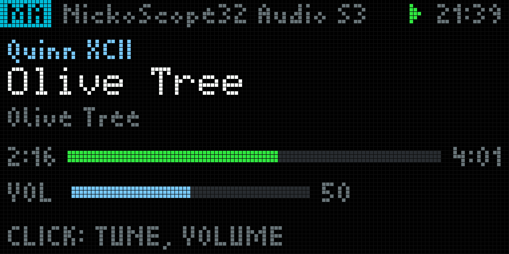
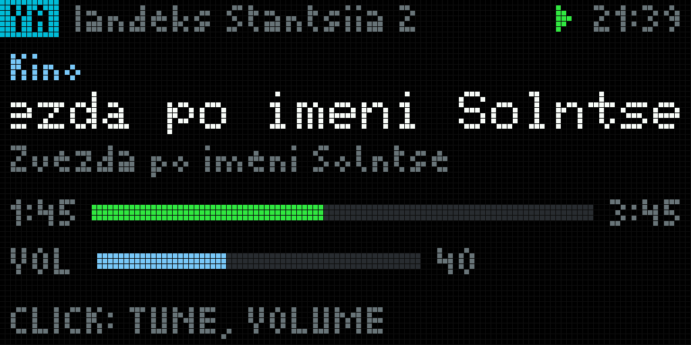

# Media player, phase 1: now playing and a remote

A Home Assistant or Music Assistant player on the 128 x 64 panel, and a remote
for it, over the MQTT bus. **No audio on the panel** in this phase. Design:
`docs/17-media-player.md` in the knowledge base, sections 3.1 (the
`MEDIAPLAYER_ENABLED` half), 3.5, 4 (option a) and 6. The local radio
(`MEDIAPLAYER_RADIO_ENABLED`, phase 2) is not built: that flag refuses to compile.

```
Home Assistant ── AppDaemon app matrix_media ──MQTT──► panel: state, players, favs, ha
      ▲              (tools/media/appdaemon)   ◄──MQTT── panel: select (retained), cmd
      └── media_player.* / music_assistant.play_media
```

## Flags

| Flag | Needs | In |
|---|---|---|
| `MEDIAPLAYER_ENABLED` | `MQTT_BUS_ENABLED`, `CONTROL_ENCODER_ENABLED` (`#error` otherwise) | `matrix-waveshare-rgb` |
| `MEDIAPLAYER_RADIO_ENABLED` | - | refuses to build: phase 2 |

Build-time values in `media.h`, each a design choice and named as one:
`MEDIA_STALE_S` 150 (two and a half of the app's 60 s keepalives),
`MEDIA_TUNE_REST_MS` 1200 and `MEDIA_VOL_STEP` 2 (docs/17 3.5),
`MEDIA_VOL_SEND_MS` 250, `MEDIA_OVERLAY_MS` 1600 (docs/17 6).

## Files

| | |
|---|---|
| `media_model.h/.cpp` | payload model and validation, UTF-8 bounds, transliteration, track key, progress, command payloads. No Arduino: tested on the host |
| `media_ha.cpp` | topics, ingest, the selection, commands and volume coalescing, NVS, `/api/media`'s content |
| `media_page.cpp` | the page, the knob inside it, the screens |
| `../web/web_panel.cpp` | `/api/media`; the card in `web_panel_page.h` / `web_panel_js.h` |
| `tools/media/` | host test, preview renderer, samples, the AppDaemon app and its test |

## MQTT

Everything under `nickoscope_matrix/<dev>/media/`. **`<dev>`** is the last
three bytes of the panel's Wi-Fi station MAC in lower-case hex, the same six
digits as the broker client id `apc-XXYYZZ`: stable across renames, different
per panel. It is on the portal (Panel > Media > Diagnostics > topics), in the
boot log (`[media] topics nickoscope_matrix/a1b2c3/media/{...}`) and on the
OFFLINE / WAITING screens (`DEV a1b2c3`).

The panel subscribes once to `.../media/+` (its own `cmd` and `select` come
back and are ignored). `mqtt_bus` now holds eight handlers and eight
subscriptions; with every page built in, six of each are in use.

| Topic | Retained | From | Payload |
|---|---|---|---|
| `state` | yes | app | the followed player, below |
| `players` | yes | app | `{"v":1,"ts":…,"sel":"media_player.x","list":[{"id","name","st"}]}`, at most 8 |
| `favs` | yes | app | `{"v":1,"ts":…,"list":[{"id":"library://radio/2","name":"101 SMOOTH JAZZ"}]}`, at most 16 |
| `ha` | yes | app (its MQTT will) | `online` or `offline` |
| `select` | yes | panel | `{"v":1,"player":"media_player.x"}` |
| `cmd` | no | panel | `{"v":1,"cmd":…,"player":"media_player.x"[,"value":…][,"id":…]}` |

`state`:

```json
{"v":1,"ts":1789414780,"player":"media_player.nickoscope32_audio_s3","name":"NickoScope32 Audio S3",
 "src":"MA","st":"playing","kind":"music","title":"Olive Tree","artist":"Quinn XCII","album":"Olive Tree",
 "vol":50,"muted":false,"pos":56,"pos_at":1789414720,"dur":241,"err":"NOT_MA"}
```

| Field | Rule on the panel |
|---|---|
| `v` | must be 1 |
| `ts` | required, epoch seconds ≥ 1e9: when the app last confirmed the state |
| `player` | `""` (follows none) or `media_player.` + `[a-z0-9_]`, at most 63 characters |
| `st` | `playing` `paused` `idle` `off` `unavailable`; required with a player |
| `kind` | `music` (default) `radio` `tts` |
| `name` `title` `artist` `album` | strings; cut to 47 / 127 / 95 / 95 bytes at a whole code point |
| `src` | up to four of A-Z 0-9 (default `HA`): the tag's text |
| `vol` | whole number 0-100, or absent (not reported) |
| `muted` | boolean |
| `pos` `dur` | whole seconds 0-604800; `pos_at` epoch of the position anchor |
| `err` | up to sixteen of A-Z 0-9 _: the app's last refused command |

A field of the wrong type refuses the **whole payload** and what is on screen
stays; so does an empty (cleared) retained topic. List entries that fail are
dropped and counted (`dropped`). Payloads stay under 1900 B, which leaves room
for the topic and header in the bus's 2048 B buffer; the app shortens strings
or drops entries to keep there. JSON strings may be UTF-8 or `\u` escapes.

Commands (`cmd`): `toggle` `play` `pause` `next` `prev`; `vol` with `value`
0-100; `vol_step` with `value` -20..20, not 0; `mute` with `value` true/false;
`play_fav` with `id` from the last `favs`; `select` with `player` (the panel
itself uses the retained `select` topic, so the app learns the choice after
its own restart). The app acts only on the player it follows and only if that
player is in its `players` list.

**Staleness.** The app sends `state` on real changes and again every 60 s.
The panel calls it stale when `ts` is older than 150 s by its NTP clock (by
arrival time without a clock, or when the clocks disagree by five minutes).

**New track.** A key over player, title, artist and album. The same retained
payload delivered again after a reconnect, or a keepalive, has the same key and
triggers nothing; a different key turns the title amber for 3 s and restarts
its scroll.

**Volume from the knob** goes as one absolute `vol` at most every 250 ms, the
newest value only, and as coalesced `vol_step` when the player reports no
volume (an absolute guess could be loud).

## The page



Header: source tag (cyan music, orange radio, magenta TTS), player name, state
icon, clock. Then artist, the title in the large font (scrolls when wider than
the panel), album, progress extrapolated as `pos + (now − pos_at)` and never
past `dur` (radio: a red LIVE), volume bar, a hint. Screens:

| Screen | When |
|---|---|
| OFFLINE, `MQTT BROKER` | the bus is not connected (the line says NO WIFI, CONNECTING or NO BROKER) |
| OFFLINE, `HOME ASSISTANT APP SAYS IT IS OFFLINE` | the retained `ha` is `offline` |
| WAITING | connected, no `state` yet |
| NO PLAYER | the app follows none, or the followed player is `unavailable` |
| STALE | the last state at 45 % brightness, progress frozen, red STALE tag, `NO UPDATE FOR 7 MIN` |

**Knob** (docs/17 3.5). Outside the page it browses pages as before. On the
page a click enters **TUNE**: rotation walks the radio favourites on a dial and
the one under the pointer starts once the knob rests 1.2 s (a countdown bar;
`SENT` or `NOT SENT` after); with no favourites rotation is next / previous
track, one command per 350 ms. The next click commits a pending station and
enters **VOLUME**: 2 % a detent, with the volume band for 1.6 s after each
change. The next click leaves. The 30 s idle timeout, the carousel and the
portal also leave, committing a pending station. The page asks for 20 Hz while
something moves, 5 Hz otherwise; carousel slot 20 s.

**Text.** The fonts are ASCII (Picopixel and the built-in 5x7). Every string
from Home Assistant is transliterated before it is drawn:

- Cyrillic per **ICAO Doc 9303, Eighth Edition 2021, Part 3, Section 6.B**
  (read from icao.int on 2026-09-14): Ж ZH, Х KH, Ц TS, Ч CH, Ш SH, Щ SHCH,
  Ъ IE, Ы Y, Ю IU, Я IA, Ё E, Й I, Є IE, Ї I, Ґ G. The table gives capitals;
  small letters take the same letters in small. Its language exceptions
  (Ukrainian first letters, Serbian, Belarusian, Bulgarian, Macedonian) are
  **not** applied - a title does not say its language. The soft sign is not in
  the table and is dropped; Ѐ Ѓ Ћ Ѝ are not in it either and become E G C I
  (our choice). A capital that becomes two or more letters is Title-case next
  to small letters and all capitals next to capitals: `Щи` Shchi, `ЩИ` SHCHI.
- Latin letters with diacritics lose them (Björk → Bjork), Æ Œ ß Þ IJ become
  two letters; typographic quotes, dashes, ellipsis, № and non-breaking spaces
  become ASCII; emoji, variation selectors, zero-width and combining marks are
  dropped; anything else is one `?` per run. Broken UTF-8 becomes `?`. Never
  a byte the font cannot draw.

`Звезда по имени Солнце` · `Кино` · `Яндекс Станция 2` →
`Zvezda po imeni Solntse` · `Kino` · `Iandeks Stantsiia 2`:



## NVS

| Namespace | Key | Type | |
|---|---|---|---|
| `media` | `player` | string, ≤ 63 | the player chosen in the portal; written 2.5 s after the last change, only when it differs |
| `panel` | `pages` bit 7 | u16 | the page's on/off switch (`PANEL_KEY_MEDIA`, appended: no other bit moves) |

## Portal: Panel > Media

`GET /api/media` - `dev`, `root`, `handler`, `subscribed`, `selected`,
`selSent`, `selSaved`, `bridge` (online/offline/unknown), `staleS`,
`volPending`, `np` {`player`, `name`, `src`, `st`, `kind`, `title`, `artist`,
`album`, `vol`, `muted`, `pos` (extrapolated now), `dur`, `ts`, `age`, `rx`,
`stale`, `err`}, `players` {`sel`, `list`, `dropped`, `age`}, `favs` {`list`,
`dropped`, `age`}, `cmds` {`sent`, `failed`, `last`, `lastOk`, `agoMs`},
`refused`, `lastRefusal`, `jsonPeak`, `page`, `showing`, `mqtt`.

`POST /api/media`, `application/json` only, exactly one of:
`{"select":"media_player.x"}` · `{"cmd":"toggle|play|pause|next|prev"}` ·
`{"vol":0..100}` · `{"vol_step":-20..20}` · `{"mute":true}` ·
`{"play_fav":"library://radio/2"}`. 400 bad input or an unknown key; 409 a
player or favourite not in Home Assistant's lists, or no player; 503 MQTT not
connected (nothing sent) or no memory. `select` is kept and goes out when the
broker is there.

The card: the player selector (from `players`), a now-playing mirror with
transport buttons, volume slider and mute, the favourites with Play, and
diagnostics (MQTT, the app's `ha`, state age and the stale threshold, the
player's availability, lists, the selection, commands, refusals, topics).
Every string from Home Assistant is set with `textContent` or `esc()`.

## Home Assistant

An AppDaemon app, as the rail board's option A: `tools/media/appdaemon/matrix_media.py`
(one file) and `apps_media.yaml`. It reads states and calls actions through
AppDaemon's own Home Assistant connection (no token), and publishes straight to
the broker with paho, so the recorder does not store a call_service event a
second. It logs command names, entity ids and error codes, never payload
contents or credentials.

- follows the panel's `select` when the player is in `players`, else
  `default_player`; publishes `players` (and `sel`) when a name or state changes;
- publishes `state` when anything but `ts` changes or the position moves more
  than 2 s from where the last anchor puts it (a player that re-anchors while
  playing is not a change; a seek is); at most once a second; and the same
  state every `keepalive` seconds;
- reads Music Assistant's radio favourites with `music_assistant.get_library`
  (`media_type: radio`, `favorite: true`, `limit: 16`, `order_by: name`,
  `return_response`) at start and every `favs_refresh` seconds;
- maps `toggle/play/pause/next/prev` to `media_player.media_play_pause /
  media_play / media_pause / media_next_track / media_previous_track`,
  `vol` to `volume_set` (`volume_level` 0-1), `vol_step` to `volume_set` from
  the current level (or `volume_up` / `volume_down` without one), `mute` to
  `volume_mute` (`is_volume_muted`), `play_fav` to `music_assistant.play_media`
  (`media_id` the favourite's URI, `media_type: radio`) - Music Assistant
  players only (those with the `mass_player_type` attribute), else `NOT_MA`;
- a command for a player it does not follow is `NOT_FOLLOWED`; to an
  unavailable one `UNAVAILABLE`; a refused or failed call `CALL_FAILED`. The
  code rides in `state.err` until a command succeeds;
- the MQTT will is `ha: offline`, retained; `online` on every connect, with
  the lists and state published again.

A plain automation variant is **not** delivered: the position-anchor
comparison, the throttle, the keepalive and the allowlist checks are not
simpler in Jinja, and a call_service per change would land in the recorder.

### Install (review first; nothing has been installed)

```bash
# 0. The panel's device id: portal > Panel > Media > Diagnostics > topics,
#    nickoscope_matrix/<device>/media/... Put it in tools/media/appdaemon/apps_media.yaml, "device:".
#    Check "players" and "default_player" there too.

# 1. The broker login, by hand, in AppDaemon's secrets (never echoed):
#    /addon_configs/a0d7b954_appdaemon/secrets.yaml: nothing new. The app reads
#      nicko_mqtt_user and nicko_mqtt_pass, the broker login flight_board already
#      uses there (installed that way on the owner's AppDaemon, 2026-09-14).

# 2. The app into AppDaemon's apps directory:
scp tools/media/appdaemon/matrix_media.py nickohome:/tmp/
ssh nickohome 'sudo cp /tmp/matrix_media.py /addon_configs/a0d7b954_appdaemon/apps/ && rm /tmp/matrix_media.py'

# 3. apps.yaml: a backup, then the entry appended:
ssh nickohome 'sudo cp /addon_configs/a0d7b954_appdaemon/apps/apps.yaml /addon_configs/a0d7b954_appdaemon/apps/apps.yaml.bak-media-$(date +%Y%m%d-%H%M%S)'
scp tools/media/appdaemon/apps_media.yaml nickohome:/tmp/
ssh nickohome 'sudo sh -c "printf \"\n\" >> /addon_configs/a0d7b954_appdaemon/apps/apps.yaml && cat /tmp/apps_media.yaml >> /addon_configs/a0d7b954_appdaemon/apps/apps.yaml" && rm /tmp/apps_media.yaml'

# 4. AppDaemon notices changed app files by itself (its log shows "Modified Python files" then
#    "Starting apps" for earlier edits). The app says so when it starts:
ssh nickohome 'sudo grep -E "matrix_media|media: " /addon_configs/a0d7b954_appdaemon/appdaemon_main.log | tail -n 5'
#    expected: "media: 5 players, following media_player.nickoscope32_audio_s3, device ..., favourites on".
#    If matrix_media does not start, restart the AppDaemon app in Settings > Apps.

# 5. On the broker: Settings > Devices & services > MQTT > Configure > "Listen to a topic":
#    nickoscope_matrix/<device>/media/#  -> ha online, players, favs, state (retained, so at once).

# 6. On the panel (after flashing this firmware): portal > Panel > Media > choose the player;
#    Diagnostics shows "ha app online" and the state age. On the panel: turn to MEDIA, click, turn.
```

To remove: delete the `matrix_media` entry and `matrix_media.py`, then clear
the retained topics (`state`, `players`, `favs`, `ha`, `select`) with an empty
retained publish, e.g. HA's `mqtt.publish` with `retain: true` and no payload.

## Checks

| | Command |
|---|---|
| model, samples, app, portal script | `python3 tools/media/check_media.py` |
| previews | `python3 tools/media/render.py` → `tools/media/preview/` |
| flags | `python3 tools/flag_matrix.py` |
| firmware | `pio run -e matrix-waveshare-rgb` |

`check_media.py` compiles `tools/media/media_host_test.cpp` with the project's
ArduinoJson (184 checks: every field's type and range, bounds at code points,
list caps, transliteration including every code point below U+0800 coming out
printable, the track key, extrapolation, command payloads, and the parse peak
of the largest payloads: 1558 B of favourites peaks at 5.8 KB against the 12 KB
cap). It runs every sample through the panel's parser, including five that must
be refused; runs the AppDaemon app against a fake Home Assistant and broker (18
tests, including its payloads through the panel's parser and no credential in
the log); and parses the portal script with JavaScriptCore.

`flag_matrix.py` on 2026-09-14: 31/31 as intended - `media + bus + knob` and
`media + carousel + cards` build, media is in `everything`, and `media without
the bus`, `media without the knob` and `media radio (phase 2)` are refused by
their `#error`; every earlier row and both bring-up images unchanged.

## Cost

`matrix-waveshare-rgb`: flash +35.6 KB, static RAM +1.0 KB. The model and its
parse spares (7.6 KB) are allocated once in PSRAM, and JSON parses draw on
PSRAM, capped at 12 KB. Internal heap on the device: not measured.

## Not verified

- **Nothing was flashed and nothing was installed.** The page has been seen
  only as host renders; the app has run only against fakes.
- On hardware: legibility of Picopixel's small letters across a room, colours
  and the 45 % stale level on the HUB75; pixels of a scrolled title drawn past
  the panel's edge are assumed clipped by the matrix library, as the
  notification marquee assumes; `WiFi.macAddress()` at `mediaBegin()` giving
  the station MAC (the bus reads it the same way for its client id); internal
  heap and the JSON peak on the device; HA to panel latency.
- In AppDaemon: the real return shape of `call_service(..., return_response=True)`
  (4.5.13's docstring reads `["result"]["response"]`; the app also accepts two
  other shapes); that `run_in` and `run_every` behave as their 4.5.13
  signatures say; the paho version inside the AppDaemon container (the
  flight_board app's device module uses `CallbackAPIVersion.VERSION2`, so 2.x);
  that appending to apps.yaml starts the app without a restart; that the broker
  login may publish under `nickoscope_matrix/`.
- In Home Assistant: that `music_assistant.play_media` with a `library://radio/N`
  URI and `media_type: radio` starts the station (source read: the URI goes
  through `verify_item_uri`; not executed, it would change what plays); what
  `media_title` / `media_artist` / `media_content_id` hold while Music Assistant
  plays a radio station, so the `kind: radio` heuristic (`://radio/` in the
  content id) is unconfirmed; what Yandex stations report while playing music,
  and whether `volume_set` / `volume_mute` act on them.
- The ICAO table's language exceptions are deliberately not applied.

## Sources

- Knowledge base `docs/17-media-player.md`; this repo's `src/railboard`
  (patterns), `src/mqtt/mqtt_bus.cpp`, `src/panel`, `src/web`.
- ICAO Doc 9303 Part 3, Eighth Edition 2021, Section 6.B, from
  `icao.int/sites/default/files/publications/DocSeries/9303_p3_cons_en.pdf`.
- Home Assistant `2026.9.2`: `components/music_assistant/services.py`,
  `schemas.py`, `media_player.py`; `components/media_player/services.yaml`.
- AppDaemon `4.5.13` (pinned by the add-on `v0.19.2`, `appdaemon/requirements.txt`):
  `plugins/hass/hassapi.py`, `plugins/hass/hassplugin.py`, `adapi.py`, `utils.py`.
- paho-mqtt `2.1.0`: `src/paho/mqtt/client.py`.
- Adafruit GFX (installed): `drawCircle`, `writeLine`, for the renderer.
- Live and read-only on the owner's Home Assistant, 2026-09-14: the
  `media_player` entities and their attributes, the Music Assistant actions and
  config entry, `music_assistant.get_library` for radio favourites (16), the
  AppDaemon apps directory layout and version; no secret read or printed.
