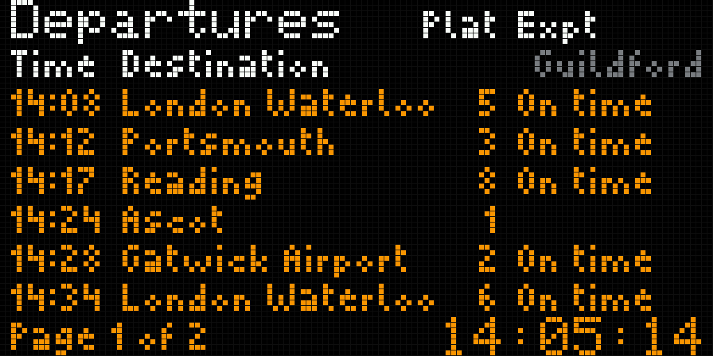
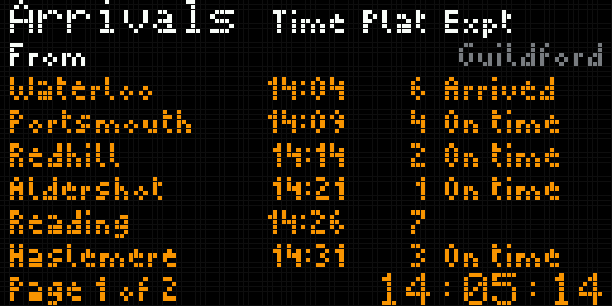

# Rail board

A UK station screen for any National Rail station, from Realtime Trains data
that Home Assistant fetches every 20 s. One list on the whole panel at a time:
departures, then arrivals, 10 s each. Guildford until the web portal chooses
another station.




## Where it lives

- The knob browses to it as TRAINS; a click enters it (hint `TURN: LISTS`).
  Inside, each detent steps **departures → arrivals → diagnostics** and round
  again (anticlockwise the other way). A list chosen this way holds for
  `RB_HOLD_S` = 60 s after the last detent; then the 10 s alternation resumes
  from that list. Another click, or 30 s without the knob, leaves the page as
  for every page.
- The carousel gives the page 20 s (or the common slot): both lists once.
- A page opened again after more than 2 s off screen starts on departures.
- Build flag `RAILBOARD_ENABLED`, on in `matrix-waveshare-rgb`. It needs
  `MQTT_BUS_ENABLED` and `CONTROL_ENCODER_ENABLED`; without either the build
  stops with `#error`.

## Data flow

```
web portal ──{"crs":"WAT"}──▶ /api/railboard ──▶ src/panel (NVS "panel"/"rbStn")
                                                   └▶ railboardSetStation(): drop old boards,
                                                      resubscribe .../WAT/+, publish selection

panel ──retained {"crs":"WAT"}──▶ nickoscope_matrix/railboard/select
                                      │ MQTT trigger
                                      ▼
                           Home Assistant: input_text.railboard_crs ──state──▶ poll now
                                      │ every 20 s, one run at a time
data.rtt.io ◀──HTTPS + bearer token───┘
                                      │ normalise, keep 8 a list
                                      ▼ MQTT, retained
                  nickoscope_matrix/railboard/WAT/departures | arrivals | status | config
                                      │
                                      ▼ mqtt_bus → railboardIngest() → railboardRender()
                               panel: draws into the back buffer, main loop flips
```

Home Assistant does the HTTPS, for three reasons:

1. **RTT's terms require it.** The spec: "no token is placed in a distributable
   user application unless specifically authorised by us. End-user applications
   are expected to proxy their requests through a server-side application"
   (`specification/main.yml` line 19). A token flashed into firmware is exactly that.
2. Internal SRAM bottoms out near 43 KB with the panel running and the HUB75
   frame buffers live there; a TLS session every 20 s was never measured.
3. It is the flight board's split already, so nothing new runs on the device.

One request serves both lists. `/gb-nr/location` has no arrivals/departures
switch (its parameters, lines 1024–1128); each service in the line-up carries
its own `temporalData.arrival` and `temporalData.departure` at the station, so
Home Assistant splits one response in two.

### Choosing the station

The flight board's pattern, adapted. The flight board subscribes to a topic per
selection and asks Home Assistant only if nothing retained arrives; here Home
Assistant polls anyway, so the **retained selection is the request**:

- The panel publishes `{"crs":"WAT"}` retained on `nickoscope_matrix/railboard/select`
  when the station changes, and again on every reconnect to the broker.
- Home Assistant's MQTT trigger copies a valid code into `input_text.railboard_crs`.
  The listener has no retain filter (core `mqtt/trigger.py`), so the retained
  selection also reaches it after a Home Assistant restart.
- The change of state triggers a poll at once; otherwise the next 20 s tick
  picks it up.
- If Home Assistant fetched that station before, its retained boards arrive the
  moment the panel subscribes, marked Data updating until a fresh one comes.

**MQTT budget.** One subscription whatever the station (`…/<crs>/+`: departures,
arrivals, status and config); the old one is unsubscribed before the new one is
made. One handler, registered on `nickoscope_matrix/railboard/` without the
station, so a change needs no new handler; messages for another station still
in flight are ignored. With every page built: cards 3 + flight board 1 + rail
board 1 = 5 of `MQTT_MAX_SUBS` 6, and 5 of `MQTT_MAX_HANDLERS` 6.

**NVS.** Namespace `panel`, key `rbStn`, a string of exactly three capitals A–Z,
default `GLD`. Written by `panelTick()` a few seconds after the last change, like
every other panel setting. Read with `isKey()` first: `Preferences::getString()`
logs at error level for a key never written (arduino-esp32 2.0.17
`Preferences.cpp`), which would be every boot until a station is first set.

## Payloads (schema v1)

All topics are retained. The panel refuses a board whose `v` is not 1, whose
`dir` does not match its topic, or whose `crs` is not the selected station, and
keeps what it was showing.

### `…/select` (published by the panel)

```json
{"crs":"GLD"}
```

### `…/<crs>/departures`, `…/<crs>/arrivals`

```json
{"v":1,"crs":"GLD","stn":"Guildford","dir":"dep","ts":1789391107,"rt":"OK",
 "s":[{"t":1789391280,"x":1789391700,"p":"5","n":"London Waterloo","o":"SW","st":"late","d":7}]}
```

| key | meaning |
|---|---|
| `ts` | when Home Assistant got this answer, UTC epoch seconds. Staleness is judged by this, not by arrival time |
| `stn` | `query.location.description`, mixed case as RTT spells it; the panel shows the code until one arrives |
| `rt` | `systemStatus.realtimeNetworkRail`: `OK`, `REALTIME_DATA_LIMITED`, `REALTIME_DATA_NONE` |
| `s` | at most 8 services, sorted by scheduled time |
| `t` | scheduled (`scheduleAdvertised`), UTC epoch seconds |
| `x` | `realtimeActual`, else `realtimeForecast`, else `realtimeEstimate`; 0 if none |
| `p` | platform, `actual` else `planned`, ≤3 chars |
| `n` | destination (departures) or origin (arrivals); several joined with ` & `, cut to 24 on a word |
| `o` | `scheduleMetadata.operator.code`, or `BUS` for any bus `modeType`. Not drawn: the station screen has no operator column |
| `st` | `ok` · `late` (expected minute after scheduled) · `canc` · `nr` (no realtime time yet) · `arr` (arrived) |
| `d` | minutes late, for `late` and `arr` |

Times travel as UTC epochs and become London time on the panel. Jinja in
Home Assistant can only convert to Home Assistant's own time zone, which need
not be London.

A service counts as cancelled here when its event has `isCancelled`, when
`displayAs` is `CANCELLED` or `DIVERTED`, or when it `TERMINATES` here (for
departures) or `STARTS` here (for arrivals). Passing trains (`displayAs` `PASS`
or null), non-passenger services, `OPERATIONAL_ONLY` calls, set-down-only calls
on departures and pick-up-only calls on arrivals are left out.

### `…/<crs>/status`

```json
{"v":1,"at":1789391700,"err":"NET","code":0,"retry":0,"rl":""}
```

Published after every attempt. `err` is empty on success, else `AUTH` (401,
403), `RATE` (429), `HTTP` (other non-2xx), `BAD` (200 without `services`), `NET`
(timeout or connection error). `retry` is `Retry-After`; `rl` is
`X-RateLimit-Remaining-Day` as sent.

### `…/<crs>/config` (optional)

```json
{"v":1,"rows":8,"switch_s":10,"level":100,"stale_s":80,"diag":false}
```

| key | range | |
|---|---|---|
| `rows` | 1–8 | services listed; six to a page, a second page for more |
| `switch_s` | 3–600 | seconds each list is on screen; with two pages, each page gets half |
| `level` | 10–100 | percent of full colour on this page. Panel brightness stays the web UI's |
| `stale_s` | 30–3600 | Data updating after this long without a fresh board |
| `diag` | bool | show diagnostics instead of the board |

The ranges are what the page can draw, not recommendations. `panels` and `font`
from the earlier two-list layout are ignored. Build-time defaults are in
`railboard.h`. The portal can apply a config until the next retained one arrives
or the panel reboots.

## Layout

Modelled on the owner's photograph of a UK station screen: a black ground with
nothing lit behind the text, white title and column headings, amber rows in mixed
case, a large amber clock at the foot, and pages when the rows do not fit.

```
 y   departures                                   arrivals
 0   Departures (big)            Plat Expt        Arrivals (big)     Time Plat Expt
 9   Time Destination            Guildford        From                    Guildford
16   14:08 London Waterloo          5 On time     Redhill            14:04    2 14:06
23   14:12 Portsmouth               3 14:19       Reading            14:14      Cancelled
..   six rows to a page                           page 2 starts with Continued......
57   Page 1 of 2                   14:05:14 (big) Page 1 of 1                 14:05:14
```

- **Two faces.** The title and the clock are the built-in 5×7 font. Everything
  else is Picopixel: 5 px capitals, 3 px lower case, 1 px descenders, so a 7 px
  pitch keeps a pixel of air under a `g`. The grid uses every row: title 0–7,
  headings 2–6 and 9–14, rows 16–56, clock 57–63.
- **Columns.** Expt is left-aligned at x 93: Cancelled, its widest word (33 px),
  ends on the last lit column. Plat is right-aligned 4 px short of it, under its
  heading; on arrivals Time is right-aligned short of Plat's heading. The place
  name gets what is left: on departures up to 64 px, enough for London Waterloo
  (56 px); on arrivals about 51 px, so London Waterloo arrives as Waterloo.
- **Names** keep whole letters always, and whole words where a word boundary
  allows: the full name; a London terminus without London when one word is left;
  the name less trailing words; only when even the first word does not fit, that
  word cut to as many letters as fit. The brief asked for truncation by fitted
  width; whole words come first because a cut word reads as a typo - the flight
  board found EUROAIRPOR on live data. The real board's abbreviations ("Warrington
  Bk Qy") come from a table this data does not carry.
- **Station** name on the second heading line, right-aligned and dim so it does
  not read as a column heading. Not on the photograph; kept from the earlier brief.
- **Expt** says On time, the expected time for a late train, the actual time for
  a late arrival, Arrived, or Cancelled - in red, the one colour that is not amber
  or white. A service with no realtime report says nothing rather than On time.
- **Pages.** Six rows to a page. With more services the list has two pages, each
  half of the list's 10 s; page 2 starts with Continued...... The footer says
  Page 1 of 1 when everything fits.
- **Stale.** When Home Assistant's `ts` is older than `stale_s`, or before NTP,
  the footer says Data updating instead of the page count. A service whose time
  has passed by 60 s (120 s once arrived) leaves the list by the panel's own
  clock, so an outage shows trains still to come.
- **Colour.** Amber is 255,150,0: the photograph's 255,170,0 leans yellow on
  these panels. Headings 255,255,255, Cancelled 255,36,24, station 120,126,132.
- **Not drawn:** the calling-point line under a service ("Front Train Only") -
  the payload has no such field. The large-type option of the two-list layout
  is gone: the station screen fixes its type sizes.

| scene | preview |
|---|---|
| departures, page 1 of 2 | [`departures.png`](../../tools/railboard/preview/departures.png), 1:1 [`departures_128x64.png`](../../tools/railboard/preview/departures_128x64.png) |
| arrivals | [`arrivals.png`](../../tools/railboard/preview/arrivals.png), 1:1 [`arrivals_128x64.png`](../../tools/railboard/preview/arrivals_128x64.png) |
| page 2, Continued...... | [`departures_page2.png`](../../tools/railboard/preview/departures_page2.png) |
| delays | [`delay.png`](../../tools/railboard/preview/delay.png) |
| cancellations and a late arrival | [`cancellation.png`](../../tools/railboard/preview/cancellation.png) |
| 10 min without data | [`stale.png`](../../tools/railboard/preview/stale.png) |
| a station name too long | [`long_name.png`](../../tools/railboard/preview/long_name.png) |
| diagnostics | [`diagnostics.png`](../../tools/railboard/preview/diagnostics.png) |
| before any board | [`waiting.png`](../../tools/railboard/preview/waiting.png) |

The previews come from `tools/railboard/render.py`, which reads every layout
number, colour and word out of `railboard.cpp`, mirrors its draw functions, and
decodes the firmware's own fonts (Picopixel from `src/fonts/picopixel_fb.h` and
the Adafruit GFX glyph table; `tools/picopixel.json` has no lower case). The
sample payloads in `tools/railboard/samples/` are **synthetic**: plausible
Guildford services, not an RTT response.

## Diagnostics

`UPDATED` is the time Home Assistant fetched the newest board, in London time,
and how long ago. Below it: services and receipt age per list, Home Assistant's
last attempt (`OK 200`, `AUTH HTTP 401`, `RATE 429 RETRY 120 S`, `NET`), RTT's
realtime status and requests left today, MQTT state and refused payloads,
internal heap now and lowest, the JSON parse peak, and `SELECT`: the station and
whether its selection has gone out, with NTP state.

## Web portal

Panel → Rail board:

- **Station**: a code field (upper-cased as you type, three letters A–Z, Enter or
  Set station), what is being followed (`Guildford · GLD`, or the code until a
  board names it), whether the selection has reached the broker, and presets.
  A wrong code gets a message under the field in the portal's error style; the
  route refuses anything but three capitals with 400.
- **Presets**, each checked against National Rail's own station page on
  2026-09-14: Guildford (GLD), London Waterloo (WAT), Woking (WOK), Reading (RDG),
  Gatwick Airport (GTW), London Road (Guildford) (LRD).
- **Status** adds `showing`: the list on screen, and whether it is alternating,
  pinned, or held by the knob and for how long.
- **Layout** has services per list, seconds per list, colour level and stale
  time; the Lists and Type fields of the two-list layout are gone.

## London time

Computed from UTC by `uk_time.h`, not through the device's TZ setting, which
belongs to the clock pages. The rule is The Summer Time Order 2002 (SI
2002/262), article 2(2): summer time runs from 01:00 GMT on the last Sunday in
March to 01:00 GMT on the last Sunday in October
(<https://www.legislation.gov.uk/uksi/2002/262/article/2/made>). The clock, the
row times and diagnostics all use it, so they agree with each other even on a
panel set to another zone.

`python3 tools/railboard/check_uk_time.py` compiles the header on the host and
compares it with zoneinfo `Europe/London`: every hour from 2000 to 2037 and every
minute for a day either side of each change, **548 480 instants, 0 differ**.

## Home Assistant side

`tools/railboard/ha_package_railboard.yaml`:

- `input_text.railboard_crs`: the station Home Assistant follows. Its `pattern`
  is client-side only, so every automation checks the code itself.
- `railboard_follow_selection`: MQTT trigger on `…/select`; a code of exactly
  three capitals is copied into the helper, anything else is logged and ignored.
- `railboard_poll`: `time_pattern` `seconds: "/20"` plus a state trigger on the
  helper, `mode: single`, rest_command `timeout: 10`, so requests cannot overlap.
  An invalid or empty helper falls back to GLD. Failure: `continue_on_error` on
  the request, the answer classified, a line to the log through
  `system_log.write` (logger `railboard`), only `…/status` published, and the next
  cycle tries again; the retained boards stay, which is the last good data. A 429
  waits out `Retry-After` (capped at 15 min). `lookback_min: 30`,
  `window_min: 90`: set `lookback_min: 0` if RTT refuses the window.
- `railboard_config`: `…/<crs>/config` every 5 min and when the station changes.

The payload is built inside the automation and never stored in an entity, so no
state or attribute holds a board.

### What the owner does

1. If `ha_package_guildford.yaml` was installed, delete it: both would poll.
2. In `<config>/secrets.yaml` add one line, the word Bearer, a space, and the
   token from <https://api-portal.rtt.io>:
   `rtt_bearer: "Bearer PASTE-YOUR-TOKEN-HERE"`.
   This needs a long-life **access** token. A refresh token has to be exchanged
   at `/api/get_access_token` first, and the package does not do that.
3. Enable packages once in `configuration.yaml`
   (`homeassistant: packages: !include_dir_named packages`) and copy the package
   to `<config>/packages/railboard.yaml`.
4. Restart Home Assistant. Within 20 s `…/GLD/departures`, `…/arrivals` and
   `…/status` should be retained on the broker, and **Settings → System → Logs**
   should show nothing for `railboard`.
5. Choose a station in the portal and check `input_text.railboard_crs` follows.
6. Never enable debug logging for `homeassistant.components.rest_command`: at
   debug level it logs request headers, and that header is the token.

## Verified

Against the RTT spec, `realtimetrains/api-specification` at commit `57ace42`,
`specification/main.yml`:

| fact | lines |
|---|---|
| server `https://data.rtt.io` | 74–76 |
| HTTP bearer auth, applied globally | 98–101, 789–790 |
| `GET /gb-nr/location?code=…`, code "any short or long code" | 1018–1033 |
| `timeFrom`/`timeWindow`, default window 60 min; "may be limited by your authorisation token" | 1048–1090 |
| responses 200 (with `services`), 204 no services, 400 | 1129–1169 |
| scheduled/realtime times, `isCancelled` | 243–282 |
| `displayAs` values, null = PASS | 197–218 |
| platform `planned`/`actual` | 307–328 |
| operator `code`/`name`; do not cache the name by code | 394–406 |
| origin/destination arrays | 467–476, 633–639 |
| 429 with `Retry-After`; `X-RateLimit-Remaining-<Minute/Hour/Day/Week>` | 37–46 |

- **Station codes**, from National Rail's station pages, each headed "Name (CRS)":
  Guildford (GLD), London Waterloo (WAT), Woking (WOK), Reading (RDG), Gatwick
  Airport (GTW), London Road (Guildford) (LRD).
- **Home Assistant**, against the docs linked in the package header, plus core
  source where the docs are silent: rest_command returns
  `status`/`content`/`headers` for any HTTP status and raises only on timeout,
  client error or an undecodable body (`rest_command/__init__.py` 200–273);
  mqtt.publish fields (`mqtt/services.yaml`); `time_pattern` accepts `seconds`
  (`triggers/time_pattern.py`); the MQTT trigger sets `payload_json` only when
  the payload parses and does not filter retained messages (`mqtt/trigger.py`
  87–107); `input_text.set_value` ignores a value outside min/max length with a
  warning (`input_text/__init__.py` 257–268); an entity state is capped at 255
  characters (`const.py` `MAX_LENGTH_STATE_STATE`).
- **Firmware**: `matrix-waveshare-rgb` builds with 0 warnings; `tools/flag_matrix.py`
  **22/22** as intended, including `rail board + bus + knob` building and `rail board without bus` refused (run 2026-09-14, scratch env in the tree's own `.pio`).
- **Portal script** passes JavaScriptCore's `checkSyntax`; every `rb…` id it uses
  exists in the page; no stray `%TOKEN%` in the markup.
- **Package** parses as YAML and every Jinja `if`/`for` block closes.

## Not verified

- **Nothing here has run on hardware**, and no real RTT response has been seen:
  there is no token on this side. The acceptance (a normal day plus a delay or
  cancellation, on real data) is still open.
- **The Home Assistant package has never been loaded**, and its templates were
  read, not executed: jinja2 is not installed on this machine.
- **The portal page has not been opened in a browser.** Its script was only
  parsed.
- That a retained selection reaches the MQTT trigger on a live Home Assistant
  restart: read from the source, not seen.
- Legibility of 3 px Picopixel lower case across a room: judged from the host
  render, not from the panel.
- Whether the owner's token accepts a 30 min lookback and a 90 min window
  (lines 1074 and 1089 say it may not), and its rate limits.
- That RTT always sends times with a UTC offset. The spec says RFC 3339 (line
  183) and the package relies on it.
- 401/403/429 are not listed among `/gb-nr/location`'s responses. `AUTH` and
  `RATE` follow HTTP's meaning and the spec's rate-limit section.
- Whether `scheduledCallType`, `inPassengerService` and `modeType` are present
  without detailed mode. The filters skip a service only when the field is
  there and says so.

## Choices that are not standards

Design choices for this board, taken from the 20 s poll, the panel and the
owner's photograph, and marked so they are not mistaken for norms:

- 10 s per list, each of two pages half of that.
- Six rows to a page: what the 64 px grid holds between the headings and the clock.
- `RB_HOLD_S` 60 s for a list chosen with the knob.
- `stale_s` 80 s: four polls, three missed plus the one in flight.
- Grace 60 s after a service's time (120 s once arrived).
- Lookback 30 min, window 90 min; `Retry-After` honoured up to 15 min.
- Late from one minute: the expected minute differs from the scheduled one,
  which is what a board can show. It is not a punctuality measure.
- Amber 255,150,0.
- `RB_JSON_CAP` 8 192 B: see Cost.

## Cost

Against the same env at `62a0e6a` (the two-list board): **+5 056 B flash,
+104 B RAM** (static; 1 915 177 → 1 920 233 and 91 492 → 91 596).

- JSON parsing allocates from PSRAM through a capped allocator, never internal
  SRAM while PSRAM is present. Host measurement of the worst payload (8 services,
  24-character names, 935 B): peak 4 271 B on a 64-bit host, where one
  ArduinoJson pool is 4 096 B; on the 32-bit target a pool is 1 024 B
  (ArduinoJson 7.4.3 `Configuration.hpp`). The device's real peak is in
  diagnostics as `JSON`.
- The worst payload is 982 B on the wire, inside mqtt_bus's 2 048 B buffer.
- 5 fps on this page: the clock shows seconds.

## Merge touch points

- `src/main.cpp`: the knob case for `PAGE_RAILBOARD` calls `railboardKnob(d)`;
  `ctrlEnterHint` is `TURN: LISTS`; `railboardLoop()` after `cardsLoop()`; two
  comments (panelBegin order, carousel seconds).
- `src/panel/panel.{h,cpp}`: `rbStn` in `PanelState`, read in `panelBegin()`,
  applied with `railboardSetStation()`, written in `panelTick()`;
  `panelSetRailStation()`, `panelRailStation()`.
- `src/web/web_panel.cpp`: `handleRailboard()` takes `crs`, `rows` 1–8, no
  `panels` or `font`.
- `src/web/web_panel_page.h`: a Station card, a `showing` row, the Layout card
  without Lists and Type, two CSS rules (`.pn-crs`, `.pn-stn`).
- `src/web/web_panel_js.h`: presets, `setStation()`, `renderRb()` additions,
  the Now-showing sketch of the new layout.
- `tools/flag_matrix.py`: the scratch env is written to `.pio/flag_matrix.ini`
  inside the tree instead of `/tmp/pio_flag_matrix.ini`. A worktree and the main
  tree ran the matrix at once on 2026-09-14 and shared that file, so each could
  build the other's flags.

## Status and next steps

Done: the single-list page, the station choice end to end, the generic package,
previews, the UK time check, build and flag matrix. Open, in order:

1. The owner removes the Guildford package if installed, puts the token in
   `secrets.yaml`, and loads `ha_package_railboard.yaml`.
2. Watch `…/status` and the log for a day of polls: `AUTH`, `HTTP 400` (then set
   `lookback_min: 0`), the rate-limit remainder.
3. Save one real `…/departures` payload next to the samples, and render it.
4. Flash this branch; check the board on a normal day and a disrupted one, the
   portal's station field, and lower case from across the room.
