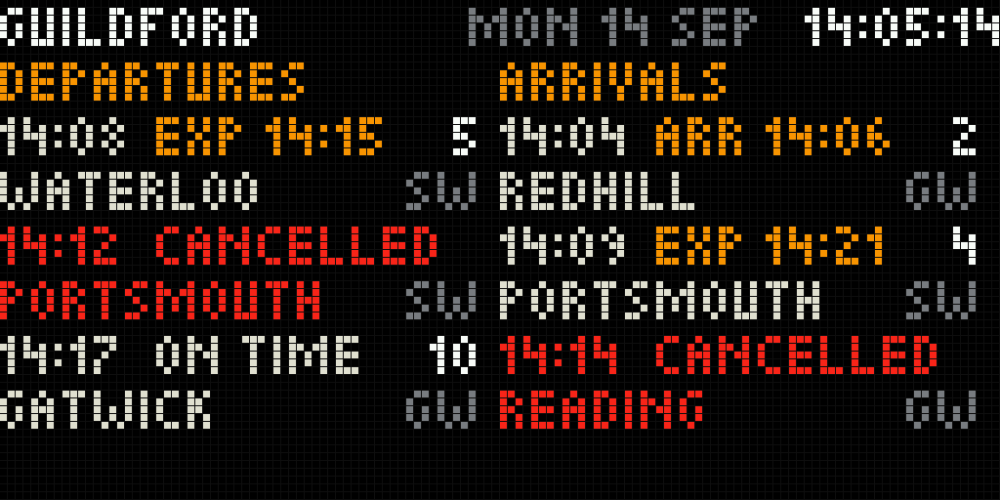

# Rail board

A UK station board for Guildford: departures on the left panel, arrivals on the
right, from Realtime Trains data that Home Assistant fetches every 20 s.



## Where it lives

- Long press on the knob: the page after the flight board. The carousel gives it
  20 s, or the common 15 s slot under `CAROUSEL_ALL_STYLES`.
- Short press: board ↔ diagnostics. Turn: with one panel, show the other list now.
- Build flag `RAILBOARD_ENABLED`, on in `matrix-waveshare-rgb`. It needs
  `MQTT_BUS_ENABLED` and `CONTROL_ENCODER_ENABLED`; without either the build
  stops with `#error`.
- `RAILBOARD_BOOT_PAGE` (off) makes this the page shown after a reboot. Without
  it the board still fills itself at boot: the subscription is made in
  `setup()` and the retained payloads arrive as soon as the broker connects.

## Data flow

```
data.rtt.io ──HTTPS + bearer token──▶ Home Assistant       every 20 s, one run at a time
                                        │ normalise, keep 8 a list
                                        ▼ MQTT, retained
                  nickoscope_matrix/railboard/GLD/departures | arrivals | status | config
                                        │
                                        ▼ mqtt_bus → railboardIngest() → railboardRender()
                                      panel: draws into the back buffer, main loop flips
```

Home Assistant does the HTTPS, for three reasons:

1. **RTT's terms require it.** The spec: "no token is placed in a distributable
   user application unless specifically authorised by us. End-user applications
   are expected to proxy their requests through a server-side application"
   (`specification/main.yml` line 19). A token flashed into firmware is exactly that.
2. Internal SRAM bottoms out near 43 KB with the panel running and the HUB75
   frame buffers live there; a TLS session every 20 s was never measured.
3. It is the flight board's split already, so nothing new runs on the device.

One request serves both lists. `/gb-nr/location` has no arrivals/departures
switch (its parameters, lines 1024–1128); each service in the line-up carries
its own `temporalData.arrival` and `temporalData.departure` at the station, so
Home Assistant splits one response in two.

## Payloads (schema v1)

All four topics are retained. The panel refuses a payload whose `v` is not 1, or
whose `dir` does not match its topic, and keeps what it was showing.

### `…/departures`, `…/arrivals`

```json
{"v":1,"crs":"GLD","stn":"Guildford","dir":"dep","ts":1789391107,"rt":"OK",
 "s":[{"t":1789391280,"x":1789391700,"p":"5","n":"London Waterloo","o":"SW","st":"late","d":7}]}
```

| key | meaning |
|---|---|
| `ts` | when Home Assistant got this answer, UTC epoch seconds. Staleness is judged by this, not by arrival time |
| `stn` | `query.location.description` |
| `rt` | `systemStatus.realtimeNetworkRail`: `OK`, `REALTIME_DATA_LIMITED`, `REALTIME_DATA_NONE` |
| `s` | at most 8 services, sorted by scheduled time |
| `t` | scheduled (`scheduleAdvertised`), UTC epoch seconds |
| `x` | `realtimeActual`, else `realtimeForecast`, else `realtimeEstimate`; 0 if none |
| `p` | platform, `actual` else `planned`, ≤3 chars |
| `n` | destination (departures) or origin (arrivals); several joined with ` & `, cut to 24 on a word |
| `o` | `scheduleMetadata.operator.code`, or `BUS` for any bus `modeType` |
| `st` | `ok` · `late` (expected minute after scheduled) · `canc` · `nr` (no realtime time yet) · `arr` (arrived) |
| `d` | minutes late, for `late` and `arr` |

Times travel as UTC epochs and become London time on the panel. Jinja in
Home Assistant can only convert to Home Assistant's own time zone, which need
not be London.

A service counts as cancelled here when its event has `isCancelled`, when
`displayAs` is `CANCELLED` or `DIVERTED`, or when it `TERMINATES` here (for
departures) or `STARTS` here (for arrivals). Passing trains (`displayAs` `PASS`
or null), non-passenger services, `OPERATIONAL_ONLY` calls, set-down-only calls
on departures and pick-up-only calls on arrivals are left out.

### `…/status`

```json
{"v":1,"at":1789391700,"err":"NET","code":0,"retry":0,"rl":""}
```

Published after every attempt. `err` is empty on success, else `AUTH` (401,
403), `RATE` (429), `HTTP` (other non-2xx), `BAD` (200 without `services`), `NET`
(timeout or connection error). `retry` is `Retry-After`; `rl` is
`X-RateLimit-Remaining-Day` as sent.

### `…/config` (optional)

```json
{"v":1,"panels":2,"rows":3,"font":"small","switch_s":10,"level":100,"stale_s":80,"diag":false}
```

| key | range | |
|---|---|---|
| `panels` | 1–2 | 2: both lists; 1: alternate every `switch_s` |
| `rows` | 1–3 | services per list; large type caps it at 2 |
| `font` | `small`, `large` | Picopixel, or the built-in 5×7 |
| `switch_s` | 3–600 | seconds per list on one panel |
| `level` | 10–100 | percent of full colour on this page. Panel brightness stays the web UI's |
| `stale_s` | 30–3600 | DATA UPDATING after this long without a fresh board |
| `diag` | bool | show diagnostics instead of the board |

The ranges are what the page can draw, not recommendations. Build-time
defaults are in `railboard.h`.

## Layout

One 7 px grid of Picopixel lines, nine of them: exactly 64 px.

```
line  y   left panel (x 0..63)            right panel (x 64..127)
0     1   GUILDFORD      MON 14 SEP             14:05:14
1     8   DEPARTURES                       ARRIVALS
2    15   14:08 EXP 14:15    5             14:04 ARR 14:06    2
3    22   WATERLOO          SW             REDHILL           GW
4-7       two more services
8    57   DATA UPDATING (only when stale)  DATA UPDATING
```

- Two lines per service: 64 px holds about fifteen Picopixel capitals and
  LONDON WATERLOO alone is 62 px. Names lose whole words only; a London
  terminus loses LONDON first when one word is left (WATERLOO), never when more
  are (LONDON ROAD (GUILDFORD) keeps LONDON ROAD).
- The last three columns of each list stay dark. The first preview had none,
  and the left platform ran into the right time: `5` + `14:04` read `514:04`.
- Warm white for ordinary text, amber for the list titles, delays and stale
  data, red for cancellations. No rules, boxes or logos.
- A service whose time has passed by 60 s (120 s once arrived) leaves the list
  by the panel's own clock, so during an outage DATA UPDATING stands over trains
  still to come.
- With no clock yet (before NTP) the board counts as stale: freshness cannot be
  shown.
- Large type (`font: large`): time and platform over the place name, ten
  characters to a panel. No operator code or status word fits, so a late train
  shows its expected time in amber in place of the scheduled one and a
  cancellation says CANC.

| scene | preview |
|---|---|
| normal day | [`normal.png`](../../tools/railboard/preview/normal.png) |
| delays and cancellations | [`disrupted.png`](../../tools/railboard/preview/disrupted.png) |
| 10 min without data | [`stale.png`](../../tools/railboard/preview/stale.png) |
| large type | [`large.png`](../../tools/railboard/preview/large.png) |
| one panel, both frames | [`one_panel.png`](../../tools/railboard/preview/one_panel.png) |
| diagnostics | [`diagnostics.png`](../../tools/railboard/preview/diagnostics.png) |
| before the broker | [`waiting.png`](../../tools/railboard/preview/waiting.png) |

The previews come from `tools/railboard/render.py`, which reads every layout
number, colour and word out of `railboard.cpp` and mirrors its draw functions.
The sample payloads in `tools/railboard/samples/` are **synthetic**: plausible
Guildford services, not an RTT response.

## Diagnostics

`UPDATED` is the time Home Assistant fetched the newest board, in London time,
and how long ago. Below it: services and receipt age per list, Home
Assistant's last attempt (`OK 200`, `AUTH HTTP 401`, `RATE 429 RETRY 120 S`,
`NET`), RTT's realtime status and requests left today, MQTT state and refused
payloads, internal heap now and lowest, the JSON parse peak, and whether BST is
in force.

## London time

Computed from UTC by `uk_time.h`, not through the device's TZ setting, which
belongs to the clock pages. The rule is The Summer Time Order 2002 (SI
2002/262), article 2(2): summer time runs from 01:00 GMT on the last Sunday in
March to 01:00 GMT on the last Sunday in October
(<https://www.legislation.gov.uk/uksi/2002/262/article/2/made>).

`python3 tools/railboard/check_uk_time.py` compiles the header on the host and
compares it with zoneinfo `Europe/London`: every hour from 2000 to 2037 and every
minute for a day either side of each change, **548 480 instants, 0 differ**.

## Home Assistant side

`tools/railboard/ha_package_guildford.yaml`: a `rest_command` holding the token,
an automation that polls, normalises and publishes, and one that publishes
`…/config` every 5 min. The payload is built inside the automation and never
stored in an entity, so no state or attribute holds a board.

- Poll: `time_pattern` `seconds: "/20"`, `mode: single`, rest_command
  `timeout: 10`. A trigger that arrives while a run is still going is dropped,
  so requests cannot overlap.
- Failure: `continue_on_error` on the request. The response is classified, a
  line goes to the log through `system_log.write` (logger `railboard.gld`),
  only `…/status` is published, and the next cycle tries again. The retained
  boards stay as they were, which is the "last good data".
- 429: the run waits out `Retry-After` (capped at 15 min), and `mode: single`
  holds off the 20 s triggers meanwhile.
- `lookback_min: 30`, `window_min: 90`: asks from 30 min ago, so a train
  scheduled before now but still to come stays listed. Set `lookback_min: 0` if
  RTT refuses the window.

### What the owner does

1. In `<config>/secrets.yaml` add one line, the word Bearer, a space, and the
   token from <https://api-portal.rtt.io>:
   `rtt_bearer: "Bearer PASTE-YOUR-TOKEN-HERE"`.
   This needs a long-life **access** token. A refresh token has to be exchanged
   at `/api/get_access_token` first, and the package does not do that.
2. Enable packages once in `configuration.yaml`
   (`homeassistant: packages: !include_dir_named packages`) and copy the package
   to `<config>/packages/railboard_guildford.yaml`.
3. Restart Home Assistant. Within 20 s the three topics should be retained on
   the broker, and **Settings → System → Logs** should show nothing for `railboard.gld`.
4. Never enable debug logging for `homeassistant.components.rest_command`: at
   debug level it logs request headers, and that header is the token.

## Verified

Against the RTT spec, `realtimetrains/api-specification` at commit `57ace42`,
`specification/main.yml`:

| fact | lines |
|---|---|
| server `https://data.rtt.io` | 74–76 |
| HTTP bearer auth, applied globally | 98–101, 789–790 |
| `GET /gb-nr/location?code=…`, code "any short or long code" | 1018–1033 |
| `timeFrom`/`timeWindow`, default window 60 min; "may be limited by your authorisation token" | 1048–1090 |
| responses 200 (with `services`), 204 no services, 400 | 1129–1169 |
| scheduled/realtime times, `isCancelled` | 243–282 |
| `displayAs` values, null = PASS | 197–218 |
| platform `planned`/`actual` | 307–328 |
| operator `code`/`name`; do not cache the name by code | 394–406 |
| origin/destination arrays | 467–476, 633–639 |
| 429 with `Retry-After`; `X-RateLimit-Remaining-<Minute/Hour/Day/Week>` | 37–46 |

- **GLD is Guildford**: National Rail's station page is headed "Guildford (GLD)"
  (<https://www.nationalrail.co.uk/stations/guildford/>). RTT's own live pages
  for Guildford are `realtimetrains.co.uk/search/…/gb-nr:GLD`, as indexed by a
  web search; the page itself answered with a browser check, so it was not read.
- Home Assistant syntax against the docs linked in the package header, plus
  core source where the docs are silent: rest_command returns
  `status`/`content`/`headers` for any HTTP status and raises only on timeout,
  client error or an undecodable body (`rest_command/__init__.py` 200–273);
  mqtt.publish fields (`mqtt/services.yaml`); `time_pattern` accepts `seconds`
  (`triggers/time_pattern.py`); a template result that parses as a dict still
  reaches mqtt.publish as its original string (`cv.string`,
  `config_validation.py` 714–715).
- `matrix-waveshare-rgb` builds with 0 warnings, and `tools/flag_matrix.py`
  result: **20/20** as intended, including `rail board + bus + knob`
  building and `rail board without bus` refused (run 2026-09-14).

## Not verified

- **Nothing here has run on hardware**, and no real RTT response has been seen:
  there is no token on this side. The spec's acceptance (a normal day plus a
  delay or cancellation, on real data) is still open.
- **The Home Assistant package has never been loaded.** It parses as YAML and
  every Jinja `if`/`for` block closes, but the templates were read, not
  executed: jinja2 is not installed on this machine.
- Whether the owner's token accepts a 30 min lookback and a 90 min window
  (lines 1074 and 1089 say it may not).
- The rate limits of the owner's plan. Three requests a minute is 4 320 a day;
  the headers will say, and `rl` carries the day's remainder to diagnostics.
- That RTT always sends times with a UTC offset. The spec says RFC 3339 (line
  183) and the package relies on it: `as_timestamp` of a time without an
  offset would assume Home Assistant's zone.
- 401/403/429 are not listed among `/gb-nr/location`'s responses. `AUTH` and
  `RATE` follow HTTP's meaning and the spec's rate-limit section.
- Whether `scheduledCallType`, `inPassengerService` and `modeType` are present
  without detailed mode. The filters skip a service only when the field is
  there and says so.
- Operator code `GW` in the samples is illustrative.

## Choices that are not standards

These numbers are design choices for this board, taken from nothing but the
20 s poll and the panel, and marked so they are not mistaken for norms:

- `stale_s` 80 s: four polls, three missed plus the one in flight.
- Grace 60 s after a service's time (120 s once arrived).
- Lookback 30 min, window 90 min.
- `Retry-After` honoured up to 15 min.
- Amber from one minute late: the expected minute differs from the scheduled
  one, which is what a board can show. It is not a punctuality measure.
- `RB_JSON_CAP` 8 192 B: see Cost.

## Cost

Measured against the same env without the flag, base commit `835f341`:
**+12 472 B flash, +1 328 B RAM** (static; 1 766 229 → 1 778 701 and
89 524 → 90 852).

- RAM is the two boards plus the scratch copy they are parsed into, 8 services each.
- JSON parsing allocates from PSRAM through a capped allocator, never internal
  SRAM while PSRAM is present. Host measurement of the worst payload (8 services,
  24-character names, 935 B): peak 4 271 B, and 4 301 B for the normal sample,
  on a 64-bit host where one ArduinoJson pool is 4 096 B. On a 32-bit target a
  pool is 1 024 B (ArduinoJson 7.4.3 `Configuration.hpp`), so the device should
  need less; its real peak is shown in diagnostics as `JSON`.
- The worst payload is 982 B on the wire, inside mqtt_bus's 2 048 B buffer.
- `MQTT_MAX_HANDLERS` in `mqtt_bus.cpp` went from 4 to 6: cards (3) and the
  flight board (1) had used all four, and a refused handler is a page that
  never updates.
- 5 fps on this page: the header clock shows seconds.

## Status and next steps

Done: the page, the package, previews, the UK time check, build and flag
matrix. Open, in order:

1. The owner puts the token in `secrets.yaml` and loads the package.
2. Watch `…/status` and the log for one day of polls: `AUTH`, `HTTP 400`
   (then set `lookback_min: 0`), the rate-limit remainder.
3. Save one real `…/departures` payload next to the samples, and render it.
4. Flash this branch and check the board on a normal day and on a disrupted one.
