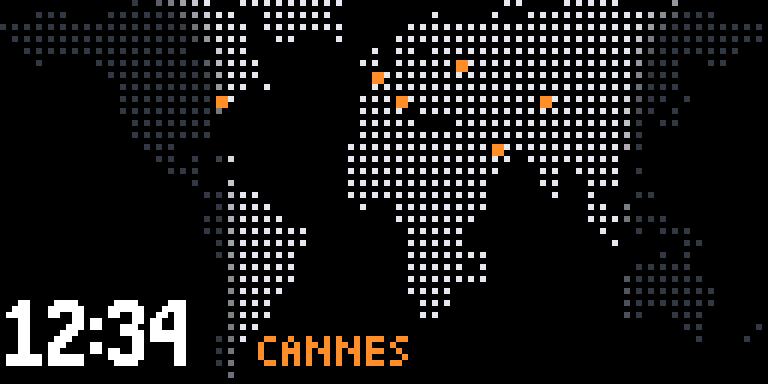
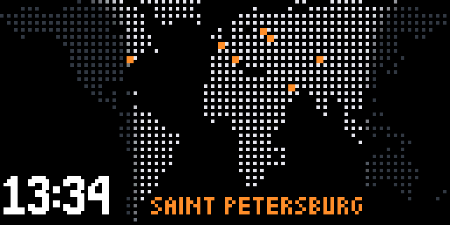
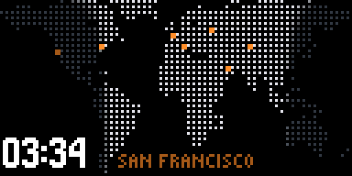

# World clock

A dotted world map on the panel's own grid. 128×64 divides exactly into 64×32
dots on a 2 px pitch, so the look needs no rescaling. Land in daylight is lit,
night is dim, and civil twilight (sun between 0 and −6°) blends between them,
so the terminator draws itself and creeps across the map through the day.
HH:MM sits in the empty South Pacific and is **home's** time, in home's own
zone; home's name sits beside it. Cities are orange 2×2 dots, and home's dot
breathes.

## Where it lives

- Long press on the knob: the page after the clock. The carousel gives it 20 s.
- Build flag `WORLDCLOCK_ENABLED`; needs `CONTROL_ENCODER_ENABLED` (`#error` otherwise).

## Home's time and name

The time is home's local time, summer time included, whatever zone the panel
itself is set to. Each city carries a POSIX TZ string, and
[`posix_tz.cpp`](posix_tz.cpp) evaluates it for the current UTC second. The
page does not switch the process zone with `setenv("TZ")`: that zone is shared
by every task that calls `localtime_r`, the clock page and the weather task
among them.

The name is drawn in Picopixel, in orange like the dots, bottom-aligned with
the digits. It starts at x 43, past Tierra del Fuego's dots, and has 72 px
before New Zealand's: open Southern Ocean on this mask, so it needs no backing
box and cannot reach the time, which ends at x 30. Picopixel because it is
the small font the flight board, rail board and cards already use on this
panel, and the one the prototype can draw (`px.text`). *SAINT PETERSBURG* takes
61 of the 72 px:

**When home changes, the name breathes with home's dot for 10 s, eases out
over the last 2 s, and then holds still.** The chosen design is on the left,
the alternative (breathing for good) on the right:

| pulse, then settle (chosen) | breathe for good |
|---|---|
|  |  |

Why this way:

- The name has to stay. The time belongs to whichever city is home, so
  without the label nobody can tell whose time it is.
- The movement does not have to stay. This page hangs on the wall all day and
  already has one thing that breathes. A label that pulses forever pulls the
  eye every time it rises, while the change it announced is long over.
- It pulses **in step with the dot**, using the same brightness value, so the
  name and the dot rise and fall together and read as one thing.
- 10 s is half the 20 s the carousel gives the page, so a change made while
  the page is up is seen pulsing and then seen settled within one visit.
- The pulse starts on the page's first frame after the change, not at the
  moment of the change. A change made while another page is showing is
  announced when the world clock is next on screen.

A city just added and made home, caught at the bottom of a breath:

## Zones

[`tzdb.h`](tzdb.h) maps 489 IANA zone names to POSIX strings, 88 of them
distinct: 11 315 bytes. It is written by
[`tools/luasim/gen_tz.py`](../../tools/luasim/gen_tz.py) from the tz database
on the machine that runs it, tzdata **2026c** for this copy. The tz database is
in the public domain (its `LICENSE`). Each string is its zone's TZif footer,
which tzfile(5) defines as the POSIX-TZ-style string "for use in handling
instants after the last transition time stored in the file".

A footer only takes over after the file's last stored transition, so the
generator checks every footer against its zone from 2026-09-01 to 2028-09-01,
using Python's zoneinfo for both. The two must agree at both ends of that
window and one second either side of every change in either. By hand, it
refused a week-early March rule for Paris, an hour-late October rule, Paris
without summer time, and posix_tz_db's strings for America/Vancouver and
Europe/Chisinau. Two zones have no footer that matches in the window. Each gets
the fixed offset it keeps longest there, and the header lists both:
Africa/Casablanca and Africa/El_Aaiun, at +00, which misses 19 days at +01.

Why not [nayarsystems/posix_tz_db](https://github.com/nayarsystems/posix_tz_db)
as it stands: its table was last regenerated for tzdata 2025b, and 7 of its 461
strings differ from 2026c. Among them, 2026c moves America/Vancouver and
America/Edmonton to permanent UTC−7 and UTC−6 from November 2026. GitHub
reports its licence as MIT, but the `LICENSE` file still carries the
`[year] [fullname]` template. Its method is the one used here: its `gen-tz.py`
reads the same `/usr/share/zoneinfo` footers.

## One source

The land mask and the city list are written by
[`tools/luasim/gen_world.py`](../../tools/luasim/gen_world.py) into both
`worldmap.h` here and the Lua prototype
[`world_clock.lua`](../../tools/luasim/scripts/world_clock.lua). A city's zone
is its IANA name there. The POSIX string written beside it comes from `tzdb.h`,
the same table the portal's cities use. To change the built-in cities, edit
`CITIES` and rerun it. The pre-commit hook runs `gen_tz.py --check` and
`gen_world.py --check`, which need no network, and refuses a commit where the
copies disagree.

Cities built in: Cannes, Moscow, New York, London, Dubai, Almaty.

## How it was checked

`python3 tools/luasim/fx_parity.py --quick` runs three checks on the world clock:

- **The page against its prototype.** `wchost` compiles `worldclock.cpp` and
  `posix_tz.cpp` for the host against a stand-in display. It renders the page
  under the same four clocks luasim gives `world_clock.lua`: 12:34 CEST, 23:59,
  a day's sweep, and 06:10 on 1 January at UTC−5. The homes are Cannes just
  changed, New York settled, a custom *SAINT PETERSBURG* just added, and a
  custom *SYDNEY* whose summer spans the new year. The frames are compared
  after the panel's RGB565 step: 16 of 16 identical. A negative control first
  requires Cannes and New York to look different.
- **The zone evaluator against zoneinfo.** Every string in `tzdb.h`, plus
  POSIX forms no zone uses today, is checked every 6 h from 2026 to 2029 and one
  second either side of each change: 543 992 instants, all equal. The
  zero-based day form (`59`) is checked against macOS libc instead, because
  Python 3.9's zoneinfo starts it a day early; POSIX (XBD 8.3) and libc agree
  with each other. 14 malformed strings must be refused, and are. A negative
  control requires a one-week change in a rule to show up.
- The Lua runtime's own parity (luasim against `fxhost`) still covers the
  script, as it does every script.

Not yet on hardware.

## Cost

Against 1c82839, the same build without these changes: **+5 432 B flash,
+1 144 B RAM**. The zone table is not linked yet, since nothing looks a zone
up by name so far.

- The mask is 32 × `uint64_t`, 256 bytes of flash.
- The colour table is 32×64 `uint16_t`, computed once a minute, so a frame is
  774 pixel writes and no trigonometry.
- Refresh drops to 10 fps on this page: only the home dot and the name move.

## Honest limits

- Declination by a cosine approximation, sun longitude straight from UTC. The
  equation of time moves the line by up to 4°; a dot is 5.6° wide.
- Before NTP sync the map is all night and the time reads `--:--`, rather than
  drawing 1970 with confidence.
- A POSIX string holds one rule for ever. A zone that changes its rules after
  tzdata 2026c is wrong until `tzdb.h` is regenerated and the firmware is
  rebuilt. Morocco's Ramadan changes cannot be written as a POSIX rule at all.
