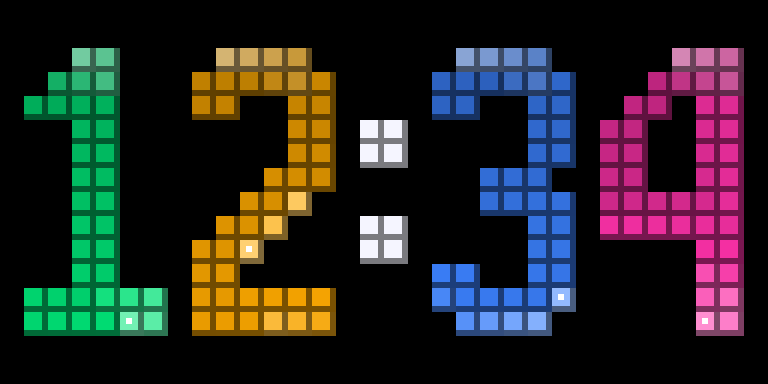
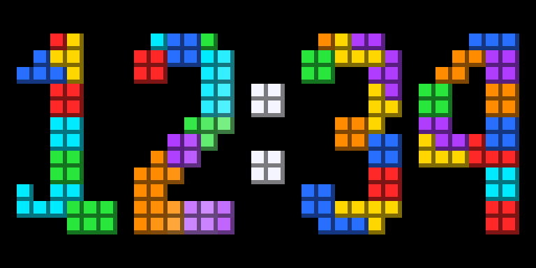
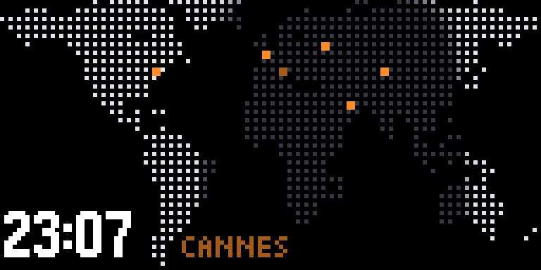
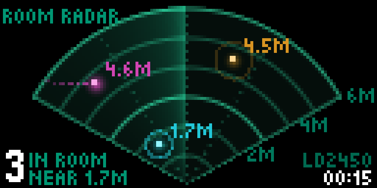
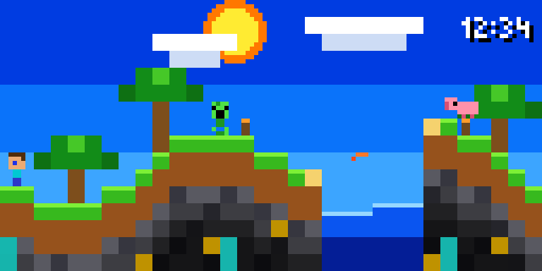

# luasim — the panel's Lua runtime, on your desk

Runs the **same vendored Lua 5.4.8** the firmware runs, against the same `px.*`
raster API, on the same 128×64 canvas, with the same corrected Picopixel font —
so an effect can be written and judged before the panels exist and without a
flash cycle.

```bash
make                                   # builds luasim and regenerates the font
./luasim scripts/demo.lua 40 out.raw
python3 render.py out.raw out.gif 6    # or out.png for a single frame
```

Optional flags set the simulated clock:

```bash
./luasim scripts/world_clock.lua 1   out.raw --start 23:07 --yday 255 --utc 2
./luasim scripts/world_clock.lua 240 out.raw --sweep    # one whole day across the frames
```

## What is in scripts/

| | | |
|---|---|---|
|  | **snake_clock.lua** | HH:MM in the world clock's bold face, 48 px tall on pure black, where each digit is a snake. On the minute the four crawl off the bottom and four more crawl in from the top and lay themselves out as the next time. A pulse runs head to tail the whole time; nothing lights the background — [full minute](preview/snake_clock.gif) |
|  | **tetris_clock.lua** | The same bold 48 px clock in tetrominoes, on pure black. The rows clear from the bottom like completed lines, everything above drops, and the next minute falls in. Two glints sweep the stack between changes, inside the blocks only — [full minute](preview/tetris_clock.gif) |
|  | **world_clock.lua** | A dotted world map on the panel's 64x32 grid: land in daylight is lit, night is dim, and civil twilight blends between them, so the terminator draws itself and creeps across the day. Big time in the empty South Pacific, cities as orange dots, home breathing. Mask and cities from Natural Earth via `gen_world.py`, which also writes the firmware's copy — ported to C in [`src/worldclock`](../../src/worldclock/README.md) and matching this script pixel for pixel — [a full day](preview/world_clock.gif) |
|  | **room_radar.lua** | Who is in the room, as a 24 GHz HLK-LD2450 radar sees it: its own 6 m, ±60° fan drawn up from the bottom edge at 10 px to the metre. Up to three people with trails sampled at the radar's 10 Hz, a burst of light where someone walks in, a slow ring around someone sitting still, and a room that dims once it is empty. The people are scripted; `fake_targets()` returns what the radar would, and it is the one function to replace — [24 s](preview/room_radar.gif), at 2×, 10 fps and 32 colours: the sweep repaints most of the fan every frame, and at 3× the GIF was 5 MB |
|  | **minecraft.lua** | A blocky world with a full day/night cycle in one minute, in saturated colour for an LED panel: a black night, stone that darkens with depth, ore, torches that light the blocks around them. Steve patrols the hills with a step cycle and jumps, a creeper hisses and blows up once a minute, a pig wanders by day and a zombie by night, and a fish jumps from the lake — [full minute](preview/minecraft.gif) |
| | **demo.lua** | Exercises every `px.*` call. Start here when writing a new effect |

Previews are 225 frames at 3× — a quarter of the real frame rate, so they are
choppier than the panel will be.

## The contract a script follows

Define a global `draw()`. The host calls it once per frame.

```lua
function draw()
  local t = px.t()        -- animation phase, [0,1). NEVER seconds
  local n = px.now()      -- {hour, min, sec} - wall time comes from here
  px.clear(0, 0, 0)
  px.text(2, 2, "HELLO", 255, 180, 0)
end
```

`px.t()` being a phase and not a clock is one of the three rules the flagship
project calls *cannot be otherwise* — mixing the two is the classic bug.

Two optional globals matter only on the panel, and luasim ignores both:

| Global | Default | |
|---|---|---|
| `PERIOD` | `60` | seconds `px.t()` spans. The panel takes the phase from the wall clock, so at 60 it is the second hand and a clock's change lands on the minute. `room_radar.lua` sets it to its 24 s story |
| `FPS` | `20` | the effect's frame cap, 1–30 |

## On the panel

Every script here except `demo.lua` and `world_clock.lua` (a native page
already) is compiled into the firmware as a page of its own — see
[`src/lua/README.md`](../../src/lua/README.md).

```bash
python3 gen_effects.py          # after editing a script: regenerate the embedded copy
python3 fx_parity.py            # the firmware's runtime against luasim, pixel for pixel
```

`gen_effects.py --check` runs in the pre-commit hook. `fx_parity.py` builds
`fxhost` — the firmware's own `src/lua/lua_fx.cpp`, `lua_px.cpp` and
`nslua_sandbox.cpp` against a stand-in display — renders every script through
both at several clocks, and prints each script's exact instruction counts, heap
peak and host draw time.

## The API

| Call | |
|---|---|
| `px.size()` | → `128, 64` |
| `px.t()` | animation phase `[0,1)` |
| `px.now()` | `{hour, min, sec, yday, utc}` — `yday` is 0-based, `utc` is local minus UTC in hours; anything that needs the sun needs both |
| `px.clear(r,g,b)` | |
| `px.pixel(x,y,r,g,b)` | |
| `px.line(x0,y0,x1,y1,r,g,b)` | |
| `px.rect(x,y,w,h,r,g,b,fill)` | |
| `px.circle(x,y,rad,r,g,b,fill)` | |
| `px.text(x,y,s,r,g,b)` | Picopixel, upper-cased |
| `px.width(s)` | pixel width of `s`, for right-alignment |
| `px.get(x,y)` | → `r,g,b` already on the canvas |
| `px.blend(x,y,r,g,b,a)` | alpha-blend one pixel |
| `px.glow(x,y,rad,r,g,b,amp)` | a radial light, falling off as `(1-d/rad)²` |

The raster calls **overwrite**. That is right for shapes and wrong for light: a
dim colour paints a dark blot, not a faint glow. `blend` and `glow` are the way
to add light to something already drawn, and `glow` is one C call rather than a
Lua loop over a few hundred pixels — the same reason `beam.kit` exists on the
H743.

No `io`, no `os`, no `package` — those libraries are not compiled into the
vendored tree at all, so a script cannot reach the filesystem or the host.

## What this does NOT simulate

Deliberately. These are hardware properties, and answering them is the point of
the bring-up bench rather than of this tool:

- the PSRAM allocator, and whether a Lua heap competes with the HUB75 DMA
- the instruction-budget hook and the wall-clock deadline (`fxhost` does run
  them, with the panel's budgets, under `fx_parity.py`)
- the dedicated task's C stack, which is what stops a hostile nested script
  from overflowing the parser's stack at compile time

A script that looks right here can still be too slow on the panel. Frame budget
is measured on hardware, not here.

## Why the font is generated

`gen_font.py` builds `font_picopixel.inc` from `src/fonts/picopixel_fb.h`, the
firmware's own font — including the corrected `U`. A second copy would drift,
and text is exactly where drift is invisible until it is embarrassing.
