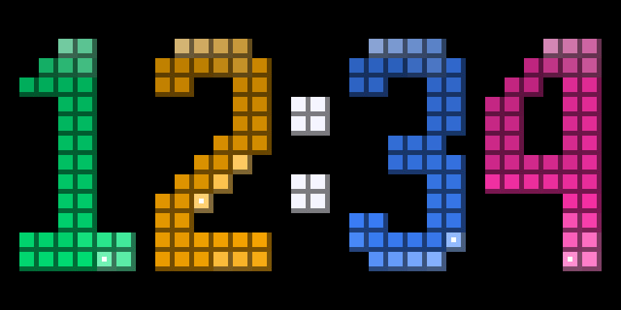
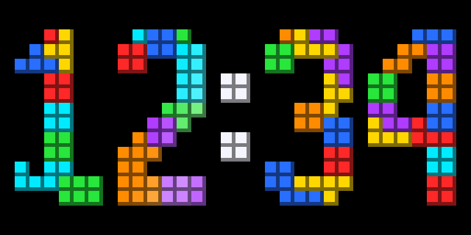
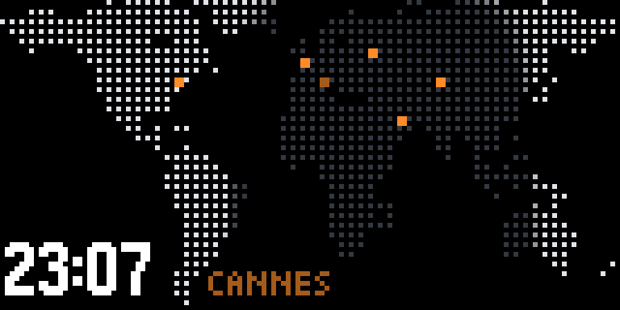
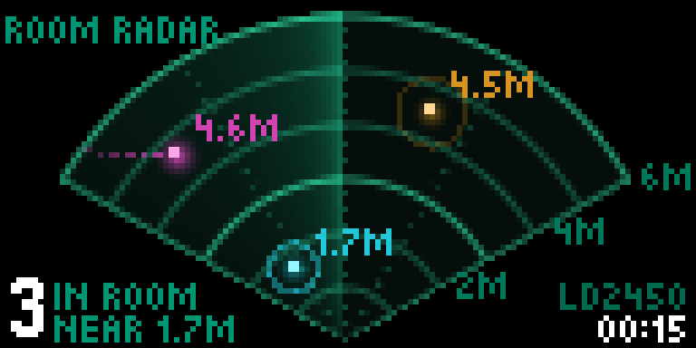
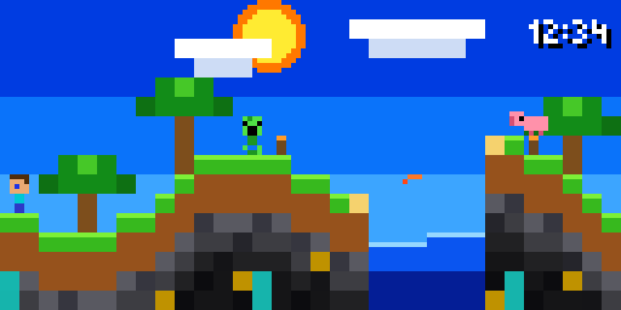
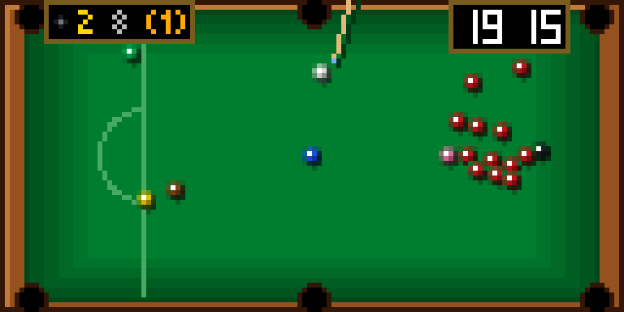
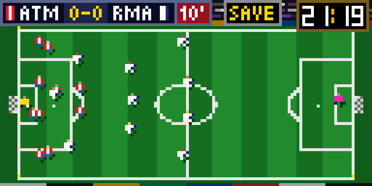

# luasim — the panel's Lua runtime, on your desk

Runs the **same vendored Lua 5.4.8** the firmware runs, against the same `px.*`
raster API, on the same 128×64 canvas, with the same corrected Picopixel font —
so an effect can be written and judged before the panels exist and without a
flash cycle.

```bash
make                                   # builds luasim and regenerates the font
./luasim scripts/demo.lua 40 out.raw
python3 render.py out.raw out.gif 6    # or out.png for a single frame
```

Optional flags set the simulated clock:

```bash
./luasim scripts/world_clock.lua 1   out.raw --start 23:07 --yday 255 --utc 2 --year 2026
./luasim scripts/world_clock.lua 240 out.raw --sweep    # one whole day across the frames
```

## What is in scripts/

| | | |
|---|---|---|
|  | **snake_clock.lua** | HH:MM in the world clock's bold face, 48 px tall on pure black, where each digit is a snake. On the minute the four crawl off the bottom and four more crawl in from the top and lay themselves out as the next time. A pulse runs head to tail the whole time; nothing lights the background — [full minute](preview/snake_clock.gif) |
|  | **tetris_clock.lua** | The same bold 48 px clock in tetrominoes, on pure black. The rows clear from the bottom like completed lines, everything above drops, and the next minute falls in. Two glints sweep the stack between changes, inside the blocks only — [full minute](preview/tetris_clock.gif) |
|  | **world_clock.lua** | A dotted world map on the panel's 64x32 grid: land in daylight is lit, night is dim, and civil twilight blends between them, so the terminator draws itself and creeps across the day. Big time in the empty South Pacific in home's own zone, home's name beside it (breathing with home's dot for 10 s after a change, then still), cities as orange dots. Mask and cities from Natural Earth via `gen_world.py`, which also writes the firmware's copy; zones from `gen_tz.py`. Ported to C in [`src/worldclock`](../../src/worldclock/README.md), which `fx_parity.py` renders on the host (`wchost`) and holds to this script pixel for pixel; `wc_preview.py` draws that page's previews — [a full day](preview/world_clock.gif) |
|  | **room_radar.lua** | Who is in the room, as a 24 GHz HLK-LD2450 radar sees it: its own 6 m, ±60° fan drawn up from the bottom edge at 10 px to the metre. Up to three people with trails sampled at the radar's 10 Hz, a burst of light where someone walks in, a slow ring around someone sitting still, and a room that dims once it is empty. The people are scripted; `fake_targets()` returns what the radar would, and it is the one function to replace — [24 s](preview/room_radar.gif), at 2×, 10 fps and 32 colours: the sweep repaints most of the fan every frame, and at 3× the GIF was 5 MB |
|  | **minecraft.lua** | A blocky world with a full day/night cycle in one minute, in saturated colour for an LED panel: a black night, stone that darkens with depth, ore, torches that light the blocks around them. Steve patrols the hills with a step cycle and jumps, a creeper hisses and blows up once a minute, a pig wanders by day and a zombie by night, and a fish jumps from the lake — [full minute](preview/minecraft.gif) |
|  | **snooker_clock.lua** | A snooker table that plays whole frames by itself, with the time top right on a game-style HUD plate and the score, break and fouls top left. Table, spots and the rack follow the WPBSA Official Rules (Section 1 Rules 1-2, Section 3 Rule 2); balls are drawn 1.93x real, the most the pack allows between Pink and Black, as pre-lit sprites with a highlight and a shadow. Break-off, pots with draw, stun and follow for position, safeties, misses, fouls with Rule 11 penalties, colours re-spotted, the final sequence and re-racks. A frame breaks off on every ten minutes of the clock, seeded by it and played in fixed steps, so every panel plays the same one; between frames the plate says when the next begins, and a page opened mid-frame catches up first — [the break, a red with follow and the blue](preview/snooker_clock.gif), at full frame rate; 1:1 stills [break](preview/snooker_clock_1x_break.png) and [play](preview/snooker_clock_1x_play.png) |
|  | **football_clock.lua** | A football match that plays itself: Atletico Madrid in 4-4-2 against Real Madrid in 4-3-3, told apart by kit colours only - red and white stripes with blue shorts, all white with a navy edge, keepers in yellow and magenta. Pitch markings to the IFAB Laws of the Game 2026/27, Law 1, seen from a broadcast angle; mown stripes, nets, a crowd. Passing, carrying, pressing, tackles, blocks, shots and saves, crosses and headers, throw-ins, corners, goal kicks, goals with a celebration, half-time and full-time, then a new match. A broadcast score bug with the match minute (20x) and the real time top right. A match kicks off on every five minutes of the clock, seeded by it and played in fixed steps, so every panel plays the same one; a page opened mid-match catches up first - [an attack, a save and the goal](preview/football_clock.gif), at full frame rate; 1:1 stills [attack](preview/football_clock_1x_attack.png) and [goal](preview/football_clock_1x_goal.png) |
| | **demo.lua** | Exercises every `px.*` call. Start here when writing a new effect |

Previews are 225 frames at 3× — a quarter of the real frame rate, so they are
choppier than the panel will be.

## The contract a script follows

Define a global `draw()`. The host calls it once per frame.

```lua
function draw()
  local t = px.t()        -- animation phase, [0,1). NEVER seconds
  local n = px.now()      -- {hour, min, sec} - wall time comes from here
  px.clear(0, 0, 0)
  px.text(2, 2, "HELLO", 255, 180, 0)
end
```

`px.t()` being a phase and not a clock is one of the three rules the flagship
project calls *cannot be otherwise* — mixing the two is the classic bug.

Two optional globals matter only on the panel, and luasim ignores both:

| Global | Default | |
|---|---|---|
| `PERIOD` | `60` | seconds `px.t()` spans. The panel takes the phase from the wall clock, so at 60 it is the second hand and a clock's change lands on the minute. `room_radar.lua` sets it to its 24 s story |
| `FPS` | `20` | the effect's frame cap, 1–30 |

The header's comment lines may say what the screen is, in English and Russian:
`-- @name.en`, `-- @about.en`, `-- @control.en knob press: <what the button
does>`, `-- @function.en`, and `.ru` for each. They are comments, so luasim,
`validate.py` and the panel pass over them; the virtual twin's page shows them
under the panel ("This screen"). The format, and why only the header is read:
[`gallery/README.md`](../../gallery/README.md), "What a screen says about
itself". A copy here of a gallery script carries the same lines as the
gallery's.

## On the panel

Every script here except `demo.lua` and `world_clock.lua` (a native page
already) is compiled into the firmware as a page of its own — see
[`src/lua/README.md`](../../src/lua/README.md).

```bash
python3 gen_effects.py          # after editing a script: regenerate the embedded copy
python3 fx_parity.py            # the firmware's runtime against luasim, pixel for pixel
```

`gen_effects.py --check` runs in the pre-commit hook. `fx_parity.py` builds
`fxhost` — the firmware's own `src/lua/lua_fx.cpp`, `lua_px.cpp` and
`nslua_sandbox.cpp` against a stand-in display — renders every script through
both at several clocks, and prints each script's exact instruction counts, heap
peak and host draw time. It also builds `wchost`, the native world clock page
against the same kind of stand-in, holds it to `world_clock.lua` for four homes
under the same clocks, and checks the page's POSIX TZ evaluator against Python's
zoneinfo for every zone in `src/worldclock/tzdb.h`.

## The API

| Call | |
|---|---|
| `px.size()` | → `128, 64` |
| `px.t()` | animation phase `[0,1)` |
| `px.now()` | `{hour, min, sec, yday, utc, year}` — `yday` is 0-based, `utc` is local minus UTC in hours; anything that needs the sun needs both, and another zone's summer time needs `year` too |
| `px.clear(r,g,b)` | |
| `px.pixel(x,y,r,g,b)` | |
| `px.line(x0,y0,x1,y1,r,g,b)` | |
| `px.rect(x,y,w,h,r,g,b,fill)` | |
| `px.circle(x,y,rad,r,g,b,fill)` | |
| `px.text(x,y,s,r,g,b)` | Picopixel, upper-cased |
| `px.width(s)` | pixel width of `s`, for right-alignment |
| `px.get(x,y)` | → `r,g,b` already on the canvas |
| `px.blend(x,y,r,g,b,a)` | alpha-blend one pixel. In integers since 2.7.4 (Q8 alpha): pixels may differ by a level or two from before |
| `px.glow(x,y,rad,r,g,b,amp)` | a radial light, falling off as `(1-d/rad)²`. In integers since 2.7.4; a radius over 4096 draws nothing |
| `px.fade(a[,r,g,b[,x,y,w,h]])` | since 2.7.4: every pixel of the box (the canvas by default) the fraction `a` of the way to the colour (black by default), rounded so it arrives. One call for a trail, a fading sky, a smoke. [`src/lua/px_raster.h`](../../src/lua/px_raster.h) |
| `px.blur(a[,x,y,w,h])` | since 2.7.4: FastLED's `blur2d` over the box, `a` in 0..1 (FastLED's `blur_amount`/255): each pixel keeps `1-a` and gives `a/2` to each neighbour, rows then columns. Light is not quite conserved, so repeated blurs also fade |
| `px.mode("add"\|"set")` | since 2.7.4: `-> the mode before`. In `"add"`, `pixel`, `rect`, `line`, `circle` and `text` add their colour to the canvas, saturating at 255: light that overlaps gets brighter, as lasers and sparks do. Every script starts in `"set"` |
| `px.palette(stops)`, `px.palette{"cos",a,b,c,d}` | since 2.7.4: `-> pal`, a 768-byte string of 256 colours. `stops` is `{ {pos,r,g,b}, ... }`, `pos` 0..255 rising, interpolated between; or Inigo Quilez's cosine palette `a + b*cos(2pi(c*t + d))`, each of `a,b,c,d` a table of three (r, g, b) in 0..1 terms. Cheap enough to rebuild every frame. [`src/lua/px_layer.h`](../../src/lua/px_layer.h) |
| `px.pal(pal, i[, bri])` | since 2.7.4: `-> r, g, b`, colour `i` (wrapped to 0..255) scaled by `bri` 0..1 |
| `px.layer([v])` | since 2.7.4: `-> L`, one byte a pixel over the canvas (8 KB of the effect's heap). `L:set(x,y,v)`, `L:get(x,y)`, `L:fill(v)` |
| `px.capture(L)` | since 2.7.4: the canvas into the layer, each pixel's brightest channel: draw with the ordinary calls, then colour it through a palette |
| `px.show(L, pal[, offset[, bri[, mode]]])` | since 2.7.4: the layer onto the canvas through the palette, colour `(v + offset) & 255`. Step `offset` a frame for palette cycling. `mode`: `"set"`, `"add"`, `"max"`, `"skip0"` (0 is transparent). Used by `kaleidoscope.lua` |
| `px.scroll(dx, dy[, wrap])` | since 2.7.4: the canvas moved by whole pixels; black comes in, or with `wrap` what went out the other side |
| `px.mirror("h"\|"v"\|"hv")` | since 2.7.4: the left half onto the right, the top onto the bottom, or the top-left quarter onto all four (a kaleidoscope) |
| `px.weather()` | since 2.7.4: `-> {temp, min, max, humidity, wind, code, fahrenheit}` (Celsius, km/h, WMO code; `fahrenheit` is the owner's unit), the weather clock's own data, or nil while the panel has none (weather off, no location, not fetched yet). Asking keeps the fetch going. luasim and fxhost: `--weather T` |
| `px.city()` | since 2.7.4: `->` the world clock's home as it prints it (`"CANNES"`), or nil. luasim and fxhost: `--city NAME` |
| `px.save([n])`, `px.restore([n])` | since 2.6.6: the canvas put aside, and back (`restore` -> true, or false if nothing was saved). For a still camera: draw the unchanging picture once, save it, and each later frame restore it and draw only what moves. Since 2.7.5 four slots, `n` 1..4 (default 1); earlier firmware ignores `n` and keeps one. [`src/lua/px_snapshot.h`](../../src/lua/px_snapshot.h) |
| `px.mix(n, a[, x,y,w,h])`, `px.forget(n)` | since 2.7.5: slot `n` mixed over the canvas by `a` (0..1) in the box (the canvas by default) -> true, or false if the slot is empty; `forget` empties a slot and gives its 24 KB back. 3.0 ms the whole canvas on the panel. The flow from one scene into the next: paint the old scene, `px.save(2)`, paint the new, `px.mix(2, 1 - u)` as `u` goes 0 -> 1. Used by `kaleidoscope.lua` |
| `px.feedback{zoom, rot, dx, dy, cx, cy, decay, edge}` | since 2.7.5: the picture on the canvas resampled - zoomed by `zoom` (>1 grows) and turned by `rot` radians (clockwise) about `cx, cy` (the centre by default), moved by `dx, dy`, and made darker by `decay` (0..1); `edge` `"black"`, `"clamp"` or `"wrap"`. Call it first, then draw: what is drawn streams away in spirals and tunnels (MilkDrop). Every field optional. Bilinear, integers only; 6.5 ms the whole canvas on the panel. [`src/lua/px_feedback.h`](../../src/lua/px_feedback.h); used by `vortex.lua` |
| `px.noise(x, y[, z])` | since 2.7.5: Ken Perlin's improved noise at a point, about -1..1, smooth in all three (z is time). Integers inside, so the panel and luasim agree. For drifting parameters, flow, twinkles. [`src/lua/px_field.h`](../../src/lua/px_field.h) |
| `px.field(L, terms[, base])` | since 2.7.5: the layer filled with `base` (default 128) + 127 x the sum of up to 8 terms at each pixel: `{"sin", fx, fy, phase, amp}`, `{"ring", cx, cy, f, phase, amp}`, `{"ray", cx, cy, n, phase, amp}`, `{"noise", scale, z, amp[, octaves]}` (radians a pixel, pixels). Then `px.show` colours it: plasma, clouds, a nebula in one call. On the panel a sin term 3.7 ms, a ring or ray 11 ms, three octaves of noise 18 ms (noise is sampled on a grid, ~3 points a noise unit, and interpolated). Used by `nebula.lua` |
| `px.particles(max[, seed])` | since 2.7.5: a particle system in C, up to 4096, with its own random numbers. `P:emit{x, y, n, w, h, speed, speedj, angle, spread, life, lifej, r, g, b | pal, idx, idxj}` (px, px/s, radians - 0 right, clockwise - s, jitters 0..1), `P:step{dt, gx, gy, drag, flow, flowscale, flowz, edge}` (gravity px/s^2, drag a second, a flow field that is the curl of Perlin noise, edge `"kill"`/`"wrap"`/`"bounce"`), `P:draw{mode, bri, fade, size}` (`"add"` by default, dimmed toward the end of a life), `P:count()`, `P:clear()`. Fireworks, snow, sparks, flow. On the panel 800 particles step in ~1 ms (~11 ms in a flow field) and draw in ~1.5 ms. [`src/lua/px_particles.h`](../../src/lua/px_particles.h); used by `flow.lua` |
| `px.step(L, kind[, params])` | since 2.7.6: a step of a simulation on a layer. `"fire"` `{cool, heat, seed}` - heat rising from a random bottom row (lodev's fire); `"life"` `{decay, born, survive}` - Conway's Life, alive above 127, the dead fading into trails, rules as digit strings; `"wave"` `{prev = L2, damp}` - ripples (Hugo Elias), heights v - 128, writes the next into `prev`: swap the two after each step. [`src/lua/px_sim.h`](../../src/lua/px_sim.h) |
| `px.reaction{f, k, da, db}` | since 2.7.6: Gray-Scott reaction-diffusion over the canvas (Karl Sims's parameters, 9-point Laplacian, wrapping edges), two fields in Q12. `R:seed(x, y, r)`, `R:step(n)` (1..32), `R:params{f, k, da, db}`, `R:show(L)` (B into a layer), `R:clear()`. Spots, coral, mazes, worms by f and k. Used by `reaction.lua` |
| `px.aline(x0,y0,x1,y1,r,g,b[,a])`, `px.dot(x,y,r,g,b[,a])`, `px.tri(x0,y0,x1,y1,x2,y2,r,g,b)` | since 2.7.6: an anti-aliased line with ends at fractions of a pixel, a dot at a fraction of a pixel (its light over four), a filled triangle (pixel centres, top-left rule). Slow motion that glides instead of stepping. They follow `px.mode`. [`src/lua/px_draw.h`](../../src/lua/px_draw.h) |
| `px.model{v, e, f, orient}`, `px.mesh(M, {ax, ay, az, scale, x, y, dist, r, g, b, mode})` | since 2.7.6: a 3D body built once (vertices x,y,z; edges and faces as 1-based index lists; `orient = true` turns a convex body's faces outward), then turned, projected and drawn in one call a frame: `"wire"` (anti-aliased edges, dimmer with depth), `"solid"` (faces toward the viewer, farthest first, lit from the viewer) or `"both"`. Used by `solids.lua` |
| `px.uvmap(kind[, params])`, `M:set(x, y, u, v[, shade])`, `px.remap(M, src, du, dv[, pal])` | since 2.7.7: the screen redrawn through a map - for each pixel, where in a texture its colour comes from (u, v, 0..255 across and down the texture, wrapping) and how bright (shade 0..255, 0 is black). Built once in C: `"tunnel"` `{cx, cy, depth}`, `"polar"` `{cx, cy, scale}`, `"sphere"` `{cx, cy, r}` (a globe lit from the front, black outside), `"plane"` `{horizon, height, fov}` (a floor, mode 7, darker far off), `"swirl"` `{cx, cy, turn}` (the screen twisted by `turn` radians at the centre, less farther out, reflected back in at the corners), `"blank"` for `M:set`. Then each frame one `px.remap`: `src` a snapshot slot (1..4) or a layer with its palette, slid by `du, dv` - flying down the tunnel, the globe turning, the floor rushing past. The tunnel, the polar map and the floor want a texture that tiles: `px.field` sines a whole number of times across 128 and down 64 do. A map is 24 KB of heap. On the panel a map takes 12-21 ms to build (build it at load), a remap 3.2 ms from a layer and 2.2 ms from a snapshot. [`src/lua/px_remap.h`](../../src/lua/px_remap.h); used by `warp.lua` |
| `px.grab(x,y,w,h)`, `px.blit(s,x,y[,flip[,mul[,r,g,b,a]]])` | since 2.7.1: a piece of the canvas cut out as a sprite (black is transparent; trimmed, `-> s, dx, dy`, or nil if all black), and stamped back in one call - mirrored with `flip`, each colour scaled by `mul` (0..4) and mixed toward `r,g,b` by `a` (0..1). A sprite is a string: width, height, then RGB bytes, so `string.char` builds one too. For things that repeat a few poses: draw each pose once, grab it, blit it after. [`src/lua/px_sprite.h`](../../src/lua/px_sprite.h); used by `aquarium.lua`, exercised by `sprite_test.lua` |
| `px.button()` | since 2.7.3: how many times the effect's button has been pressed - the knob's click or the remote's OK on its page, or `POST /api/lua {"click":true}`. A count, not a state: react when it changes. In luasim and fxhost, `--clicks f1,f2,...` presses it at those frames |
| `px.terrain{grid, cam, kinds, ...}` | since 2.6.3: ground going into the distance, drawn natively (voxel space) - a height field of a byte a cell seen from a camera, lit by the sun, a pattern per kind of ground, water with the sky in it, haze. Arguments and limits in [`src/lua/px_terrain.h`](../../src/lua/px_terrain.h); used by `golf_course.lua`, exercised by `terrain_test.lua` |

The raster calls **overwrite**. That is right for shapes and wrong for light: a
dim colour paints a dark blot, not a faint glow. `blend` and `glow` are the way
to add light to something already drawn, and `glow` is one C call rather than a
Lua loop over a few hundred pixels — the same reason `beam.kit` exists on the
H743.

No `io`, no `os`, no `package` — those libraries are not compiled into the
vendored tree at all, so a script cannot reach the filesystem or the host.

## What this does NOT simulate

Deliberately. These are hardware properties, and answering them is the point of
the bring-up bench rather than of this tool:

- the PSRAM allocator, and whether a Lua heap competes with the HUB75 DMA
- the instruction-budget hook and the wall-clock deadline (`fxhost` does run
  them, with the panel's budgets, under `fx_parity.py`)
- the dedicated task's C stack, which is what stops a hostile nested script
  from overflowing the parser's stack at compile time

A script that looks right here can still be too slow on the panel. Frame budget
is measured on hardware, not here.

## Why the font is generated

`gen_font.py` builds `font_picopixel.inc` from `src/fonts/picopixel_fb.h`, the
firmware's own font — including the corrected `U`. A second copy would drift,
and text is exactly where drift is invisible until it is embarrassing.
